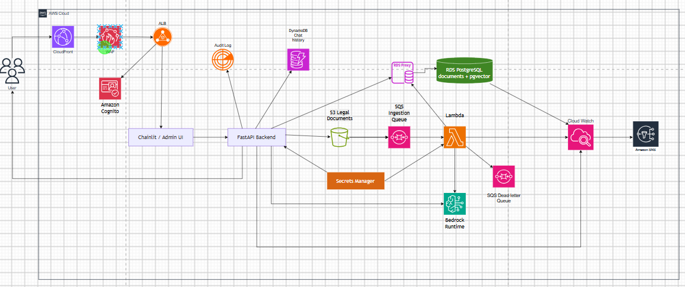

# Vietnamese Legal RAG Chatbot

## Vietnamese Legal Q&A Solution on AWS

### 1. Executive Summary

Vietnamese Legal RAG Chatbot allows users to ask questions in Vietnamese about legal texts (Laws, Decrees, Circulars, etc.) and receive answers with source citations. The system uses an RAG pipeline: retrieve relevant legal text chunks from a vector store, then pass them to a large language model (LLM) on **Amazon Bedrock** to generate accurate answers and reduce hallucination compared to a pure LLM chatbot.

The solution targets internal use (legal departments, research centers, law students) with roughly 10–50 concurrent users. The initial corpus comes from the HuggingFace dataset NguyenKH/core_legal_knowledge, with the ability to add new documents via admin upload.

**Live demo:** [http://18.143.187.153:8501/](http://18.143.187.153:8501/) (Streamlit on EC2, ap-southeast-1)

### 2. Problem Statement

**Current Problems**

* Searching Vietnamese legal texts is often manual and time-consuming when finding relevant articles/clauses.
* Pure LLM chatbots may answer incorrectly or invent non-existent legal provisions.
* There is no centralized system for uploading, indexing, and managing the lifecycle of new legal documents.

**Solution**

Build an RAG chatbot on AWS with three main flows:

1. **Ingestion flow:** Admin uploads PDF/TXT to **Amazon S3** → event triggers **Amazon SQS** → **AWS Lambda** performs chunking, calls **Amazon Bedrock Titan Embeddings**, stores vectors in **Amazon RDS PostgreSQL (pgvector)**.
2. **RAG query flow:** User sends a question via **Chainlit/FastAPI** on **Amazon EC2** (behind **Application Load Balancer**) → embed question → vector search on RDS → build prompt → **Amazon Bedrock LLM** (Claude 3 / Llama 3) generates answer → stream to UI.
3. **Operations flow (Observability):** Logs/metrics to **Amazon CloudWatch** → **Amazon SNS** sends email alerts on errors or cost threshold breaches.

User authentication via **Amazon Cognito** (users/editors/admins groups). Conversation history stored in **Amazon DynamoDB** with TTL and GSI for admin use.

**Benefits**

* Answers grounded in actual legal text with citation metadata.
* Automated ingestion pipeline when admins upload new documents.
* Cloud-native architecture, scalable for corpus size and user count.
* Leverages AWS managed services, reducing infrastructure operations vs. full self-hosting.

### 3. Solution Architecture

**AWS Services Used**

| Service                                      | Role                                                             |
| -------------------------------------------- | ---------------------------------------------------------------- |
| **Amazon EC2**                         | Host FastAPI + Chainlit app in private subnet                    |
| **Application Load Balancer (ALB)**    | HTTPS entry point, load balancing to EC2/ECS                     |
| **Amazon RDS (PostgreSQL + pgvector)** | Vector database storing legal chunks and embeddings              |
| **Amazon Bedrock**                     | Titan Embeddings + LLM (Claude 3, Llama 3)                       |
| **Amazon S3**                          | Store source documents, upload manifests, vector store artefacts |
| **AWS Lambda**                         | Ingestion processing: read S3, chunk, embed, write RDS           |
| **Amazon SQS + DLQ**                   | Ingestion queue, retry and dead-letter handling                  |
| **Amazon DynamoDB**                    | Chat history and conversation metadata                           |
| **Amazon Cognito**                     | JWT authentication, RBAC for users/editors/admins                |
| **Amazon VPC**                         | Public/private/isolated subnets, security groups                 |
| **VPC Endpoints**                      | Access S3, Bedrock, DynamoDB without Internet                    |
| **Amazon CloudWatch + SNS**            | Logging, metrics, alarms, email notifications                    |
| **AWS CloudFormation**                 | IaC deploy foundation stack (Cognito, DynamoDB, S3, SQS)         |
| **AWS Secrets Manager**                | Manage RDS password, API keys (production)                       |

**Component Design**

* **Frontend/Chat UI:** Chainlit (demo/UAT) or web app integrated with Cognito (production).
* **API Layer:** FastAPI with **/api/chat**, **/api/admin/***, JWT middleware.
* **RAG Core:** QAService — pgvector retriever, prompt builder, Bedrock generator.
* **Ingestion Worker:** Lambda handler reading S3/SQS, supports PDF/TXT, partial batch failure.
* **Admin:** Presigned S3 upload, Cognito user management, soft delete for documents.

### 4. Technical Implementation

**Implementation Phases**

| Phase                         | Content                                    | Timeline   |
| ----------------------------- | ------------------------------------------ | ---------- |
| 1. Research & local prototype | RAG pipeline, SQLite vector store, FastAPI | Weeks 4–5 |
| 2. Basic AWS integration      | S3 sync, Docker, Chainlit                  | Weeks 6–7 |
| 3. Production data layer      | RDS pgvector, Bedrock                      | Week 7     |
| 4. Auth & foundation IaC      | Cognito, DynamoDB, CloudFormation stack    | Week 8     |
| 5. Serverless ingestion       | S3 → SQS → Lambda → RDS                 | Week 8     |
| 6. Optimization & reporting   | Benchmark, CloudWatch, finalize report     | Week 8     |

**Technical Requirements**

* Python 3.11+, FastAPI, Sentence-Transformers / Bedrock Embeddings.
* PostgreSQL 15+ with pgvector extension.
* Docker container for EC2/ECS deployment.
* IAM least privilege; do not commit credentials to git.
* Recommended region: **ap-southeast-1** (Singapore).

**Deployment Links**

| Type                        | Link                                                                                              |
| --------------------------- | ------------------------------------------------------------------------------------------------- |
| **Repository**        | [github.com/KhanhKoy/vietnamese-legal-llmops](https://github.com/KhanhKoy/vietnamese-legal-llmops) |
| **Production (demo)** | [http://18.143.187.153:8501/](http://18.143.187.153:8501/)                                         |

Source code includes src/rag_core/, src/api/, infra/foundation.yaml, deploy/Dockerfile. The demo environment runs on EC2 (ap-southeast-1) with a Streamlit UI, connected to RDS pgvector and Bedrock.

### 5. Timeline & Milestones

* **Weeks 1–2 (22/06 – 03/07):** AWS fundamentals, S3/IAM.
* **Weeks 3–4 (06/07 – 17/07):** VPC workshop, RAG research and legal dataset.
* **Weeks 5–6 (20/07 – 31/07):** Local prototype, FastAPI, Docker, Chainlit.
* **Weeks 7–8 (03/08 – 14/08):** Bedrock, RDS pgvector, Cognito, Lambda ingestion, benchmark, report.
* **Post-internship:** HA deployment, WAF, admin frontend, migrate all embeddings to Bedrock Titan.

### 6. Budget Estimation (dev/staging, ap-southeast-1)

| Item                                       | Estimated cost/month         |
| ------------------------------------------ | ---------------------------- |
| EC2 t3a.small                              | ~$14 USD                     |
| RDS db.t3.micro PostgreSQL                 | ~$15 USD                     |
| Amazon Bedrock (embed + LLM, ~10K queries) | ~$5–20 USD                  |
| S3 Standard (~10 GB)                       | ~$0.25 USD                   |
| DynamoDB on-demand                         | ~$1 USD                      |
| Lambda + SQS                               | ~$1 USD                      |
| Cognito                                    | Free tier (< 50K MAU)        |
| CloudWatch + SNS                           | ~$2 USD                      |
| **Total estimate**                   | **~$40–55 USD/month** |

*Note:* Production costs with ALB, 2 EC2 instances, RDS Multi-AZ will be higher. Can be reduced with ECS Fargate Spot, RDS Reserved Instance, or shutting down instances outside lab hours.

### 7. Risk Assessment

| Risk                           | Impact | Mitigation                                                          |
| ------------------------------ | ------ | ------------------------------------------------------------------- |
| LLM hallucination              | High   | RAG requires context citations; prompt refuses when data is missing |
| Bedrock cost over budget       | Medium | CloudWatch alarms, token limits, cache common questions             |
| Outdated legal corpus          | High   | Admin upload pipeline, S3 versioning, soft delete                   |
| High latency with large corpus | Medium | pgvector index (IVFFlat/HNSW), RDS Proxy, periodic benchmarking     |
| Credential exposure            | High   | Secrets Manager, IAM roles for EC2/Lambda, no hard-coded keys       |

### 8. Expected Outcomes

* Prototype chatbot answering Vietnamese legal questions with source citations.
* Automated ingestion pipeline for new PDF/TXT documents.
* Extensible platform for legal NLP research and RAG metrics evaluation (Recall@k, MRR).
* Hands-on AWS knowledge: EC2, S3, RDS, Lambda, Bedrock, Cognito, DynamoDB, VPC, CloudFormation.
