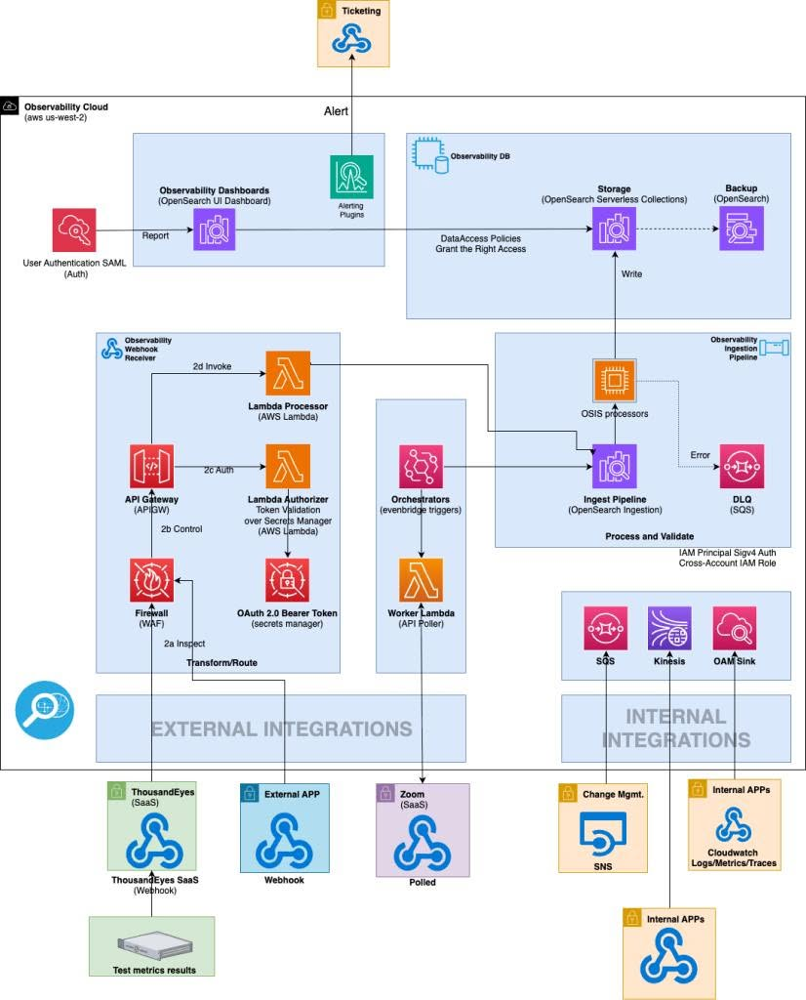

# Amazon đã xây dựng hệ thống giám sát toàn diện cho hơn 400 văn phòng bằng Amazon OpenSearch Serverless như thế nào?

Amazon hiện sở hữu hơn 400 văn phòng tại hơn 50 quốc gia, phục vụ khoảng 330.000 nhân viên. Mỗi ngày, hàng triệu bản ghi (logs), chỉ số hiệu năng (metrics) và sự kiện (events) được tạo ra từ nhiều hệ thống khác nhau như mạng nội bộ, Wi-Fi, Zoom, Microsoft Teams, Slack, hệ thống phòng họp và các ứng dụng doanh nghiệp.

Trong bài viết này, AWS chia sẻ cách đội ngũ Corporate Infrastructure Services (CIS) xây dựng một nền tảng **Full Stack Observability** dựa trên **Amazon OpenSearch Serverless**, giúp tập trung dữ liệu giám sát về một nơi duy nhất, từ đó rút ngắn thời gian phát hiện và xử lý sự cố.

---

## Full Stack Observability (FSO) là gì?

Để giải quyết bài toán này, Amazon Corporate Infrastructure Services (CIS) đã xây dựng nền tảng FSO tập trung trên Amazon OpenSearch Serverless, tích hợp với các hệ thống bên ngoài và nội bộ như Cisco ThousandEyes, Zoom, và hệ thống quản lý thay đổi.

Nền tảng được xây dựng dựa trên **sáu nguyên tắc thiết kế cốt lõi**:

- **Bảo mật ngay từ thiết kế (Secure by Design):** Ưu tiên bảo vệ cho cơ sở hạ tầng, người dùng và dữ liệu của Amazon.
- **Tối ưu hóa với AWS (AWS First):** Tối đa hóa việc sử dụng các dịch vụ do AWS quản lý (AWS Managed Services) bất cứ khi nào có thể.
- **Mua, Mượn, rồi mới Tự dựng (Buy, Borrow, then Build):** Tận dụng các giải pháp có sẵn để rút ngắn thời gian triển khai sản phẩm ra thị trường (time‑to‑market).
- **Đơn giản hóa (Simplicity):** Giảm thiểu tối đa số lượng thành phần hệ thống và các phụ thuộc (dependencies) không cần thiết.
- **Tiết kiệm & Hiệu quả (Frugality):** Tối đa hóa giá trị kinh doanh mang lại trong khi giảm thiểu chi phí và sự phức tạp về công nghệ.
- **Tiêu chuẩn mở (Open Standards):** Ưu tiên áp dụng các tiêu chuẩn mở và thành phần mã nguồn mở để đảm bảo tính linh hoạt lâu dài.

---

## Kiến trúc nền tảng FSO

Nền tảng FSO này bao gồm **ba tầng kiến trúc chính**:

### 1. Nguồn dữ liệu (Integrations Layer)

Dữ liệu từ đa dạng nguồn được đưa vào nền tảng qua nhiều giao thức như webhooks, event streaming, và CloudWatch logs.

### 2. Xử lý & Lưu trữ (Platform Layer)

Toàn bộ quá trình chuẩn hóa, biến đổi, làm giàu và định tuyến dữ liệu được xử lý bởi **Amazon OpenSearch Ingestion (OSIS)** – một pipeline tự động, không cần quản lý server hay scaling logic. Dữ liệu sau đó được lưu trữ và phân tích trong **Amazon OpenSearch Serverless**, với khả năng:

- Tự động scale theo khối lượng công việc
- Nhân bản đa vùng (Multi‑AZ replication)
- Backup tự động lên S3
- Phân tầng lưu trữ (hot/warm/cold)
- Quản lý vòng đời index

Hệ thống còn có cơ chế xử lý lỗi qua **Dead Letter Queue (SQS)** để bắt và retry các message thất bại.

### 3. Phân tích & Cảnh báo (Consumption Layer)

- **FSO Dashboards** cung cấp trực quan hóa phong phú.
- Người dùng xác thực thông qua **SAML** và có thể truy cập ngay vào các dashboard dựng sẵn để theo dõi tình trạng mạng, hiệu năng ứng dụng cũng như độ sẵn sàng của dịch vụ trên tất cả các chi nhánh được giám sát.
- Công cụ cảnh báo tích hợp sẵn trên OpenSearch Dashboards tự động theo dõi các ngưỡng thiết lập và kích hoạt thông báo khi có bất thường.

### Điểm đặc biệt của nền tảng

Thay vì phải quản lý hạ tầng, đội ngũ FSO tập trung vào việc tạo ra các **mẫu hình ingestion có thể tái sử dụng**. Cách tiếp cận này cho phép họ mở rộng từ 3 văn phòng thí điểm lên 24 văn phòng trong giai đoạn 1, với lộ trình rõ ràng tới 400 văn phòng toàn cầu.

---

## Kết quả đạt được

Sau khi triển khai, nền tảng FSO đã mang lại những con số ấn tượng:

-**Tiết kiệm hàng nghìn giờ làm việc** của kỹ sư mỗi năm nhờ tự động hóa giám sát và tương quan dữ liệu.
-**MTTD (Thời gian phát hiện sự cố)** đạt mục tiêu **5 phút** phát hiện sự cố trước khi người dùng bị ảnh hưởng.
-**Độ sẵn sàng (continuous visibility) 99,9%** đảm bảo khả năng quan sát liên tục vào hạ tầng quan trọng.
-**Hơn 500+ người dùng** đang sử dụng nền tảng để tăng tốc quá trình tìm kiếm dữ liệu.
-**Giảm 83% MTTD** trong giai đoạn thí điểm.
-**Tỷ suất lợi nhuận đầu tư (ROI) dự kiến 220%** mỗi năm chỉ riêng từ việc tiết kiệm thời gian của kỹ sư.

---

## Những bài học rút ra từ quá trình triển khai

Qua quá trình xây dựng và mở rộng, đội ngũ Amazon CIS đã đúc kết **7 bài học quý giá**:

1. **Bắt đầu từ kết quả kinh doanh rõ ràng (Start with Clear Business Outcomes):**Đừng xây dựng observability chỉ vì nó "hay ho". Hãy đo lường các chỉ số kỹ thuật (MTTD, MTTR,…) để xây dựng business case thuyết phục ban lãnh đạo.
2. **Áp dụng tiêu chuẩn mở (Embrace Open Standards):**OpenTelemetry được chọn làm tiêu chuẩn ngay từ ngày đầu. Nếu lần tích hợp đầu tiên mất vài tuần, thì đến tích hợp thứ mười chỉ mất vài giờ.
3. **Thiết kế cho mở rộng ngay từ đầu (Design for Scale from Day One):**Hãy sử dụng dịch vụ managed có khả năng auto‑scale, xây dựng tự động hóa từ đầu (Infrastructure as Code, CI/CD).
4. **Bắt đầu Nhỏ, Mục Tiêu Lớn (Start Small, Think Big):**Thử nghiệm trước (Pilot) tại các chi nhánh đại diện để chứng minh hiệu quả mô hình, sau đó mới mở rộng từng bước dựa trên bài học thực tế.
5. **Đầu tư vào chất lượng dữ liệu (Invest in Data Quality):**Chuẩn hóa dữ liệu ngay tại thời điểm thu thập (ingestion time), bổ sung ngữ cảnh kinh doanh (chi nhánh, khu vực, chủ sở hữu dịch vụ), kiểm tra và làm sạch dữ liệu để tránh rủi ro "rác vào thì rác ra" (garbage in, garbage out).
6. **Cân bằng cảnh báo và độ nhiễu (Balance Alerting and Noise):**Đặt ngưỡng cảnh báo thận trọng, điều chỉnh dựa trên phản hồi thực tế, đặt mục tiêu zero false positive.
7. **Trao quyền tự phục vụ (Enable Self‑Service):**
   Trao quyền truy cập Dashboard trực tiếp cho các đội vận hành, cung cấp tài liệu & hướng dẫn chi tiết, dựng sẵn các mẫu truy vấn (query templates) để các đội tự tìm ra câu trả lời cho bài toán của mình thay vì tạo ra một "đội observability" tập trung trả lời mọi câu hỏi.

---

**Bài viết tham khảo từ blog chính thức của AWS:**
[https://aws.amazon.com/vi/blogs/mt/how-amazon-achieved-full-stack-observability-across-400-offices-with-amazon-opensearch-serverless/](https://aws.amazon.com/vi/blogs/mt/how-amazon-achieved-full-stack-observability-across-400-offices-with-amazon-opensearch-serverless/)
