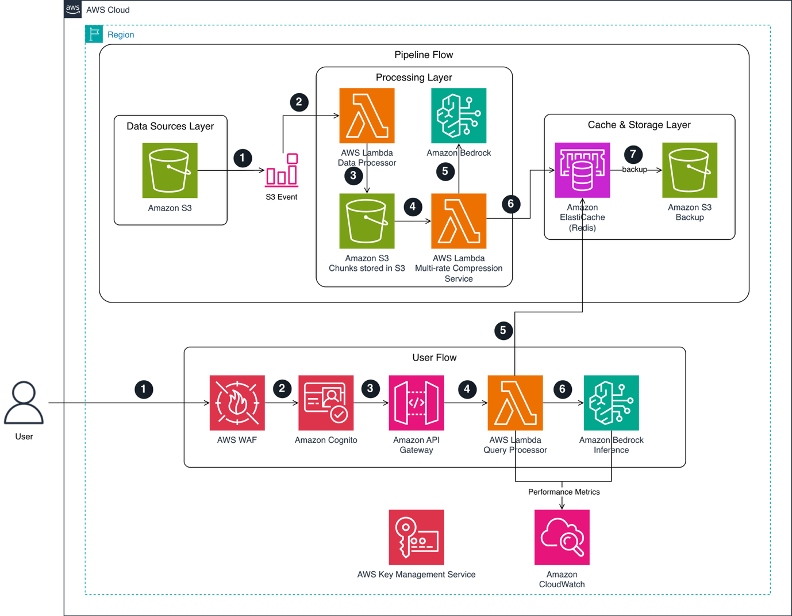

# TỐI ƯU HÓA AI DOANH NGHIỆP TRÊN AWS: BƯỚC TIẾN VƯỢT BẬC TỪ RAG ĐẾN TASK-AWARE KNOWLEDGE COMPRESSION

Retrieval-Augmented Generation (RAG) đã trở thành một tiêu chuẩn phổ biến giúp các hệ thống AI doanh nghiệp truy xuất tri thức và giảm thiểu hiện tượng "ảo tưởng" (hallucination). Tuy nhiên, khi áp dụng vào các tác vụ phân tích phức tạp trải dài trên hàng trăm tài liệu—như thẩm định tài chính doanh nghiệp hay kiểm tra tuân thủ pháp lý—RAG bắt đầu bộc lộ những hạn chế cố hữu. Việc tìm kiếm dựa trên độ tương đồng (similarity search) chỉ trích xuất các đoạn văn bản rời rạc, làm mất đi tính kết nối xuyên suốt giữa các tài liệu.

Để giải quyết triệt để rào cản này, giải pháp **Task-Aware Knowledge Compression** (TAKC - Nén tri thức định hướng tác vụ) đã ra đời. Kỹ thuật này cho phép nén toàn bộ cơ sở tri thức thành các bản biểu diễn chuyên biệt theo từng tác vụ, giúp tối ưu hóa dung lượng context window, giảm đáng kể chi phí token và nâng cao độ chính xác cho AI doanh nghiệp trên hạ tầng AWS.

Bài viết này sẽ phân tích lý do tại sao RAG truyền thống gặp giới hạn, cơ chế vận hành của TAKC và cách triển khai kiến trúc này trên AWS.

## Thách thức: Tại sao RAG truyền thống thất bại trước các tác vụ tổng hợp phức tạp?

Hãy xét kịch bản một quỹ đầu tư cần thẩm định thương vụ M&A trị giá hàng trăm triệu USD. Đội ngũ phân tích phải xử lý báo cáo tài chính 5 năm của 12 công ty con, hơn 200 hợp đồng nhà cung cấp, báo cáo môi trường và hàng chục hồ sơ pháp lý. Khi người dùng đặt câu hỏi mang tính tổng hợp cao: "*Rủi ro tài chính hợp nhất là gì nếu xét theo các điều khoản nhà cung cấp hiện tại và các vụ kiện đang diễn ra?*", RAG truyền thống gần như không thể đưa ra câu trả lời toàn diện.

Nguyên nhân chính nằm ở cách thức vận hành của RAG:

1. **Mất ngữ cảnh tổng thể (Global Context Loss):** RAG chỉ lấy ra top-k đoạn văn bản (chunks) có độ tương đồng từ vựng cao nhất. Các mối liên hệ logic ẩn nằm ở nhiều tài liệu khác nhau nhưng không chứa từ khóa tương đồng sẽ bị bỏ qua.
2. **Tràn dung lượng Context Window:** Việc đưa toàn bộ hàng trăm trang tài liệu gốc vào prompt khiến chi phí gọi API LLM tăng vọt, đồng thời làm giảm khả năng chú ý (attention) của mô hình.
3. **Tóm tắt chung chung không hiệu quả:** Các phương pháp tóm tắt truyền thống cố gắng giữ lại mọi thứ, dẫn đến việc làm loãng mật độ thông tin cần thiết cho một góc nhìn cụ thể.

## Giải pháp Task-Aware Knowledge Compression (TAKC) là gì?

Khác với tóm tắt thụ động, TAKC sử dụng LLM để nén tài liệu thông qua "lăng kính" của một tác vụ cụ thể (Task-Specific Lens). Cùng một tài liệu báo cáo thường niên, nếu nén cho tác vụ **Phân tích Tài chính**, hệ thống sẽ giữ lại doanh thu, biên lợi nhuận và dòng tiền; nhưng nếu nén cho tác vụ **Đánh giá Pháp lý**, hệ thống sẽ ưu tiên trích xuất các trích dẫn quy định và lịch sử vi phạm.

## Các đặc điểm cốt lõi của TAKC:

* **Nén định hướng tác vụ (Task-Aware):** Loại bỏ các thông tin nhiễu không liên quan, giúp giảm từ 8x đến 64x số lượng token mà vẫn bảo toàn các dữ liệu quan trọng nhất.
* **Xử lý Offline trước khi truy vấn:** Dữ liệu được nén sẵn theo các loại tác vụ trước khi lưu trữ, giúp tốc độ phản hồi khi người dùng đặt câu hỏi cực kỳ nhanh chóng.
* **Nén đa tầng (Multi-rate Compression):** Cho phép nén dữ liệu ở các mức độ chi tiết khác nhau (từ tóm tắt mức cao đến các bản nén sâu), linh hoạt điều hướng dựa trên độ phức tạp của câu hỏi.

## Tổng quan kiến trúc pipeline vận hành TAKC trên AWS

Giải pháp TAKC được triển khai hoàn toàn trên hạ tầng đám mây AWS, kết hợp các dịch vụ hàng đầu như Amazon Bedrock và Amazon SageMaker để tạo nên một quy trình tự động hóa mạnh mẽ:

1. **Ingestion Pipeline (Pipeline nén dữ liệu đầu vào)**

* **Lưu trữ tài liệu gốc:** Dữ liệu thô (PDF, DOCX, 10-K filings) được tải lên Amazon S3.
* **Định nghĩa Prompt nén:** Các prompt nén theo từng tác vụ được quản lý và đánh phiên bản tập trung tại **AWS Systems Manager Parameter Store** hoặc một vùng **S3** chuyên biệt.
* **Thực thi nén bằng LLM:** Hệ thống sử dụng các foundation model hiệu năng cao trên **Amazon Bedrock** (như Anthropic Claude) hoặc mô hình tùy chỉnh trên **Amazon SageMaker** để thực hiện nén tài liệu theo từng tác vụ.
* L**ưu trữ tri thức đã nén:** Các bản nén thu được lưu vào cơ sở dữ liệu vector/văn bản (như **Amazon OpenSearch Service**) để sẵn sàng cho bước truy vấn.

2. **Query Pipeline (Pipeline xử lý truy vấn thời gian thực)**

* **Phân tích độ phức tạp (Complexity Analyzer):** Khi người dùng gửi câu hỏi, hệ thống tự động xác định loại tác vụ và mức độ chi tiết cần thiết.
* **Truy xuất tri thức đã nén (Compressed Knowledge Retrieval):** Thay vì truy xuất từng đoạn văn bản nhỏ, hệ thống lấy ra toàn bộ bản biểu diễn tri thức đã nén tương ứng với tác vụ đó.
* **Sinh câu trả lời (Inference):** LLM trên Amazon Bedrock tiếp nhận bản tri thức cô đọng và tạo ra câu trả lời chính xác, logic với chi phí token tối ưu nhất.

## Đặc điểm triển khai và Vận hành

* **Tối ưu chi phí vận hành:** Việc nén giảm đáng kể kích thước prompt (8x–64x) giúp doanh nghiệp cắt giảm phần lớn chi phí gọi API LLM khi truy vấn thường xuyên.
* **Tính quản trị và kiểm toán cao:** Nhờ lưu trữ prompt nén dạng versioned configuration trên AWS Systems Manager, doanh nghiệp có thể dễ dàng kiểm toán, điều chỉnh tiêu chuẩn nén và kích hoạt tự động quy trình nén lại (re-compression) khi quy định thay đổi.
* **Khả năng mở rộng linh hoạt:** Kiến trúc serverless kết hợp giữa S3, Bedrock và OpenSearch Service giúp hệ thống xử lý mượt mà từ hàng trăm đến hàng triệu trang tài liệu mà không cần quản lý hạ tầng GPU phức tạp.

## Kết quả đo lường được

Ứng dụng TAKC mang lại những cải tiến vượt bậc so với các mô hình RAG truyền thống:

* **Tăng vượt trội mật độ thông tin (Information Density):** Giữ lại trọn vẹn bức tranh toàn cảnh và mối liên hệ giữa các tài liệu.
* **Tiết kiệm chi phí token:** Cắt giảm từ 8 đến 64 lần số lượng token đầu vào trong quá trình suy luận.
* **Cải thiện độ chính xác:** Giảm thiểu hiện tượng ảo tưởng và bỏ sót dữ liệu do tràn context window.

## Kết luận

Task-Aware Knowledge Compression (TAKC) đánh dấu bước tiến quan trọng vượt xa khỏi giới hạn của RAG truyền thống. Bằng cách kết hợp linh hoạt giữa Amazon Bedrock, SageMaker và các dịch vụ lưu trữ của AWS, doanh nghiệp có thể xây dựng giải pháp AI có khả năng "thấu hiểu" ngữ cảnh sâu sắc trên quy mô dữ liệu lớn, vừa đảm bảo hiệu năng vừa tối ưu chi phí.

**Link bài viết gốc:** [https://aws.amazon.com/vi/blogs/machine-learning/beyond-rag-task-aware-knowledge-compression-for-enterprise-ai-on-aws/](https://aws.amazon.com/vi/blogs/machine-learning/beyond-rag-task-aware-knowledge-compression-for-enterprise-ai-on-aws/)
