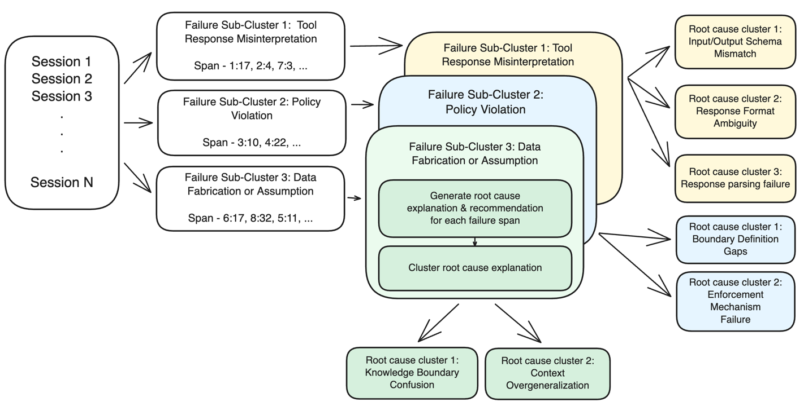
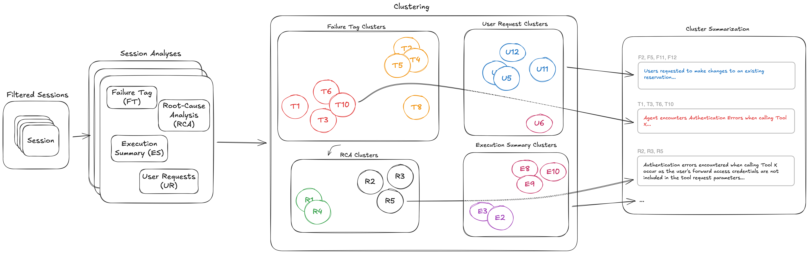

# DETECTING AND RESOLVING SILENT FAILURES IN AI AGENTS WITH AMAZON BEDROCK AGENTCORE OPTIMIZATION

When deploying AI Agent systems at scale for enterprises, one of the biggest challenges engineers face is "silent failures". Dashboards still show perfect green: a 99% completion rate, stable latency, and zero error signals from infrastructure. However, customers silently report that orders were never executed, products were reported as "in stock" despite warehouse API timeouts, or critical approval steps were inadvertently skipped by AI.

To completely resolve this issue, AWS introduced the Insights feature in Amazon Bedrock AgentCore Optimization. This technique helps shift the observability model from reactive trace inspection to proactive behavioral pattern detection, helping discover, explain, and prioritize remediation for even those failures that never generate an error signal.

This article analyzes why traditional monitoring tools face barriers, the deep analysis mechanism of Amazon Bedrock AgentCore Optimization, and how to apply this solution in practice.

## The Challenge: Why do traditional monitoring tools fail against "Silent Failures"?

In production environments, AI Agents complete tasks from a system perspective (response code 200, passing health checks), but fail in terms of business behavior. These errors do not emit exceptions or HTTP error codes, making them completely "invisible" to traditional infrastructure monitoring systems and only surfacing when end users complain.

Additionally, when AI Agent systems handle thousands of working sessions daily, engineers often encounter two main bottlenecks:

1. **Trace Noise Barrier:** Behavioral errors cannot be detected by looking at individual logs alone. Manually reviewing individual traces only reveals what happened in a single session, but cannot answer whether this is a systemic failure affecting 30% of traffic or merely an edge case affecting 3 sessions.
2. **Priority Paralysis:** When hundreds of minor errors accumulate across sessions, development teams often triage errors based on gut feel without concrete data on the impact scope of each error group.

## What is the Amazon Bedrock AgentCore Optimization Solution?

Amazon Bedrock AgentCore Optimization provides the Insights feature operating one layer above existing monitoring systems. Instead of merely collecting raw logs, AgentCore Insights ingests trace data and transforms it into actionable behavioral intelligence.

This feature enables enterprises to comprehensively evaluate Agent interaction patterns at scale, automatically detecting deviations in processing logic without requiring manual pre-configuration of filters or classification rules.

## Core Features of AgentCore Optimization:

* **Ranked Failure Pattern Discovery:** Analyzes hundreds of sessions and clusters them into behavioral failure groups, accompanied by an aggregated root cause analysis explanation for each cluster without needing to open individual traces.
* **Priority Ranking by Impact Level:** Failure patterns are ranked directly by the percentage of affected sessions, allowing engineers to instantly distinguish between critical systemic issues and rare edge cases.
* **User Intent Analysis:** Uncovers the actual distribution of user requests, helping identify coverage gaps or requests that fall outside the Agent's intended design scope.
* **Proactive Over Reactive Monitoring:** Shifts from manual trace inspection during incidents to proactively capturing the entire behavioral picture of Agents in real time.

## Overview of the Analysis Pipeline Architecture on Amazon Bedrock AgentCore

The end-to-end analysis workflow of AgentCore Optimization executes automatically through core steps:

1. **Session Attribute Extraction:** The system collects trace data from Agent sessions and extracts behavioral attributes (such as action sequences, tool calls, response statuses).
2. **Independent Clustering:** Each session analysis method independently clusters attributes to uncover similarity patterns across thousands of interactions.
3. **Cluster Summarization & Interpretation:** Generates a single root cause summary for each failure cluster, accurately describing the problem in sufficient detail for engineers to act immediately.
4. **Ranked Insights Reporting:** Ranks clusters by impact scale, producing visual reports that help development teams focus resources on fixing the most impactful failures.

## Deployment and Operational Features

* **Leveraging Existing Observability Infrastructure:** AgentCore Insights operates on already collected trace data, requiring no code or structural changes to existing AI Agents.
* **Large-scale Scalability:** The system automatically analyzes thousands of sessions in parallel on fully managed AWS infrastructure, eliminating the burden of self-maintaining analysis models or complex compute infrastructure.
* **Optimizing Engineering Team Productivity:** Helps engineers eliminate hours of manual log inspection, focusing instead on refining prompts, adding tools, or tweaking Agent logic.

## Measurable Results

Applying Amazon Bedrock AgentCore Optimization delivers tangible value to enterprise AI operations:

* **Rapid Incident Isolation:** Reduces the time needed to detect and analyze the root cause of silent failures from weeks to just minutes.
* **Development Resource Optimization:** Helps engineering teams prioritize resolving failures affecting large user volumes instead of wasting time on isolated edge cases.
* **Enhancing Agent Reliability:** Ensures AI Agents operate according to business design, minimizing risks to customer experience and business operations.

## Conclusion

Amazon Bedrock AgentCore Optimization represents a new milestone in governing and optimizing enterprise AI Agent systems. By combining advanced behavioral analytics with automated error clustering, this solution enables enterprises to master complex "silent failures," ensuring AI systems run not only with infrastructure stability but also with business accuracy.

**Original article link:** [https://aws.amazon.com/vi/blogs/machine-learning/detecting-silent-agent-failures-with-amazon-bedrock-agentcore-optimization/](https://aws.amazon.com/vi/blogs/machine-learning/detecting-silent-agent-failures-with-amazon-bedrock-agentcore-optimization/)
