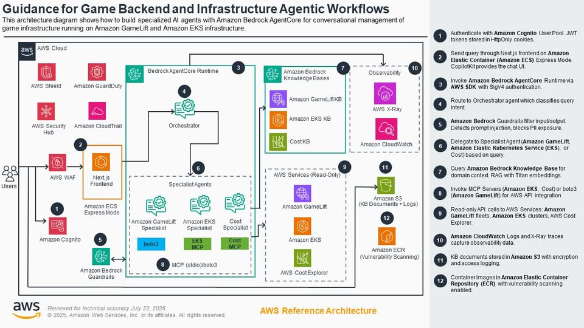

# Agentic AI đang thay đổi cách quản lý hạ tầng game như thế nào?

Đối với người chơi, một trò chơi trực tuyến thành công là trò chơi có thể đăng nhập nhanh, không bị giật lag và luôn có đủ máy chủ để phục vụ. Nhưng phía sau trải nghiệm đó là một hệ thống hạ tầng vô cùng phức tạp mà đội ngũ vận hành (Game Operations hay GameOps) phải quản lý mỗi ngày.

Đặc biệt trong các dịp ra mắt game mới hoặc cập nhật nội dung lớn, số lượng người chơi có thể tăng đột biến chỉ trong vài giờ. Khi đó, đội ngũ vận hành phải nhanh chóng quyết định nên mở thêm bao nhiêu máy chủ, đặt ở khu vực nào và làm sao để vừa đảm bảo trải nghiệm người chơi vừa tối ưu chi phí.

---

## Quản lý hạ tầng game khó hơn chúng ta nghĩ

Một trò chơi trực tuyến hiện đại thường được triển khai trên nhiều khu vực địa lý để giảm độ trễ cho người chơi. Đồng thời, hệ thống phải liên tục theo dõi:

- Số lượng người chơi đang hoạt động.
- Tình trạng của các máy chủ game.
- Mức sử dụng tài nguyên.
- Chi phí vận hành.
- Hiệu năng và độ ổn định của toàn bộ hệ thống.

Khó khăn nằm ở chỗ mỗi thành phần có thể sử dụng một công nghệ khác nhau, với giao diện quản lý và cách giám sát riêng. Điều này khiến kỹ sư vận hành phải liên tục chuyển đổi giữa nhiều công cụ chỉ để có được cái nhìn tổng thể về hệ thống.

AWS đưa ra một ví dụ thực tế: có đội ngũ vận hành phải dành khoảng **60% thời gian** chỉ để chuyển qua lại giữa các giao diện quản trị và xử lý các vấn đề về tài nguyên. Trong một đợt phát hành nội dung lớn, việc mở rộng máy chủ không kịp thời còn khiến thời gian chờ đợi của người chơi tăng lên khoảng **2 giờ**, dẫn đến khoảng **12% người chơi rời bỏ game**.

---

## Agentic AI giải quyết bài toán như thế nào?

AWS đã đưa ra giải pháp mẫu mang tên **Guidance for Game Backend & Infrastructure Agentic Workflows**. Thay vì bắt kỹ sư gõ lệnh CLI hay bấm qua từng giao diện Console, hệ thống sử dụng một tập hợp các **AI Agent chuyên biệt** (Multi-Agent System) dựng trên **Amazon Bedrock AgentCore**.

### Các Agent trong hệ thống

Hệ thống chia ra làm 4 Agent đảm nhận các vai trò riêng biệt:

| Agent | Vai trò |
| :--- | :--- |
| **Game Agent Orchestrator** | Đóng vai trò là AI điều phối trung tâm, có nhiệm vụ tiếp nhận yêu cầu từ người dùng và chuyển tiếp đến agent chuyên môn phù hợp. |
| **GameLift Servers Specialist** | Chuyên quản lý hạ tầng máy chủ game, bao gồm quản lý các phiên (fleet), tự động mở rộng hoặc thu hẹp tài nguyên (scaling) và tối ưu hiệu năng hệ thống. |
| **EKS Specialist** | Chuyên xử lý các tác vụ liên quan đến cụm Amazon EKS (Elastic Kubernetes Service), bao gồm vận hành, giám sát và khắc phục sự cố của Kubernetes. |
| **Cost Specialist** | Phân tích chi tiêu AWS và đề xuất tối ưu chi phí. |

### Cơ chế hoạt động

Các agent này cấp quyền truy cập chỉ đọc (read‑only) vào hạ tầng thông qua **MCP servers**, và có thể truy xuất dữ liệu quan sát từ CloudWatch và AWS X‑Ray. Bên cạnh đó, các **Bedrock Knowledge Bases** về GameLift, EKS và Cost Optimization được triển khai để cung cấp kiến thức chuyên ngành khi agent cần tra cứu.

**Quy trình vận hành** diễn ra như sau:

1. Người dùng đặt câu hỏi qua giao diện chat.
2. Câu hỏi được chuyển đến **Game Agent Orchestrator**.
3. Orchestrator xác định agent chuyên biệt phù hợp.
4. Agent đó truy xuất dữ liệu và trả lời.

Toàn bộ đầu vào và đầu ra đều được lọc qua **Bedrock Guardrails** để ngăn chặn prompt injection và lộ thông tin dạng cá nhân (PII).

---

## Lợi ích mang lại

Việc ứng dụng Agentic AI vào quản lý hạ tầng game giúp thay đổi cách các đội ngũ GameOps vận hành hệ thống:

- Thay vì phải làm việc với nhiều bảng điều khiển hay ghi nhớ các câu lệnh phức tạp, kỹ sư có thể tương tác với hạ tầng bằng ngôn ngữ tự nhiên để theo dõi, phân tích và đưa ra quyết định.
- Thời gian xử lý sự cố được rút ngắn đáng kể.
- Việc mở rộng hạ tầng và tối ưu chi phí trở nên hiệu quả hơn.
- Giúp các nhóm nhỏ quản lý hiệu quả những hệ thống hạ tầng ngày càng phức tạp.

---

**Bài viết tham khảo từ blog chính thức của AWS:**  
[https://aws.amazon.com/vi/blogs/gametech/how-agentic-ai-is-transforming-game-infrastructure-management/](https://aws.amazon.com/vi/blogs/gametech/how-agentic-ai-is-transforming-game-infrastructure-management/)