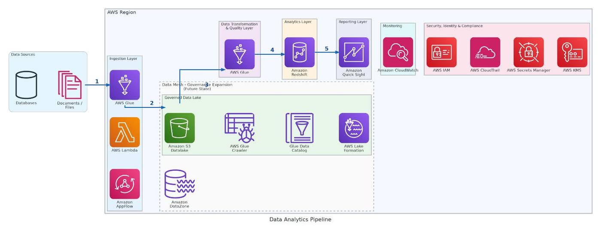

# How PDI Technologies cut 300 hours of manual reporting with Amazon QuickSight

PDI Technologies, a 40-year-old technology company serving over 200,000 locations in 60 countries across the convenience retail and petroleum wholesale industries, adopted **Amazon QuickSight** to modernize its business intelligence (BI) infrastructure. This move helped them save more than **300 hours of manual reporting per year** while establishing a unified data analytics platform across the enterprise.

---

## Challenges

Throughout its growth journey, PDI Technologies completed more than **30 mergers and acquisitions** (M&A). While this drove rapid expansion, it also left their data **siloed across multiple disparate systems**.

Each department relied on its own distinct process to aggregate data:

- The finance team spent approximately **24 hours per month** consolidating data from the ERP system and converting it into a suitable format before analysis could even begin.
- During month-end closing periods, this tedious process had to be repeated multiple times, culminating in nearly **300 hours of processing time per year**.

Beyond the time drain, fragmented data prevented departments from seeing a holistic, single source of truth, hindering cross-functional collaboration and strategic decision-making.

PDI needed a solution capable of:

- Processing and transforming data at scale from multiple different data warehouses.
- Delivering embedded analytics capability within their software products.
- Supporting enterprise-wide BI deployment.
- Dramatically improving reporting efficiency by minimizing manual workflows.

---

## Why PDI Technologies Chose Amazon QuickSight

After evaluating several BI solutions, PDI Technologies chose **Amazon QuickSight** because it met three critical requirements:

### 1. Embedded Analytics

QuickSight allows embedding dashboards directly into the company's software products. This enables **customers to view reports and analyze data right inside the application they are already using**, without needing to switch to another tool.

### 2. Deep Integration with the AWS Ecosystem

QuickSight integrates seamlessly with the existing AWS ecosystem that the business uses, enabling direct connections to storage and processing services such as:

- Amazon S3
- Amazon Redshift
- AWS Glue
- AWS Lambda

As a result, the data architecture is **simplified**, reducing operational complexity.

### 3. Scalability and Superior Performance

The platform scales to serve multiple departments simultaneously and efficiently processes massive datasets using **SPICE** (Super-fast, Parallel, In-memory Calculation Engine), accelerating data analysis and query speeds.

---

## Technical Architecture

PDI's new data architecture is designed to address three core challenges:

1. Consolidating data from over 30 acquired companies.
2. Supporting real-time analytics at scale.
3. Serving both internal and customer-facing use cases.

### The data flow operates as follows:

| Stage | Technology Used | Description |
| :--- | :--- | :--- |
| **Ingestion** | AWS Glue, AWS Lambda, Amazon AppFlow | Data from external sources (documents, files, and databases) is ingested into AWS. The goal is to **consolidate data from over 30 acquired companies** into a single platform. |
| **Storage (Governed Data Lake)** | Amazon S3, AWS Glue Data Catalog, AWS Lake Formation | Ingested data is stored in **Amazon S3** acting as the central data lake. AWS Glue crawlers automatically discover and catalog the data schema. AWS Lake Formation enforces **fine-grained access control** and governance policies across the data lake. |
| **Transformation & Quality** | AWS Glue | Raw data in S3 is processed through transformation jobs to **clean, enrich, deduplicate**, and reshape the data into formats ready for analysis. |
| **Analytics** | Amazon Redshift | Transformed data is loaded into **Amazon Redshift** to perform high-performance SQL analytics, aggregations, and complex queries on large datasets. |
| **Reporting** | Amazon QuickSight | **Amazon QuickSight** connects to Amazon Redshift to deliver dashboards, visualizations, and self-service BI to business users. |

---

## Results and Benefits

The implementation delivered results that exceeded expectations:

- **Reduced reporting time from over 10 hours to minutes**—representing the single largest efficiency gain across the organization. This reduction also minimized the risk of human error and improved data accuracy.
- **Achieved a 1,600% ROI** in finance by replacing manual modeling with QuickSight Scenarios. Previously, the finance team spent hours manually building models and configurations. Now, they can support deep analytical requests in a fraction of the time, saving an estimated **22 hours per month** per analyst.
- **Expanded BI from 1 team to 7 functional areas:** including sales, human resources, finance, marketing, revenue operations, customer success, and executive leadership.
- **Achieved an 83% efficiency increase** by converting manual operational reporting workflows for sales into automated QuickSight dashboard reports.

---

**Reference post from the official AWS blog:**  
[https://aws.amazon.com/blogs/business-intelligence/how-pdi-technologies-cut-300-hours-of-manual-reporting-with-amazon-quicksight/](https://aws.amazon.com/blogs/business-intelligence/how-pdi-technologies-cut-300-hours-of-manual-reporting-with-amazon-quicksight/)
