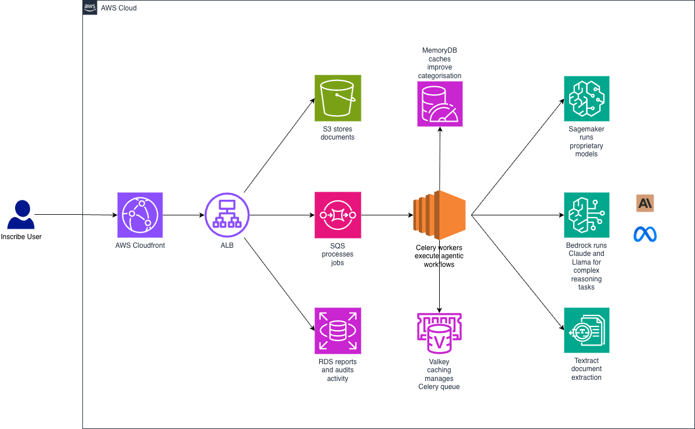

# DETECTING AND PREVENTING DOCUMENT FRAUD IN SECONDS WITH INSCRIBE AND AMAZON BEDROCK

In the financial and fintech industries, verifying the authenticity of documents such as bank statements, pay stubs, tax returns, or identity papers is a key step in credit underwriting and risk management workflows. However, the explosive growth of digital editing tools and Generative AI has made document fraud techniques increasingly sophisticated. Fraudsters can easily alter numbers, names, account balances, or transaction histories without leaving obvious editing marks or formatting errors.

To address this challenge, Inscribe—a leading document fraud detection platform—partnered with AWS to integrate **Amazon Bedrock** into its analysis engine. This combination enables processing and inspecting millions of complex financial documents in just seconds, helping financial institutions block fraud risk right at onboarding.

This article analyzes why traditional document inspection methods are no longer effective, how Inscribe leverages Amazon Bedrock to analyze document context, and the architecture structure for deploying the solution on AWS.

## The Challenge: Why do traditional document inspection tools fail against modern fraud?

Previously, document review processes heavily relied on basic Optical Character Recognition (OCR) technology combined with rule-based logic or manual inspection by underwriting specialists. This approach reveals serious limitations when facing next-generation fraud tactics:

1. **Logical and Numerical Fraud:** Fraudsters do not just modify images; they also manipulate total figures, ending balances, or transaction lists. Traditional OCR processes only read text but cannot verify mathematical logic across transaction line items.
2. **Slow Manual Underwriting Workflows:** Assigning specialists to read and cross-check every document page takes hours to days, creating a major bottleneck in customer onboarding experience.
3. **Evolving Synthetic Documents:** Attackers can use Generative AI to create entirely new documents with standard formatting that easily bypass fixed template-matching filters.

## What is the Inscribe and Amazon Bedrock solution?

Inscribe integrates advanced Foundation Models on **Amazon Bedrock** (such as Anthropic Claude) into its risk assessment platform. Instead of merely scanning surface text, the system leverages deep contextual reasoning of LLMs to "understand" structure, mathematical logic, and the integrity of financial data.

## Core features of the solution:

**Contextual & Mathematical Verification:** LLMs on Amazon Bedrock automatically recalculate balance addition/subtraction, cross-reference tax ratios and net pay, and detect hidden inconsistencies within reports.

* **Handling Diverse Document Types:** Flexible analysis across various financial forms such as bank statements, paystubs, tax forms, and personal ID documents without needing fixed template configurations for every bank or issuing institution.
* **Natural Language Explanations of Fraud Root Causes:** The system returns not only a risk score but also detailed reasons (e.g.,  *"Beginning balance does not match total transactions within the month"* ), allowing specialists to make swift decisions.
* **Real-time Processing:** Reduces complex document analysis time from hours down to just a few seconds.

## Overview of Inscribe's fraud analysis pipeline architecture on AWS

The solution architecture is designed as a fully automated workflow, combining AWS cloud services to ensure high performance and reliability:

1. **Document Ingestion:** Customers upload documents (PDFs, images) to the system via secure APIs, and data is safely stored in **Amazon S3**.
2. **Extraction & Layout Analysis:** The Inscribe platform extracts text structure, data field positions, and file metadata to detect software alteration footprints (such as Photoshop or Acrobat).
3. **Contextual Analysis with Amazon Bedrock:** Extracted data, along with specialized prompts, are sent to LLM models on **Amazon Bedrock**. The model executes logic cross-checks, verifies transaction consistency, and detects content anomalies.
4. **Risk Scoring & Decisioning:** The system aggregates file infrastructure fraud signals and contextual signals from Bedrock to produce a final risk index, automatically approving or routing to manual review.

## Deployment and Operational Features

**Strict Security and Data Compliance:** Using Amazon Bedrock ensures sensitive financial customer data is not used to retrain public models, complying with stringent security standards like SOC 2 and GDPR.

* **Serverless Scalability:** Leveraging fully managed AWS infrastructure enables Inscribe to easily scale and process millions of documents during peak credit application periods without system congestion.
* **Cost and Productivity Optimization:** Significantly reduces manual review workloads for Risk & Operations teams, helping enterprises cut operational expenses and boost customer conversion rates.

## Measurable Results

Applying Amazon Bedrock brings superior outcomes for Inscribe's financial institution clients:

* **Ultra-Fast Processing Speed:** Reduces document verification time to  **under a few seconds** , enabling instant loan approval or account opening.
* **Increased Fraud Detection Rate:** Accurately identifies sophisticated fraud cases that human eyes and traditional OCR tools miss completely.
* **Optimized Operational Costs:** Cuts manual review time by up to **80%** for underwriting specialists.

## Conclusion

Inscribe's application of Amazon Bedrock to document fraud detection demonstrates the practical power of Generative AI in solving complex risk management challenges. By combining file metadata analysis with LLM contextual reasoning on secure AWS infrastructure, this solution empowers financial institutions to proactively protect their systems against increasingly sophisticated fraud attempts.

**Original article link:** [https://aws.amazon.com/vi/blogs/machine-learning/how-inscribe-uses-amazon-bedrock-to-stop-document-fraud-in-second](https://aws.amazon.com/vi/blogs/machine-learning/how-inscribe-uses-amazon-bedrock-to-stop-document-fraud-in-seconds/)
