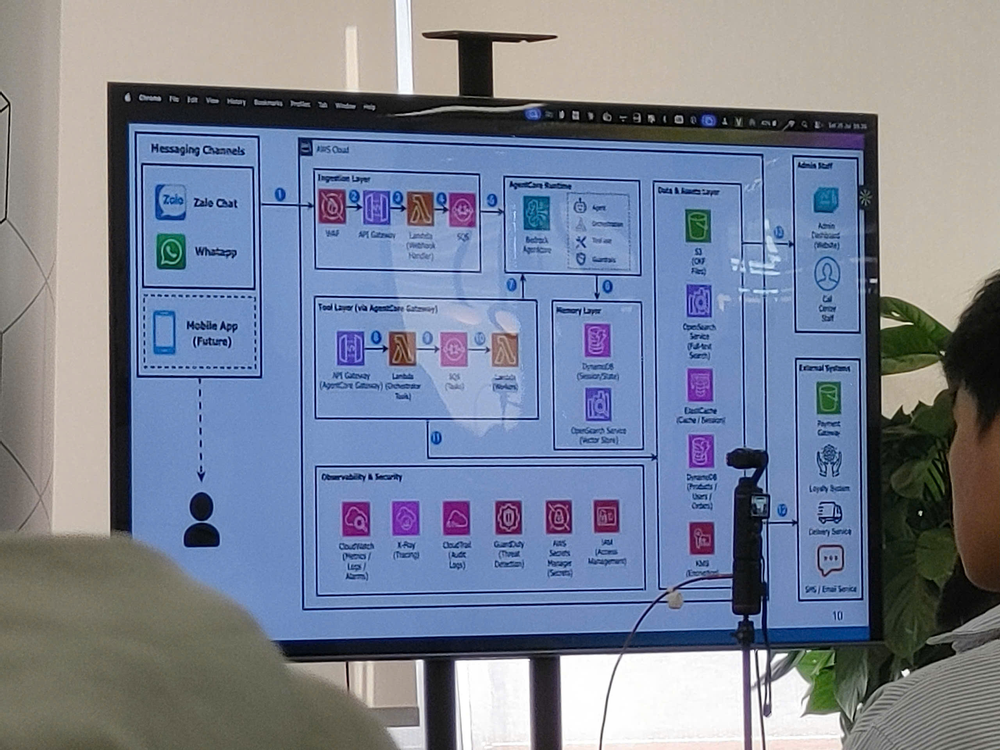
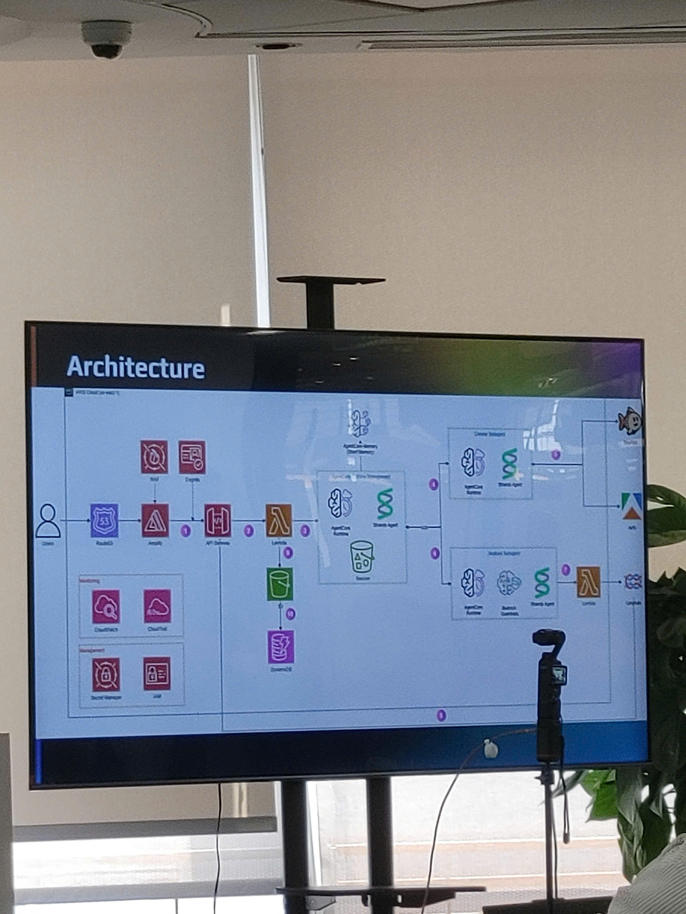

# Summary Report: “FCAJ - Agentic AI Build Week”

### Event Objectives

* Summarize and create a space to share experiences from the hands-on Hackathon competition, where builders collaborated to construct Agentic AI products.
* Drive the adoption of cloud technologies to modernize architecture, focusing on solving real-world enterprise "pain points".
* Encourage teamwork and inspire technology product development through pitching sessions from competing teams.

### Speakers

* **Joseph Marazota** - Head of Technology of ASEAN.
* **Nguyễn Gia Hưng** - Head of Solution Architect of Vietnam.
* Along with the presence of representatives from JIC Fund, AWS experts, and competing teams.

### Key Highlights

#### Traditional Operational Pain Points Addressed

Throughout the presentations, the competing teams analyzed and pointed out several severe bottlenecks in current operational systems across multiple fields:

* **Disrupted User Experience (Team One Team):** Forcing customers to download a new app, create an account, and exit their familiar chat interface to place an order creates significant friction, causing businesses to easily lose customers.
* **Fragmented Strategic Data (Team Signal Scout):** Business signals and competitor strategic data are often scattered across various reports. Analysts face difficulties synthesizing data to project return on investment (ROI) when transforming business models.
* **Cloud Architecture Design Overload (Team BL):** Manually creating architecture diagrams, estimating costs, and writing Infrastructure as Code (IaC) is time-consuming and error-prone when handling urgent customer requests.
* **Public Space Congestion (Team 3K):** Overcrowding at security gates and supermarkets poses persistent management challenges. Traffic flows lack real-time monitoring, resulting in delayed staff dispatching.
* **Anti-Money Laundering (AML) Alert Overload (Team Six Pillar):** Traditional transaction monitoring systems generate false positive rates of up to 90-95%. Manual reviews cost $20-25 USD and take up to 3 hours per case, wasting financial resources and causing analyst burnout.

#### Outstanding Technological Solutions from Competing Teams

* **AI Conversational Ordering (Team One Team):** Deploying an AI Agent directly integrated into Zalo/WhatsApp platforms for direct ordering, leveraging an Agent Core with memory capabilities to understand user intent and context.
* **Business Strategy Multi-Agent (Team Signal Scout):** Using information retrieval tools to bypass login walls, synthesizing strategic data, and combining with Amazon Bedrock Agent to analyze risks and forecast success.
* **SA Professional AI Native App (Team BL):** Building a natural language processing system to automatically generate AWS architecture diagrams alongside cost estimates and IaC code, saving Solution Architects days of work.
* **Sheper Crowd Monitoring System (Team 3K):** Combining AWS Kinesis Data Streams with Computer Vision models (YOLO) to detect and alert on crowd density in real time across zones.
* **Adaptive Workflow Engine (Team Six Pillar):** Proposing a Supervisor Agent model that manages Sub-Agents (for KYC, cash flow) to automate cross-reconciliation, significantly reducing false positives requiring manual review in the financial sector.

### Key Learnings

#### Design Thinking & Project Management

* **Business-first Mindset:** Through the teams' defense arguments, the biggest takeaway was that no matter how sophisticated or complex the underlying technology is, it matters less than whether the product thoroughly solves market "pain points".
* **Importance of Project Scoping:** Observing the successes and failures during pitch presentations showed that scoping features just enough to complete a functional MVP for a live proof-of-concept demo is far more vital than stuffing in too many ideas.

#### Technical Architecture

* **Multi-Agent Optimization:** Learned how to divide specialized agents and implement cross-checking mechanisms combined with Guardrails to minimize AI hallucinations in enterprise environments.
* **Practicality of Cloud Computing:** Gained a clearer understanding of how teams flexibly integrated AWS services such as Lambda, Kinesis, DynamoDB, and Amazon Bedrock to ensure seamless architecture performance at an effective cost.

### Application to Work & Study

* **AI System Development and Optimization:** Applying the Multi-Agent design mindset and cross-checking techniques shared at the event to refine ongoing RAG system projects built with the LangChain framework, improving retrieval and synthesis accuracy.
* **Upgrading Backend Architecture:** Applying lessons on cloud-based event-driven architecture to enhance backend API designs using frameworks like FastAPI or Django, optimizing asynchronous task processing and database communication.
* **Extracting Practical Strategies:** Learning project scoping and pitching skills from the competing teams to better prepare for practical phases in the AWS FCAJ program, as well as optimizing product development roadmaps for upcoming innovation competitions.

### Personal Experience and Takeaways from the Event

Even though I attended the event as an audience member listening in, following the teams' presentations provided me with deep and authentic takeaways:

* **Deeper Understanding of Real-World Pressure:** Through the teams' stories of teamwork, pulling all-nighters to resolve code conflicts, or fixing mispushed configuration files, I gained a vivid picture of the pressure, risk management, and crisis resolution in time-constrained tech projects.
* **Shift in Product Development Mindset:** Observing the sharp Q&A sessions between the judges and contestants, I realized that deep technical programming skills must always go hand in hand with a business mindset and a thorough understanding of the end user. Failing to answer the question "Who will use this product?" renders all technical efforts meaningless.
* **Inspiration from the Builder Community:** The vibrant atmosphere of the event and the passionate sharing from AWS Solution Architects gave me immense motivation. It drives me to continuously learn and step out of my comfort zone to officially sign up as a competitor in the near future.

#### Some event photos

