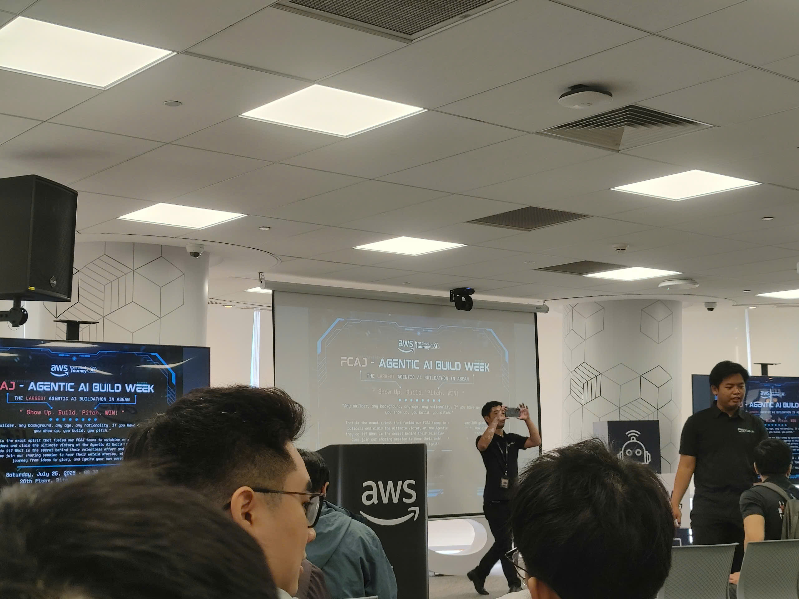

# Bài thu hoạch “FCAJ - Agentic AI Build Week”

### Mục Đích Của Sự Kiện

* Tổng kết và tạo không gian chia sẻ kinh nghiệm từ cuộc thi Hackathon thực chiến, nơi các builder cùng nhau xây dựng các sản phẩm Agentic AI.
* Thúc đẩy việc ứng dụng công nghệ đám mây để hiện đại hóa kiến trúc, tập trung giải quyết các bài toán "nỗi đau" (pain points) thực tế của doanh nghiệp.
* Khuyến khích tinh thần làm việc nhóm và truyền cảm hứng phát triển sản phẩm công nghệ thông qua các bài thuyết trình (pitching) từ các đội thi.

### Danh Sách Diễn Giả

* **Joseph Marazota** - Head of Technology of ASEAN.
* **Nguyễn Gia Hưng** - Head of Solution Architect of Vietnam .
* Cùng sự hiện diện của các đại diện từ JIC Fund, các chuyên gia AWS và các đội thi tranh tài.

### Nội Dung Nổi Bật

#### Các vấn đề của quy trình vận hành truyền thống được đặt ra

Xuyên suốt các phần thuyết trình, các đội thi đã phân tích và chỉ ra nhiều điểm nghẽn nghiêm trọng trong hệ thống hiện tại của nhiều lĩnh vực:

* **Trải nghiệm người dùng đứt gãy (One Team):** Việc ép khách hàng phải tải ứng dụng mới, tạo tài khoản và thoát khỏi giao diện chat quen thuộc để đặt hàng làm tạo ra nhiều ma sát, khiến doanh nghiệp dễ đánh mất khách hàng.
* **Phân mảnh dữ liệu chiến lược (Signal Scout):** Các tín hiệu kinh doanh và chiến lược của công ty đối thủ thường nằm rải rác trong nhiều báo cáo khác nhau. Chuyên gia phân tích gặp khó khăn trong việc tổng hợp dữ liệu để dự phóng tỷ suất hoàn vốn (ROI) khi chuyển đổi mô hình.
* **Quá tải thiết kế kiến trúc đám mây (Đội BL):** Quy trình tạo sơ đồ kiến trúc (Architecture), ước tính chi phí và viết Infrastructure as Code (IaC) hoàn toàn thủ công làm mất nhiều thời gian, dễ sinh ra lỗi nếu khách hàng yêu cầu gấp.
* **Ùn tắc không gian công cộng (Đội 3K):** Sự quá tải tại các khu vực cổng an ninh, siêu thị luôn gây khó khăn cho việc quản lý. Các luồng di chuyển không được giám sát theo thời gian thực khiến việc điều phối nhân sự trở nên chậm trễ.
* **Quá tải cảnh báo chống rửa tiền - AML (Đội Six Pillar):** Các hệ thống đánh giá giao dịch truyền thống đang sinh ra lượng cảnh báo sai (false positive) lên đến 90-95%. Việc rà soát thủ công tốn từ 20-25 USD và mất đến 3 giờ cho mỗi trường hợp, gây lãng phí tài chính và khiến chuyên viên kiệt sức.

#### Các giải pháp công nghệ nổi bật từ các đội thi

* **AI Conversational Ordering (Đội One Team):** Triển khai AI Agent tích hợp thẳng vào nền tảng Zalo/WhatsApp để người dùng đặt hàng trực tiếp, sử dụng Agent Core có bộ nhớ (memory) để hiểu ý định và ngữ cảnh người dùng.
* **Business Strategy Multi-Agent (Đội Signal Scout):** Dùng công cụ thu thập thông tin để vượt qua login wall, tổng hợp dữ liệu chiến lược và kết hợp với Amazon Bedrock Agent để phân tích rủi ro, dự báo thành công.
* **SA Professional AI Native App (Đội BL):** Xây dựng hệ thống phân tích ngôn ngữ tự nhiên để tự động sinh ra bản vẽ kiến trúc AWS, kèm theo báo giá và mã IaC, giúp các Solution Architect tiết kiệm nhiều ngày làm việc.
* **Hệ thống giám sát đám đông Sheper (Đội 3K):** Kết hợp luồng Kinesis Data Streams trên AWS với mô hình Computer Vision (YOLO) để phát hiện và cảnh báo mật độ đám đông theo thời gian thực tại các phân khu.
* **Adaptive Workflow Engine (Đội Six Pillar):** Đề xuất mô hình Supervisor Agent quản lý các Sub-Agent (về KYC, dòng tiền) để tự động hóa đối chiếu chéo, giảm thiểu đáng kể số lượng cảnh báo sai cần xử lý thủ công trong ngành tài chính.

### Những Gì Học Được

#### Tư Duy Thiết Kế & Quản Lý Dự Án

* **Ưu tiên nghiệp vụ (Business-first):** Thông qua phần biện luận của các đội thi, bài học lớn nhất là công nghệ đứng sau có xịn hay phức tạp đến đâu cũng không quan trọng bằng việc sản phẩm phải giải quyết triệt để "nỗi đau" (pain point) của thị trường.
* **Tầm quan trọng của việc khoanh vùng dự án (Scoping):** Quan sát sự thành bại trong các bài thuyết trình, có thể thấy việc giới hạn phạm vi tính năng vừa đủ để hoàn thành một MVP có khả năng chạy demo thực tế (proof of concept) quan trọng hơn việc nhồi nhét quá nhiều ý tưởng.

#### Kiến Trúc Kỹ Thuật

* **Tối ưu hóa Multi-Agent:** Học hỏi được cách phân chia các agent chuyên biệt và cơ chế kiểm tra chéo (double-check) kết hợp với các Guardrails để giảm thiểu tình trạng AI sinh ra ảo giác (hallucination) trong môi trường doanh nghiệp.
* **Tính thực tiễn của Cloud Computing:** Hiểu rõ hơn về cách các đội thi linh hoạt tích hợp các dịch vụ AWS như Lambda, Kinesis, DynamoDB và Amazon Bedrock để đảm bảo kiến trúc hoạt động trơn tru với chi phí hiệu quả.

### Ứng Dụng Vào Công Việc & Học Tập

* **Phát triển và tối ưu hóa hệ thống AI:** Áp dụng tư duy thiết kế Multi-Agent và kỹ thuật đối chiếu chéo được chia sẻ tại sự kiện để tinh chỉnh các dự án về hệ thống RAG đang xây dựng cùng framework LangChain, giúp nâng cao độ chính xác khi truy xuất và tổng hợp thông tin.
* **Nâng cấp kiến trúc Backend:** Vận dụng các bài học về kiến trúc hướng sự kiện (Event-driven) trên đám mây để cải thiện cách thiết kế các API backend bằng các framework như FastAPI hay Django, tối ưu hóa quá trình xử lý tác vụ bất đồng bộ và giao tiếp với cơ sở dữ liệu.
* **Đúc kết chiến lược thực chiến:** Học hỏi cách quản lý phạm vi dự án (scoping) và kỹ năng thuyết phục (pitching) từ các đội thi để có sự chuẩn bị tốt hơn cho các giai đoạn thực hành trong chương trình AWS FCAJ, cũng như tối ưu hóa lộ trình xây dựng sản phẩm tại các cuộc thi đổi mới sáng tạo sắp tới.

### Trải nghiệm và đúc kết từ sự kiện

Dù tham dự sự kiện với tư cách là một khán giả lắng nghe, quá trình theo dõi các đội thi báo cáo đã mang lại cho em nhiều đúc kết sâu sắc và chân thực:

* **Hiểu rõ hơn về áp lực thực chiến:** Qua lời kể của các đội về quá trình làm việc nhóm, thức đêm giải quyết xung đột code hay lỗi đẩy nhầm file cấu hình, em hình dung được rõ nét áp lực cũng như cách quản lý rủi ro và giải quyết khủng hoảng trong một dự án công nghệ có thời gian giới hạn.
* **Sự thay đổi trong tư duy làm sản phẩm:** Quan sát các phiên hỏi đáp sắc bén giữa ban giám khảo và thí sinh, em nhận ra rằng những kỹ năng chuyên môn sâu về lập trình phải luôn được song hành cùng tư duy kinh doanh và khả năng hiểu rõ đối tượng người dùng cuối. Việc không thể trả lời câu hỏi "Ai sẽ dùng sản phẩm này?" sẽ khiến mọi nỗ lực về mặt kỹ thuật trở nên vô nghĩa.
* **Nguồn cảm hứng từ cộng đồng Builder:** Không khí sôi nổi của sự kiện và sự chia sẻ nhiệt huyết từ các kiến trúc sư giải pháp của AWS đã tiếp thêm cho em rất nhiều động lực. Nó thôi thúc em không ngừng học hỏi và sẵn sàng bước ra khỏi vùng an toàn để chính thức ghi tên mình vào vị trí của những người tham gia thi đấu trong tương lai gần.

#### Một số hình ảnh khi tham gia sự kiện

