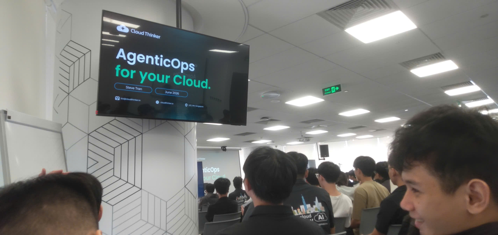

# Bài thu hoạch “FCAJ Community Day - June 2026”

### Mục Đích Của Sự Kiện

* Cung cấp góc nhìn thực tế và chia sẻ kinh nghiệm từ các chuyên gia doanh nghiệp về xu hướng phát triển hạ tầng đám mây (Cloud Infrastructure) và trí tuệ nhân tạo (AI).
* Bàn luận về vị thế và tương lai công việc của Cloud Engineer, DevOps, và Solution Architect trước sự bùng nổ của các công cụ lập trình AI.
* Phân tích các bài toán cốt lõi trong doanh nghiệp khi dịch chuyển hạ tầng lên Cloud: Quản trị chi phí (FinOps), Bảo mật (Security/Penetration Testing) và Tối ưu hóa vận hành hệ thống phức tạp.
* Giới thiệu và giải đáp thực tế về việc triển khai các giải pháp AI/MCP Server, Amazon Q/Bedrock và dự toán chi phí vận hành hạ tầng riêng tư (Private Network) trên AWS.

### Danh Sách Diễn Giả

* **Chuyên gia / Diễn giả chia sẻ về Cloud & AI** - Đại diện đến từ doanh nghiệp/AWS Community, trình bày về lộ trình sự nghiệp Cloud, bài toán rủi ro phức tạp (complexity) và ứng dụng AI vào FinOps & Security.
* **Toàn** - Diễn giả chia sẻ chi tiết về giải pháp Amazon Q, MCP Server và phân tích bài toán dự toán chi phí hạ tầng (Cost Estimation) trên AWS.

### Nội Dung Nổi Bật (Lý Thuyết Cốt Lõi)

#### Tác Động Của AI Đến Lộ Trình Phát Triển Kỹ Sư Cloud & DevOps

* **Sự chuyển dịch nhu cầu tuyển dụng:** Tốc độ triển khai code của các AI tool diễn ra rất nhanh, khiến doanh nghiệp ưu tiên những nhân sự có năng lực làm việc tốt với AI. Tuy nhiên, AI không thể thay thế hoàn toàn con người ở các vị trí cốt lõi như Solution Architect, DevOps hay Cloud Engineer.
* **Bài toán Quản trị độ phức tạp (Complexity):** Môi trường hạ tầng của các doanh nghiệp lớn rất phức tạp (bao gồm từ Source Code, Infrastructure đến Business Logic). Khi xảy ra sự cố (Incident), vẫn cần đội ngũ kỹ sư giỏi để đưa ra quyết định nhanh chóng và chính xác.
* **Ứng dụng AI vào FinOps & Security:**
  * *FinOps:* AI có khả năng hiểu cả hạ tầng AWS lẫn tài chính, từ đó hỗ trợ tối ưu hóa chi phí tốt hơn so với nhân sự tài chính thuần túy.
  * *Security:* Phát triển các công cụ AI có khả năng Pentest tự động, đánh giá rủi ro hạ tầng (IaC) và kiểm soát Security Log toàn hệ thống.

#### Phân Tích Mạng Private & Dự Toán Chi Phí AWS (Cost Estimation)

* **Thiết lập kết nối riêng tư (Private Setup):** Việc dựng hệ thống MCP Server hoặc tích hợp Chatbot riêng tư trong doanh nghiệp đòi hỏi kết hợp nhiều dịch vụ như EC2, Application Load Balancer (ALB), Route 53 Resolver và AWS Secrets Manager.
* **Chi phí vận hành cố định & biến đổi:**
  * Các chi phí cố định cho hạ tầng private (Route 53 Resolver, ALB, EC2) có thể dao động từ **$250 - $350/tháng** chưa tính dung lượng dữ liệu truyền tải.
  * Chi phí biến đổi phụ thuộc vào lượng dữ liệu Data Transfer In/Out và quy mô truy vấn của người dùng trong doanh nghiệp.

---

### Những Gì Học Được & Ứng Dụng

#### Thay Đổi Tư Duy Phát Triển Phần Mềm

* **Sử dụng AI như một trợ lực mạnh mẽ:** Thay vì lo lắng AI thay thế công việc, kỹ sư cần chủ động làm chủ các công cụ AI để gia tăng tốc độ coding, triển khai và tự động hóa công việc thường nhật.
* **Tư duy quản trị chi phí Cloud (FinOps):** Mọi thiết kế kiến trúc trên đám mây đều gắn liền với chi phí. Việc tính toán trước chi phí vận hành (cố định và biến đổi) là kỹ năng bắt buộc khi tư vấn hoặc thiết kế giải pháp cho doanh nghiệp.

#### Thực Tế Triển Khai Hạ Tầng Đám Mây (IaC)

* Lựa chọn giữa giải pháp Public và Private luôn là sự đánh đổi giữa tính bảo mật và chi phí vận hành. Việc hiểu rõ cơ chế hoạt động của các điểm cuối (Endpoint), Route 53 Resolver và VPC giúp tối ưu hóa luồng đi của dữ liệu mà vẫn giữ chi phí ở mức hợp lý.

---

### Ứng Dụng Vào Công Việc & Học Tập

* **Tối ưu hóa kiến trúc bảo mật cho dự án:** Áp dụng mô hình lưu trữ Credential an toàn bằng AWS Secrets Manager và thiết lập luồng truy vấn nội bộ qua Private Endpoint để bảo vệ dữ liệu nhạy cảm.
* **Hoạch định ngân sách Cloud bài bản:** Khi xây dựng các hệ thống Demo/Workshop hoặc dự án thực tế, luôn tạo bảng ước tính chi phí (Cost Estimation) chi tiết cho từng thành phần (EC2, ALB, DNS Resolver, Data Transfer) trước khi triển khai.
* **Nâng cao năng lực giải quyết sự cố (Troubleshooting):** Tập trung trau dồi bản chất cốt lõi về mạng (Networking), hệ thống và bảo mật để có khả năng xử lý nhanh các sự cố phức tạp mà AI chưa thể thay thế hoàn toàn.

---

### Trải nghiệm và đúc kết từ sự kiện

* **Tính kết nối cộng đồng:** Sự kiện tạo môi trường giao lưu trực tiếp giữa các bạn sinh viên, kỹ sư trẻ với các chuyên gia dày dạn kinh nghiệm đến từ nhiều doanh nghiệp công nghệ.
* **Bài học về thực tế doanh nghiệp:** Những bài toán được chia sẻ không chỉ dừng lại ở mặt lý thuyết mà xoay quanh các rào cản thực tế như ngân sách, bảo mật dữ liệu nội bộ và cách xử lý sự cố trong môi trường Production.
* **Định hướng sự nghiệp rõ ràng:** Giúp bản thân củng cố niềm tin vào lộ trình phát triển kỹ sư Cloud/DevOps, đồng thời xác định rõ các kỹ năng bổ trợ cần thiết (FinOps, Security, AI Tooling) để gia tăng lợi thế cạnh tranh.

#### Một số hình ảnh khi tham gia sự kiện

