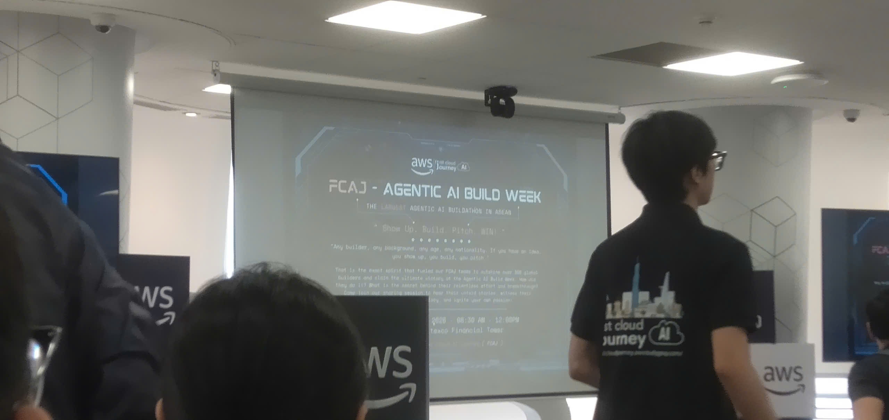

# Bài thu hoạch "FCAJ - Agentic AI Build Week"

### Mục Đích Của Sự Kiện

- Chia sẻ kinh nghiệm từ cuộc thi Hackathon thực chiến, nơi các đội thi cùng nhau xây dựng sản phẩm Agentic AI.
- Thúc đẩy việc áp dụng điện toán đám mây nhằm hiện đại hóa kiến trúc, tập trung giải quyết các bài toán thực tiễn của doanh nghiệp.
- Truyền cảm hứng phát triển sản phẩm công nghệ thông qua các phiên thuyết trình (pitching).

### Danh Sách Diễn Giả

- **Joseph Marazota** - Trưởng phòng Công nghệ khu vực ASEAN.
- **Nguyễn Gia Hưng** - Trưởng phòng Kiến trúc giải pháp tại Việt Nam.
- Cùng sự tham gia của đại diện Quỹ JIC, các chuyên gia AWS và các đội thi.

### Nội Dung Nổi Bật

#### Thực trạng vận hành truyền thống và những nút thắt

Xuyên suốt các bài thuyết trình, các đội đã chỉ ra nhiều điểm nghẽn trong hệ thống hiện hữu:

- **Trải nghiệm người dùng bị gián đoạn (Đội One Team):** Yêu cầu khách hàng tải ứng dụng mới, tạo tài khoản và rời khỏi giao diện chat quen thuộc để đặt hàng, khiến doanh nghiệp dễ mất khách hàng tiềm năng.
- **Dữ liệu chiến lược bị phân mảnh (Đội Signal Scout):** Các tín hiệu kinh doanh và chiến lược của đối thủ thường nằm rải rác trong nhiều báo cáo, khiến chuyên gia phân tích khó tổng hợp để dự báo ROI khi chuyển đổi mô hình kinh doanh.
- **Quá tải thiết kế hạ tầng đám mây (Đội BL):** Việc xây dựng sơ đồ kiến trúc, ước tính chi phí và viết mã IaC thủ công tốn nhiều thời gian và dễ phát sinh lỗi khi đáp ứng yêu cầu gấp của khách hàng.
- **Tắc nghẽn không gian công cộng (Đội 3K):** Tình trạng quá tải tại khu vực cổng an ninh, siêu thị gây khó khăn trong quản lý. Các luồng di chuyển thiếu giám sát thời gian thực khiến điều phối nhân sự bị chậm trễ.
- **Quá tải cảnh báo chống rửa tiền - AML (Đội Six Pillar):** Hệ thống giám sát giao dịch truyền thống sinh ra lượng cảnh báo sai (false positive) lên đến 90-95%. Chi phí rà soát thủ công từ 20-25 USD và mất 3 giờ mỗi trường hợp, gây lãng phí tài nguyên và kiệt sức cho chuyên viên.

#### Các giải pháp công nghệ đột phá từ các đội thi

- **AI Conversational Ordering (Đội One Team):** Triển khai AI Agent tích hợp trực tiếp trên Zalo/WhatsApp cho phép đặt hàng ngay trong khung chat, sử dụng Agent Core có khả năng ghi nhớ ngữ cảnh và thấu hiểu ý định người dùng.
- **Business Strategy Multi-Agent (Đội Signal Scout):** Sử dụng công cụ thu thập dữ liệu để vượt qua rào cản đăng nhập, tổng hợp chiến lược đối thủ và kết hợp Amazon Bedrock Agent nhằm phân tích rủi ro, dự báo tỷ lệ thành công.
- **SA Professional AI Native App (Đội BL):** Phát triển hệ thống xử lý ngôn ngữ tự nhiên để tự động tạo sơ đồ kiến trúc AWS, kèm báo giá và mã IaC, giúp các Kiến trúc sư giải pháp tiết kiệm nhiều ngày công.
- **Hệ thống giám sát đám đông Sheper (Đội 3K):** Tích hợp Kinesis Data Streams và mô hình Computer Vision (YOLO) để phát hiện, cảnh báo mật độ đám đông theo thời gian thực tại các khu vực.
- **Adaptive Workflow Engine (Đội Six Pillar):** Đề xuất mô hình Supervisor Agent quản lý các Sub-Agent (về KYC, dòng tiền) nhằm tự động hóa đối chiếu, giảm đáng kể cảnh báo sai cần xử lý thủ công trong lĩnh vực tài chính.

### Những Gì Học Được

#### Tư duy thiết kế và quản trị dự án

Qua quá trình bảo vệ của các đội, có thể thấy rằng việc xuất phát từ một vấn đề cụ thể của người dùng sẽ giúp định hướng phát triển rõ ràng hơn là bắt đầu từ một công nghệ mới rồi mới tìm kiếm ứng dụng, quan sát và thấu hiểu khách hàng mục tiêu trước khi bắt tay vào viết code.

#### Kiến trúc kỹ thuật

- **Tối ưu hóa mô hình Multi-Agent:** Học được cách phân chia các agent chuyên biệt và áp dụng cơ chế kiểm tra chéo kết hợp Guardrails để giảm thiểu tình trạng AI tạo ra thông tin ảo (hallucination).
- **Tính thực tiễn của điện toán đám mây:** Hiểu rõ cách các đội thi tích hợp linh hoạt AWS Lambda, Kinesis, DynamoDB và Amazon Bedrock để đảm bảo vận hành với chi phí tối ưu.

### Ứng Dụng Vào Công Việc & Học Tập

Học hỏi kỹ năng quản lý phạm vi và thuyết trình từ các đội thi, chuẩn bị tốt hơn cho các giai đoạn thực hành trong chương trình AWS FCAJ và các cuộc thi Hackathon sắp tới.

#### Một số hình ảnh khi tham gia sự kiện

