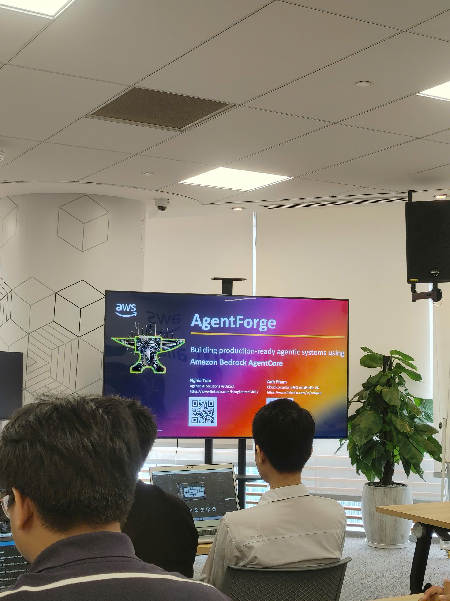

# Bài thu hoạch “AWS FCAJ Agent Forge - Deepdive Ngày 1”

### Mục Đích Của Sự Kiện

* Cung cấp nền tảng tổng quan (Introduction) về hệ sinh thái Agentic AI và các cấp độ tự chủ của trí tuệ nhân tạo.
* Đi sâu vào phân tích kiến trúc hạ tầng Amazon Bedrock AgentCore cấp độ L300 (cấp độ chuyên sâu), tập trung vào 3 thành phần lõi: Runtime, Gateway và Identity.
* Trải nghiệm môi trường lập trình thế hệ mới (Vibe Coding) thông qua việc cấu hình và thiết lập dự án AI Agent cơ bản.

### Danh Sách Diễn Giả

* **Nghĩa** - Chuyên gia AWS, phụ trách trình bày các lý thuyết chuyên sâu về kiến trúc AgentCore L300.
* **Hải Anh** - Chuyên gia AWS, trực tiếp dẫn dắt phần cấu hình môi trường và thực hành (Hands-on Lab).

### Nội Dung Nổi Bật (Lý Thuyết Cốt Lõi)

#### Kiến Trúc Amazon Bedrock AgentCore L300

* **Runtime:** Cung cấp môi trường thực thi hoàn toàn phi máy chủ (Serverless), sử dụng công nghệ MicroVM để cách ly an toàn từng phiên giao tiếp của người dùng. Hệ thống tự động mở rộng (auto-scaling) và tính phí linh hoạt dựa trên lưu lượng sử dụng thực tế.
* **Identity:** Hoạt động như một chốt chặn bảo mật, kiểm soát danh tính và quyền hạn. AgentCore sử dụng cơ chế chuyển đổi token (Workload Access Token - WAT) để mã hóa danh tính người dùng trước khi giao tiếp với các công cụ bên ngoài, đảm bảo không rò rỉ dữ liệu nhạy cảm.
* **Gateway:** Lớp middleware quản trị trung tâm, giúp chuẩn hóa các kết nối từ hàng trăm Agent đến các API bên ngoài. Gateway tích hợp quy trình Human-in-the-loop, cho phép quản trị viên con người can thiệp phê duyệt hoặc từ chối các quyết định quan trọng của AI.

#### Nội Dung Thực Hành (Hands-on Lab)

Phần thực hành tập trung vào việc thiết lập môi trường Vibe Coding và triển khai Agent thông qua giao tiếp tự nhiên với trợ lý AI Kiro. Nội dung buổi thực hành bao gồm các phần:

* **Thiết lập IDE và môi trường:** Cài đặt các công cụ phụ thuộc (Node.js, Python, AWS CDK, AgentCore CLI) và cấu hình thông tin xác thực AWS. Thiết lập tài liệu định hướng (`steering` document) để cấp ngữ cảnh cho trợ lý Kiro.
* **Khởi tạo Agent cơ bản (Deploy a basic agent):** Sử dụng dòng lệnh `agent core create` để hệ thống tự động sinh mã nguồn. Cấu hình LLM được điều chỉnh sang mô hình `Nova Micro` nhằm tối ưu hóa chi phí phát triển.
* **Khởi chạy môi trường kiểm thử cục bộ:** Sau khi mã nguồn được tạo, thao tác tiếp theo là điều hướng terminal vào thư mục gốc của dự án (ví dụ cụ thể tại `C:\Users\khanh\AgentCoreProject> cd AgentCoreProject`) và khởi chạy môi trường phát triển cục bộ bằng lệnh `agentcore dev`.

### Những Gì Học Được & Ứng Dụng

#### Thay Đổi Tư Duy Phát Triển Phần Mềm

* **Sức mạnh của Vibe Coding:** Dù chỉ mới đi được những bước thiết lập đầu tiên, việc quan sát AI IDE tự động đọc ngữ cảnh và sinh mã nguồn Agent chứng minh sự dịch chuyển rõ nét từ việc "code tay" sang "mô tả giải pháp".
* **Tối ưu hóa chi phí đám mây:** Kỹ năng tùy chỉnh tệp cấu hình LLM để chuyển sang các mô hình nhỏ gọn, chi phí thấp trong giai đoạn kiểm thử cục bộ là một phản xạ thực tiễn rất quan trọng để tránh phát sinh chi phí ngoài ý muốn khi làm việc trên tài khoản cá nhân.

#### Thực Tế Triển Khai Hạ Tầng Đám Mây (IaC)

- Việc phải chờ đợi mòn mỏi khi chạy lệnh `agentcore dev` là một minh chứng thực tế cho thấy quá trình tự động hóa triển khai hạ tầng đám mây không bao giờ diễn ra tức thì. Trải nghiệm này mang lại bài học xương máu về việc phải dự trù kỹ lưỡng thời gian triển khai (deployment time) khi thiết kế và vận hành các hệ thống RAG hoặc Chatbot Trợ lý Pháp luật phức tạp sau này, tránh gây gián đoạn dịch vụ cho người dùng cuối.

### Ứng Dụng Vào Công Việc & Học Tập

* **Nâng cấp bảo mật cho kiến trúc RAG:** Khái niệm về Identity và cơ chế Workload Access Token (WAT) từ AgentCore cung cấp một khuôn mẫu xuất sắc để ứng dụng vào việc bảo mật hệ thống Chatbot Trợ lý Pháp luật. Bằng cách thiết lập một lớp Gateway tương tự, các luồng truy xuất văn bản luật từ cơ sở dữ liệu RDS PostgreSQL (pgvector) hay các lệnh gọi đến Amazon Bedrock sẽ được kiểm soát định danh chặt chẽ, đảm bảo tính riêng tư và phân quyền truy cập an toàn.
* **Tối ưu hóa quy trình phát triển với Vibe Coding:** Việc tận dụng các IDE tích hợp AI (như Kiro) thay đổi hoàn toàn cách tiếp cận khi xây dựng các API bằng FastAPI hay cấu hình LangChain. Thay vì mất thời gian viết các đoạn mã boilerplate cơ bản, có thể dùng ngôn ngữ tự nhiên để AI tự động sinh mã, từ đó dành toàn bộ thời gian để giải quyết các bài toán hóc búa hơn về luồng xử lý bất đồng bộ (chẳng hạn như việc tối ưu hóa hiệu năng bằng `asyncio.to_thread`) hoặc tinh chỉnh chiến lược nén tri thức.
* **Quản lý hạ tầng đám mây (IaC) hiệu quả hơn:** Trải nghiệm chờ đợi cấu hình từ lệnh `agentcore dev` là bài học thiết thực về quản lý tài nguyên. Khi xây dựng luồng Ingestion lưu trữ tài liệu lên S3, SQS hay DynamoDB, việc ứng dụng tự động hóa hạ tầng (CloudFormation/CDK) cần được quy hoạch bài bản. Cần tách biệt rõ ràng môi trường phát triển (dev) và môi trường vận hành (production) để tránh việc thời gian cấp phát tài nguyên đám mây làm gián đoạn quá trình kiểm thử phần mềm.

### Trải nghiệm và đúc kết từ sự kiện

* **Thực tế phũ phàng của việc triển khai Cloud:** Điểm nhấn đáng nhớ nhất của buổi học không hẳn nằm ở những lý thuyết trơn tru, mà lại chính là khoảnh khắc cả khán phòng cùng "ngồi nhìn màn hình" chờ hệ thống chạy lệnh `agentcore dev`. Trải nghiệm này phản ánh một sự thật rất đặc trưng của nghề kỹ sư phần mềm: tự động hóa hạ tầng đám mây rất mạnh mẽ, nhưng việc cấp phát tài nguyên (provisioning) thực tế tốn khá nhiều thời gian và luôn cần sự kiên nhẫn.
* **Sự chuyển dịch từ "Thợ gõ code" sang "Kiến trúc sư giải pháp":** Việc chứng kiến AI đọc hiểu tài liệu định hướng (`steering` document) và tự động thiết lập toàn bộ khung sườn dự án mang lại một góc nhìn mới mẻ. Lập trình viên hiện đại đang dần bước ra khỏi việc cặm cụi gõ từng dòng cú pháp, tiến tới vai trò của một người đạo diễn – nơi kỹ năng mô tả bài toán, thiết kế hệ thống và định hướng luồng nghiệp vụ trở nên quan trọng hơn bao giờ hết.
* **Bước đệm nền tảng là thử thách lớn nhất:** Việc toàn bộ thời gian thực hành bị dồn vào khâu chuẩn bị môi trường (cài đặt CLI, CDK, cấu hình Access Key) cho thấy rào cản lớn nhất khi tiếp cận các công nghệ Cloud mới thường không nằm ở code, mà nằm ở việc thiết lập hệ sinh thái. Đúc kết này giúp tôi chuẩn bị tâm lý và kỹ năng khắc phục sự cố (troubleshooting) tốt hơn cho các dự án phức tạp sắp tới tại giảng đường đại học cũng như các sân chơi công nghệ lớn.

#### Một số hình ảnh khi tham gia sự kiện

