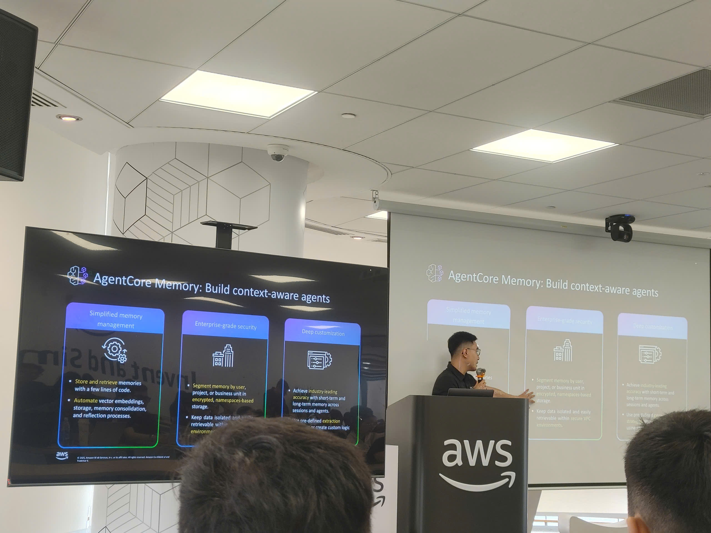
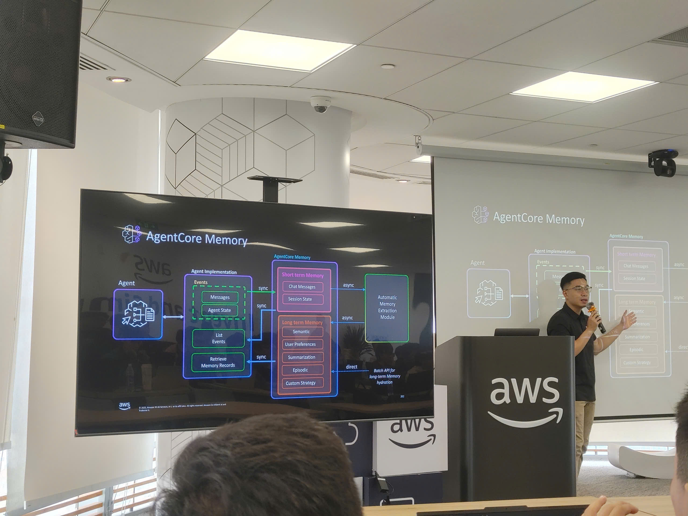

# Summary Report: “AWS FCAJ Agent Forge - Deepdive Day 2”

### Event Objectives

* **Continuing the learning path from Day 1** , diving deep into three advanced components of the Agentic AI system on Amazon Bedrock Agent Core: Memory, Observability, and Evaluation.
* **Analyzing auxiliary features (extensions)** that enhance the power of AI Agents, such as Policy, Browser, Code Interpreter, Payment, Registry, and the Optimization process.
* **Combining practical application (Hands-on Lab)** to directly deploy an AI Agent integrated with Tools and configure Agent Core Memory.

### Speakers

* **Nghia** - AWS Expert, continuing to lead the in-depth theoretical foundation and system architecture.
* **Hai Anh** - AWS Expert, providing detailed guidance on operations using the Kiro tool and Command Line Interface (CLI).

### Key Highlights (Core Theory)

#### Memory System

* **Core Problem:** Context Window limits (e.g., Claude models have a limit of 256k to 1 million tokens) prevent Agents from remembering the entire context if the conversation thread is too long. Memory is the mandatory solution for AI to automatically personalize the user experience.
* **Memory Classification:**
  * *Short-term Memory:* Stores raw data of conversation messages.
  * *Long-term Memory:* Runs asynchronous background processes to extract key insights from Short-term memory and stores them as vectors. Storage strategies include: Summary, User Preference, Semantic, and Episodic^.
* **Namespace Mechanism:** Designed in a hierarchical format to isolate memory data by Strategy > Actor (user) > Session, thereby accelerating extraction using Semantic Search algorithms and saving tokens.

#### Observability

* Provides "eyes" for developers through three pillars: Logs, Traces, and Metrics (using the OpenTelemetry standard).
* Helps track latency, token costs (cost visibility), and traffic to assess the root cause of issues (e.g., overly long user queries, tool errors, or overloaded GPU infrastructure).

#### Evaluation System

* Helps detect blind spots such as AI Hallucination and Fault reasoning that lead to incorrect Tool calls.
* Provides 13 built-in evaluators to score Correctness at 3 levels: Session (Overall objective), Trace/Choice (Accuracy of individual answers), and Span (Optimal level of tool usage). Can operate flexibly in On-demand mode (for Dev environments) and Online mode (for Production environments).

#### Extended Features

* **Policy:** Uses the Cedar language to set highly granular permissions, granting access based on the principle of least privilege to block invalid Agent actions in Production environments.
* **Browser & Code Interpreter:** Virtual environments (sandboxes) provided by AWS enabling Agents to simulate web browsing or write and execute code safely.

### Hands-on Lab

* Install an AI-integrated IDE (like Kiro) combined with configuring the `steering` document (a design standard orientation document specifying the use of the AWS US-West/East Region and the Claude Sonet model).
* Initialize the project using the CLI command `agent core create` from the Starter Toolkit, structuring the skeleton including Python configuration files and the API system.
* Configure a low-cost model (`Nova Micro`) in the `LLM.py` file to optimize costs during development practice.
* Declare Strands Agent Tools in the System Prompt to program tools for the AI to look up virtual order statuses (Refund and Return Assistant).
* Create storage functionality via CLI using the command integrating the Memory Module, aiming for the Agent to remember the user's context.
* Launch the testing environment Agent Runtime Endpoint (Local Web Server) via the `agent core dev` command to communicate directly with the LLM API.

### Key Takeaways & Applications

* **RAG Data Management Strategy:** The lesson on Namespace structure and Semantic Search in partitioning long-term data (Long-term Memory) is a perfect solution to apply immediately to the Legal Assistant Chatbot project. Instead of letting the Agent search through a massive Vector Database, hierarchically structuring legal documents (e.g., by domain -> department -> circular) will significantly save tokens and reduce latency.
* **Secure Authorization (Policy):** Using access control languages (like Cedar) brings a mindset of strict security mechanisms (Guardrails). When integrated with the AWS architecture, this prevents situations where AI arbitrarily modifies data inside the RDS PostgreSQL database or leaks sensitive internal policies.
* **Standardizing Model Evaluation (Evaluation):** Instead of merely evaluating the Chatbot by asking a few intuitive questions, I realized the necessity of building a standardized evaluation set grounded in Ground Truth, such as Session, Trace, and Span levels. This mindset clearly directs how to set up automated testing scenarios (A/B testing) and use the Observability system to continuously optimize the development lifecycle of an AI Agent (Red Teaming, Optimization).

#### Some event photos

