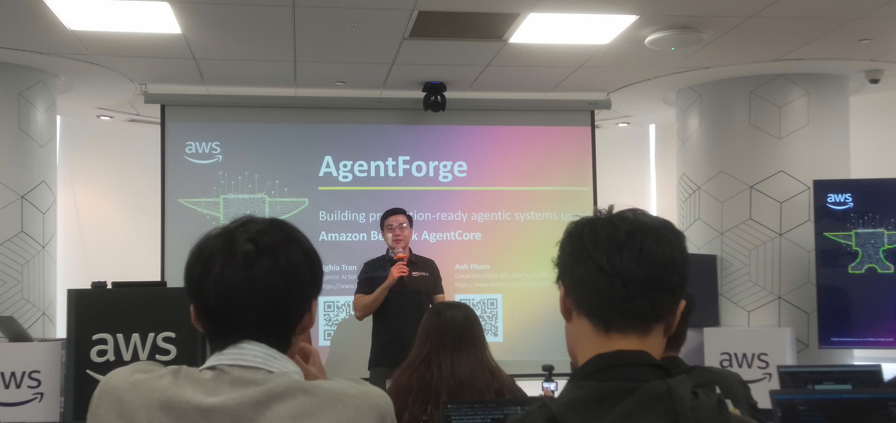

# Bài thu hoạch "AWS FCAJ Agent Forge - Deepdive Ngày 1"

### Mục Đích Của Sự Kiện

- Giới thiệu tổng quan về hệ sinh thái Agentic AI và các cấp độ tự chủ của trí tuệ nhân tạo.
- Phân tích chuyên sâu kiến trúc Amazon Bedrock AgentCore ở cấp độ L300, tập trung vào ba thành phần cốt lõi: Runtime, Gateway và Identity.
- Trải nghiệm môi trường lập trình thế hệ mới (Vibe Coding) thông qua việc cấu hình và thiết lập dự án AI Agent cơ bản.

### Danh Sách Diễn Giả

- **Nghĩa** - Chuyên gia AWS, phụ trách trình bày lý thuyết chuyên sâu về kiến trúc AgentCore L300.
- **Hải Anh** - Chuyên gia AWS, trực tiếp dẫn dắt phần cấu hình môi trường và thực hành (Hands-on Lab).

### Nội Dung Nổi Bật (Lý Thuyết Cốt Lõi)

#### Kiến Trúc Amazon Bedrock AgentCore L300

- **Runtime:** Cung cấp môi trường thực thi hoàn toàn không máy chủ (Serverless), sử dụng công nghệ MicroVM để cách ly bảo mật từng phiên giao tiếp của người dùng. Hệ thống tự động mở rộng (auto-scaling) và tính phí linh hoạt dựa trên lưu lượng sử dụng thực tế.
- **Identity:** Đóng vai trò là lớp bảo mật then chốt, kiểm soát danh tính và quyền hạn truy cập. AgentCore sử dụng cơ chế Workload Access Token (WAT) để mã hóa danh tính người dùng trước khi giao tiếp với các công cụ bên ngoài, đảm bảo không rò rỉ dữ liệu nhạy cảm.
- **Gateway:** Lớp middleware quản trị tập trung, chuẩn hóa kết nối từ hàng trăm Agent đến các API bên ngoài. Gateway tích hợp quy trình Human-in-the-loop, cho phép quản trị viên can thiệp phê duyệt hoặc từ chối các quyết định quan trọng của AI.

#### Nội Dung Thực Hành (Hands-on Lab)

Phần thực hành tập trung vào thiết lập môi trường Vibe Coding và triển khai Agent thông qua giao tiếp ngôn ngữ tự nhiên với trợ lý AI Kiro. Các bước chính bao gồm:

- **Thiết lập IDE và môi trường:** Cài đặt các công cụ cần thiết (Node.js, Python, AWS CDK, AgentCore CLI) và cấu hình thông tin xác thực AWS. Thiết lập tài liệu định hướng (steering document) để cung cấp ngữ cảnh cho trợ lý Kiro.
- **Khởi tạo Agent cơ bản (Deploy a basic agent):** Sử dụng lệnh `agentcore create` để hệ thống tự động sinh mã nguồn. Cấu hình LLM được điều chỉnh sang mô hình `Nova Micro` nhằm tối ưu chi phí phát triển.
- **Khởi chạy môi trường kiểm thử cục bộ:** Sau khi mã nguồn được tạo, di chuyển terminal vào thư mục gốc của dự án và khởi chạy môi trường phát triển cục bộ bằng lệnh `agentcore dev`.

### Ứng Dụng Vào Công Việc & Học Tập

- **Nâng cấp bảo mật cho kiến trúc RAG:** Khái niệm Identity và cơ chế Workload Access Token (WAT) từ AgentCore cung cấp một khuôn mẫu xuất sắc để ứng dụng vào bảo mật hệ thống Chatbot. Bằng cách thiết lập lớp Gateway tương tự, các luồng truy xuất dữ liệu và lệnh gọi đến Amazon Bedrock sẽ được kiểm soát định danh chặt chẽ, đảm bảo tính riêng tư và phân quyền truy cập an toàn.
- **Tối ưu hóa quy trình phát triển với Vibe Coding:** Việc tận dụng các IDE tích hợp AI (như Kiro) thay đổi hoàn toàn cách tiếp cận khi xây dựng API hay cấu hình LangChain. Thay vì mất thời gian viết các đoạn mã boilerplate, có thể dùng ngôn ngữ tự nhiên để AI tự động sinh mã, từ đó dành toàn bộ thời gian để giải quyết các bài toán hóc búa hơn về luồng xử lý và tối ưu hiệu năng.
- **Quản lý hạ tầng đám mây (IaC) hiệu quả hơn:** Trải nghiệm chờ đợi cấu hình từ lệnh `agentcore dev` là bài học thực tế về quản lý tài nguyên. Khi xây dựng luồng Ingestion lưu trữ tài liệu lên S3, SQS hay DynamoDB, việc ứng dụng tự động hóa hạ tầng cần được quy hoạch bài bản, tách biệt rõ ràng môi trường phát triển và vận hành để tránh thời gian cấp phát tài nguyên đám mây làm gián đoạn quá trình kiểm thử.

#### Một số hình ảnh khi tham gia sự kiện

