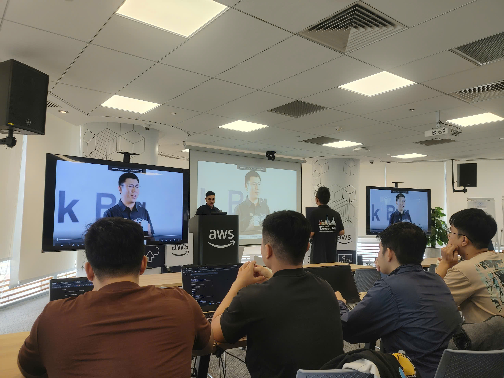
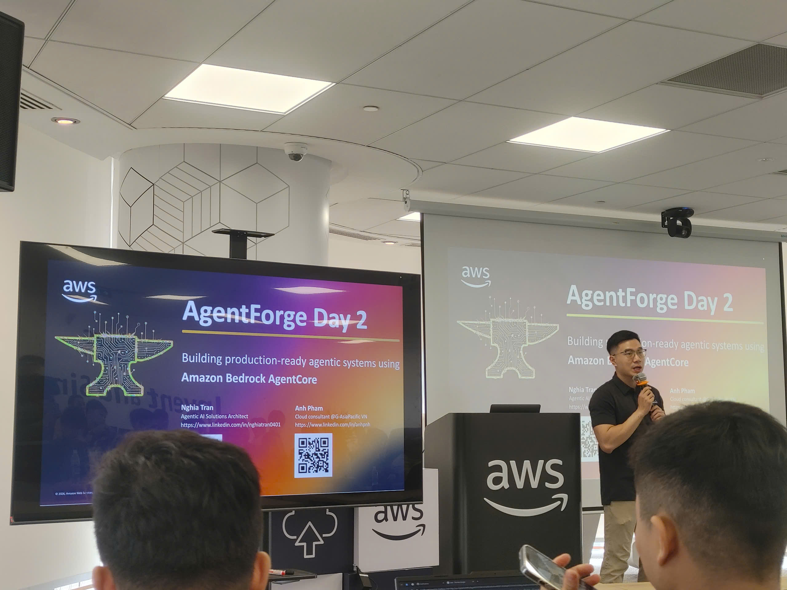

# Bài thu hoạch “AWS FCAJ Agent Forge - Deepdive Ngày 2”

### Mục Đích Của Sự Kiện

- Tiếp nối lộ trình kiến thức của Ngày 1, đi sâu vào ba thành phần nâng cao của hệ thống Agentic AI trên Amazon Bedrock Agent Core: Memory (Bộ nhớ), Observability (Giám sát) và Evaluation (Đánh giá).
- Phân tích các tính năng phụ trợ (phần mở rộng) giúp tăng cường sức mạnh cho AI Agent như Policy, Browser, Code Interpreter, Payment, Registry, và quá trình Optimization.
- Kết hợp thực hành (Hands-on Lab) triển khai trực tiếp một AI Agent có tích hợp công cụ (Tools) và cấu hình Agent Core Memory.

### Danh Sách Diễn Giả

* **Nghĩa** - Chuyên gia từ AWS, tiếp tục dẫn dắt chuyên sâu về nền tảng lý thuyết và kiến trúc hệ thống.
* **Hải Anh** - Chuyên gia từ AWS, hướng dẫn chi tiết quá trình thao tác trên công cụ Kiro và dòng lệnh (CLI).

### Nội Dung Nổi Bật (Lý Thuyết Chuyên Sâu)

#### Hệ thống Bộ nhớ (Memory)

* **Vấn đề cốt lõi:** Các giới hạn về Context Window (ví dụ: mô hình Claude có giới hạn từ 256k đến 1 triệu token) khiến Agent không thể nhớ toàn bộ ngữ cảnh nếu chuỗi hội thoại quá dài. Memory là giải pháp bắt buộc để AI tự động cá nhân hóa trải nghiệm người dùng.
* **Phân loại bộ nhớ:**
  * *Short-term Memory:* Lưu trữ nguyên bản (raw data) các đoạn tin nhắn hội thoại.
  * *Long-term Memory:* Chạy tiến trình nền bất đồng bộ (asynchronously) để trích xuất những ý chính (key insights) từ Short-term và lưu dưới dạng vector. Các chiến lược lưu trữ (strategy) bao gồm: Summary (Tóm tắt), User Preference (Sở thích người dùng), Semantic (Kiến thức ngữ nghĩa) và Episodic (Ghi nhận hành động)^.
* **Cơ chế Namespace:** Được thiết kế theo dạng thư mục phân cấp (Hierarchical format) giúp phân lập dữ liệu bộ nhớ theo Strategy > Actor (người dùng) > Session, từ đó tăng tốc độ trích xuất bằng thuật toán Semantic Search và tiết kiệm token.

#### Khả năng Giám sát (Observability)

* Cung cấp "đôi mắt" cho các nhà phát triển thông qua ba trụ cột: Logs, Traces, và Metrics (sử dụng chuẩn OpenTelemetry).
* Giúp theo dõi độ trễ (latency), chi phí token (cost visibility), lưu lượng truy cập (traffic) để đánh giá nguồn gốc vấn đề (do người dùng truy vấn quá dài, do lỗi tool, hay do hạ tầng GPU quá tải).

#### Hệ thống Đánh giá (Evaluation)

* Hỗ trợ phát hiện các điểm mù như AI ảo giác (Hallucination), suy luận sai (Fault reasoning) dẫn đến việc gọi nhầm công cụ (Tool).
* Cung cấp 13 bộ công cụ đánh giá tích hợp (built-in evaluators) chấm điểm độ chính xác (Correctness) trên 3 cấp độ: Session (Tổng thể mục tiêu), Trace/Choice (Độ chính xác của từng câu trả lời), và Span (Mức độ tối ưu khi sử dụng tool). Có thể vận hành linh hoạt ở chế độ On-demand (dành cho môi trường Dev) và Online (dành cho môi trường Production).

#### Các tính năng Mở Rộng

* **Policy (Chính sách bảo mật):** Sử dụng ngôn ngữ Cedar để thiết lập các quyền hạn cực kỳ chi tiết, cấp quyền theo nguyên tắc đặc quyền tối thiểu (least privilege) nhằm chặn các hành động không hợp lệ của Agent trên môi trường Production.
* **Browser & Code Interpreter:** Môi trường ảo (sandbox) do AWS cung cấp để Agent có thể mô phỏng duyệt web hoặc tự viết và chạy code một cách an toàn.

### Triển Khai Thực Tế (Hands-on Lab)

* Cài đặt IDE tích hợp trí tuệ nhân tạo (như Kiro) kết hợp cấu hình `steering` document (tài liệu định hướng chuẩn mực thiết kế, quy định sử dụng AWS Region US-West/East và mô hình Claude Sonet).
* Khởi tạo dự án bằng lệnh CLI `agent core create` từ Starter Toolkit, cấu trúc nên khung sườn (skeleton) bao gồm các tệp cấu hình Python và hệ thống API.
* Cấu hình mô hình chi phí thấp (`Nova Micro`) trong tệp `LLM.py` để tối ưu chi phí trong quá trình thực hành phát triển.
* Khai báo Strands Agent Tools trong System Prompt để lập trình công cụ cho AI tra cứu tình trạng đơn hàng ảo (Refund and Return Assistant).
* Tạo tính năng lưu trữ qua CLI bằng lệnh tích hợp Memory Module, hướng tới việc Agent có thể ghi nhớ bối cảnh người dùng.
* Khởi động môi trường kiểm thử Agent Runtime Endpoint (Local Web Server) qua lệnh `agent core dev` để giao tiếp trực tiếp với LLM API.

### Những Gì Học Được & Ứng Dụng

* **Chiến lược Quản trị Dữ liệu RAG:** Bài học về cấu trúc Namespace và Semantic Search trong việc phân vùng dữ liệu dài hạn (Long-term Memory) là giải pháp hoàn hảo để áp dụng ngay vào dự án Chatbot Trợ lý Pháp luật. Thay vì để Agent tìm kiếm trong một kho tri thức vector (Vector Database) khổng lồ, việc cấu trúc phân tầng các tài liệu luật pháp (ví dụ: theo lĩnh vực -> ban ngành -> thông tư) sẽ tiết kiệm số lượng token đáng kể và giảm độ trễ (latency).
* **Phân Quyền An Toàn (Policy):** Việc sử dụng ngôn ngữ kiểm soát quyền (như Cedar) mang lại tư duy về cơ chế bảo mật (Guardrails) nghiêm ngặt. Khi tích hợp cùng kiến trúc AWS, điều này ngăn chặn tình huống AI tự ý thay đổi dữ liệu bên trong CSDL RDS PostgreSQL hay tiết lộ những chính sách nội bộ nhạy cảm.
* **Tiêu chuẩn Hóa Đánh Giá Mô Hình (Evaluation):** Thay vì chỉ đánh giá Chatbot bằng cách tự đặt vài câu hỏi theo cảm tính, tôi nhận thấy sự cần thiết của việc xây dựng một bộ tiêu chuẩn đánh giá có cơ sở (Ground Truth) như cấp độ Session, Trace, Span. Tư duy này định hướng rõ ràng cách thiết lập kịch bản kiểm thử tự động (A/B testing) và sử dụng hệ thống Observability để tối ưu hóa liên tục vòng đời phát triển của một AI Agent (Red Teaming, Optimization).

#### Một số hình ảnh khi tham gia sự kiện

