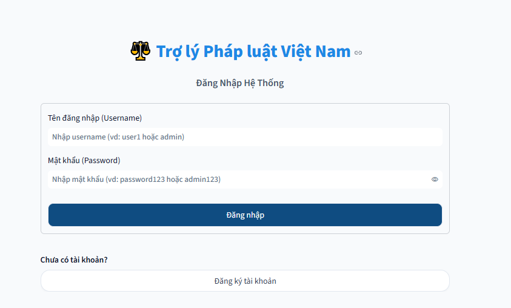
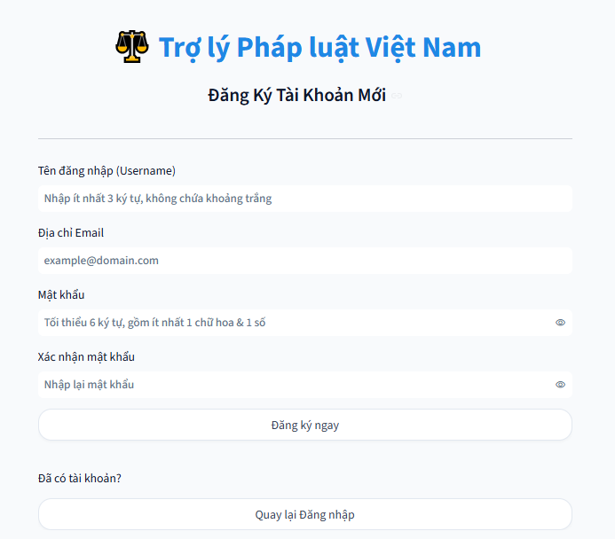
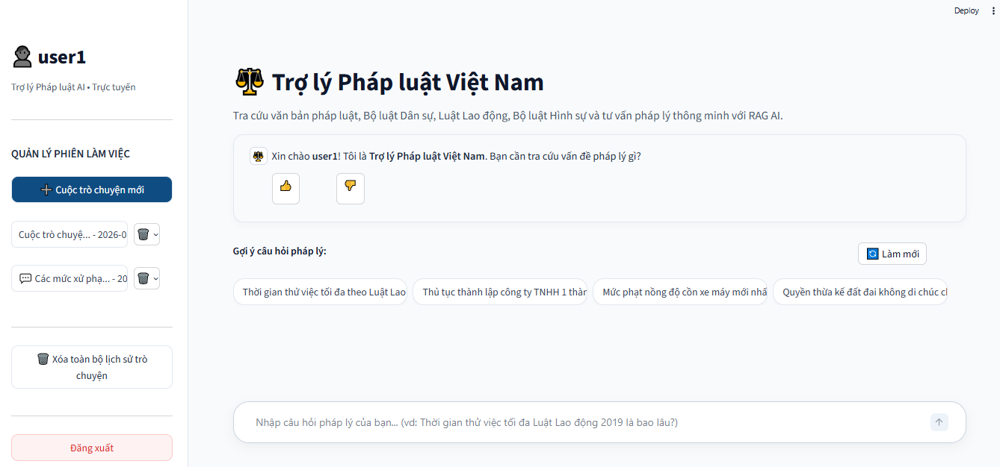
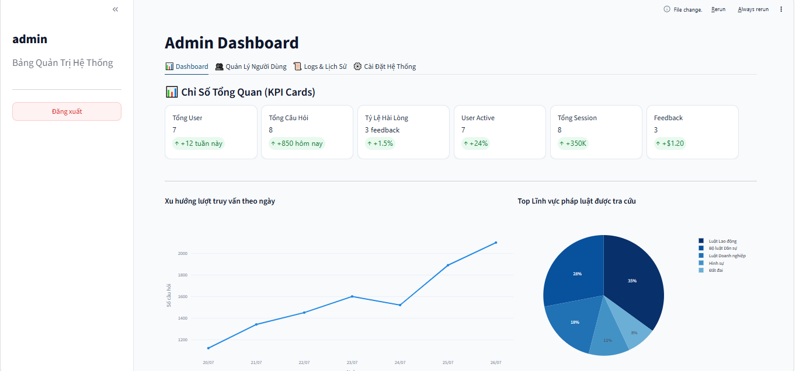
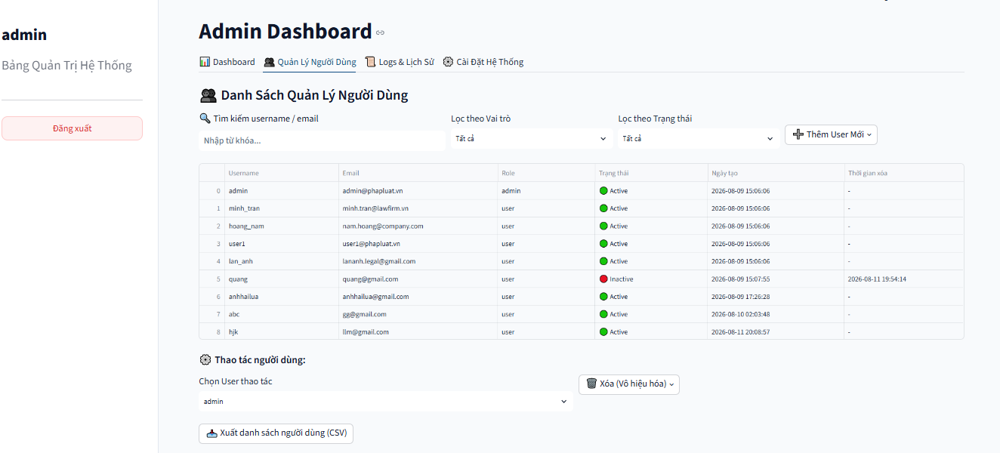
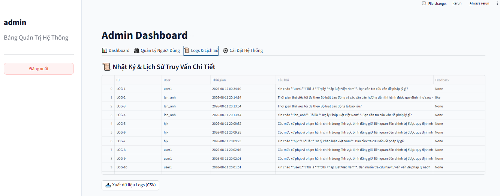
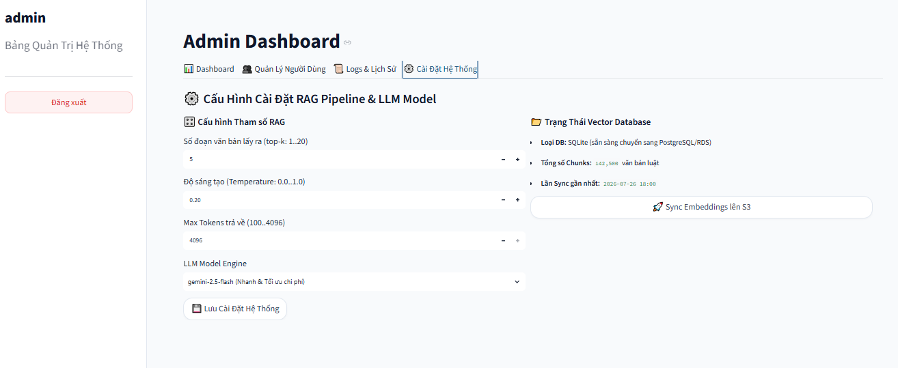

# Frontend

The application uses **Streamlit** as its user interface framework. Streamlit enables fast building of interactive web applications with Python, making it well-suited for AI/ML applications and chatbots.

## Directory Structure

```text
Frontend / UI
├── .streamlit/
│   └── config.toml          # Streamlit theme & server configuration
│
├── assets/
│   └── style.css            # Custom CSS for the interface
│
└── views/
    ├── login.py             # Login page
    ├── register.py          # Registration page
    ├── chatbot.py           # Main chat interface (User)
    └── admin.py             # Admin Dashboard
```

## Detailed File Explanation

### `.streamlit/config.toml`

Streamlit interface configuration file:

- `theme.primaryColor = "#0F4C81"`: Primary color is navy blue.
- `theme.backgroundColor = "#F8FAFC"`: Light, eye-friendly primary background.
- `theme.secondaryBackgroundColor = "#FFFFFF"`: White secondary background.
- `theme.textColor = "#1E293B"`: Dark slate gray text color.
- `theme.font = "sans serif"`: Sans-serif font.
- `server.headless = true`: Runs in headless mode (no separate GUI window).
- `server.port = 8501`: Runs on port 8501.

This is a configuration-only file, defining color themes and runtime settings without containing UI logic.

### `assets/style.css`

Custom CSS file for detailed interface styling:

- **Color variables:** Defines shared color variables (primary, hover, background, text, border).
- **Layout & Typography:** Increases font size and line-height for better readability of legal documents.
- **Form & Input:** Card-style white forms for login/register, inputs with clear borders, hover/focus effects, and sharp placeholder text.
- **Button:** Larger buttons, bold fonts, 12px border radius, with a prominent primary button.
- **Sidebar:** White background with a separating border and a prominent red logout button.
- **Chat bubbles:** User messages on the right (blue), assistant messages on the left (white/gray), with subtle shadows and rounded corners.
- **Question suggestions (suggestion chips):** Displayed as horizontal chips with horizontal scrolling if there are too many.

### `views/login.py`

**Login Page**:

- Displays a login form with two fields: username and password.
- When the user submits the form, the system validates the login credentials against the database.
- If the credentials are correct and the account is active, the user is logged in and redirected to the application.
- If the credentials are incorrect or the account is disabled, the system displays the corresponding error message.
- Includes a link to redirect to the registration page for new users.



### `views/register.py`

**Registration Page**:

- Displays a registration form with fields: username, email, password, and confirm password.
- The system validates the input data:
  - Username must meet the minimum length, contain no spaces, and not duplicate an existing account.
  - Email must be in a valid format.
  - Password must meet length and complexity requirements (containing uppercase letters and numbers).
  - Confirm password must match the entered password.
- If the data is valid, a new account is created, and the user is redirected to the login page with a success message.
- Includes a link to return to the login page for existing users.



### `views/chatbot.py`

**Main chat interface for users**:

- **Session Management**: Users can create new chat sessions, select previous sessions to continue, or delete unnecessary sessions.
- **Submit Questions**: Users input questions, which are sent to the backend for processing to retrieve answers along with reference sources.
- **Result Display**: Answers are shown in a conversational format, distinguishing between user and assistant messages. Reference sources are displayed in an expandable accordion for users to view in detail.
- **Feedback/Rating**: Users can like/dislike answers to submit feedback, helping to improve system quality.
- **Suggested Questions**: Displays sample questions for quick reference and usage.
- **Backend Connection**: All questions are sent directly to the RAG backend via APIs to receive real-time answers, without using mocked data.



### `views/admin.py`

**System Administration Interface for Admins**:

- **Dashboard**: Displays overall metrics such as the number of users, questions, feedback, and satisfaction rate along with usage trend charts.



- **User Management**: Allows searching, filtering, adding new users, disabling or restoring user accounts. Supports exporting the list to a CSV file.



- **History & Logs**: View the history of user questions and feedback, supporting filtering and data exporting.



- **System Settings**: Allows adjustment of chatbot operational parameters (number of retrieved text chunks, temperature/creativity, max output tokens, and AI model selection).


