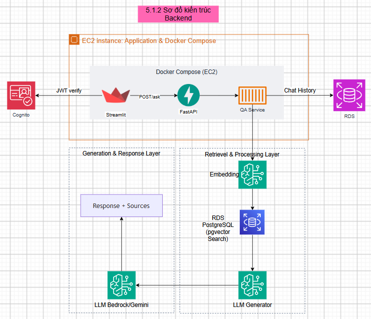
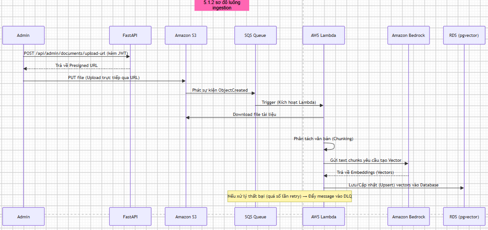
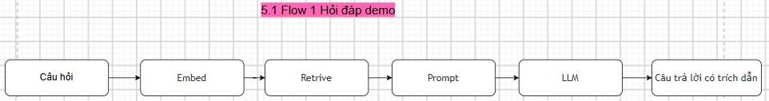
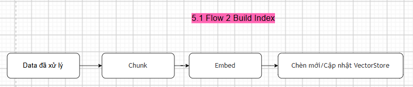
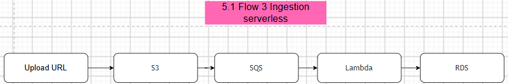
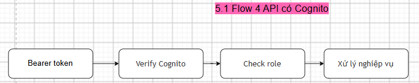

---
title: "Backend"
date: 2024-01-01
weight: 2
chapter: false
pre: " <b> 5.1.2 </b> "
---
# Backend

## Endpoints

| Endpoint                                      | Method | Auth | Desc                                                    |
| --------------------------------------------- | ------ | ---- | ------------------------------------------------------- |
| **/**                                   | GET    | —   | Health check for api.main                               |
| **/ask**                                | POST   | —   | RAG Q&A; request body contains question, optional top_k |
| **/api/health**                         | GET    | —   | Health check for api.app                                |
| **/api/chat**                           | POST   | ✓   | RAG Q&A; optional DynamoDB chat history                 |
| **/api/conversations**                  | GET    | ✓   | List the user's conversations                           |
| **/api/conversations/{id}**             | GET    | ✓   | Get details of one conversation                         |
| **/api/conversations/{id}**             | DELETE | ✓   | Delete a conversation                                   |
| **/api/admin/conversations**            | GET    | ✓   | Conversation history by day                             |
| **/api/admin/users**                    | GET    | ✓   | List Cognito users                                      |
| **/api/admin/users/{username}/disable** | POST   | ✓   | Disable a user                                          |
| **/api/admin/users/{username}/enable**  | POST   | ✓   | Enable a user                                           |
| **/api/admin/users/{username}/group**   | POST   | ✓   | Assign Cognito group                                    |
| **/api/admin/documents/upload-url**     | POST   | ✓   | S3 presigned upload                                     |
| **/api/admin/documents**                | GET    | ✓   | List documents                                          |
| **/api/admin/documents/{id}**           | PATCH  | ✓   | Update document metadata                                |
| **/api/admin/documents/{id}**           | DELETE | ✓   | Soft-delete a document                                  |

## Backend Architecture Diagram

## Ingestion Flow Diagram

## Backend flows

### Flow 1 — Demo Q&A

Main path: Streamlit → api.main → QAService.

1. Client sends **POST /ask** with question and top_k
2. FastAPI receives the request and calls QAService.ask
3. Normalize the question; optionally rewrite / expand query variants
4. Retriever embeds the question → searches in RDS pgvector
5. If no chunks are found → return the fixed "no info in DB" response
6. Rerank if USE_RERANKER is enabled
7. build_prompt merges legal context + question
8. Generator calls Gemini or Bedrock
9. Return JSON: answer + sources

### Flow 2 — Build index

Run through scripts/build_index.py or pipeline.build_index_pipeline.

1. Read config HF_DATASET_NAME / LOCAL_DEMO_PATH and connect to the vector store
2. Load existing chunk IDs to skip already indexed content
3. Read legal documents one by one from the dataset
4. chunk_document creates overlapping chunks
5. EmbeddingService generates embeddings in batches
6. Insert into pgvector / FAISS
7. Commit periodically using INDEX_COMMIT_INTERVAL

### Flow 3 — Serverless ingestion

When an admin uploads a file to S3.

1. Admin calls **POST /api/admin/documents/upload-url** → receives upload URL
2. Client PUT/POST the file to S3
3. S3 event pushes a message to SQS
4. Lambda lambda_handler consumes the event
5. Read file → chunk → embed → write to RDS pgvector
6. Skip existing chunk IDs for safe resume

### Flow 4 — Cognito-protected API

The api.app path when authentication is enabled.

1. Client sends a request to **/api/*** with an Authorization Bearer header
2. auth.py verifies the JWT against Cognito JWKS
3. If AUTH_DISABLED=true → use a synthetic user with admins/editors/users groups
4. require_roles checks group membership before admin routes
5. Handler calls QAService or admin/ingestion services
6. For **/api/chat**, history can be written to DynamoDB when ENABLE_CHAT_HISTORY is enabled

## RAG Core

Main modules under **src/rag_core/**:

| Module              | Role                                  |
| ------------------- | ------------------------------------- |
| config.py           | Read settings from .env               |
| dataset_reader.py   | Read HuggingFace legal corpus         |
| chunking.py         | Create overlapping chunks             |
| embeddings.py       | Local or Bedrock Titan embeddings     |
| vector_store.py     | pgvector RDS or FAISS + SQLite        |
| pipeline.py         | build_index_pipeline and ask_pipeline |
| retriever.py        | Embed query → vector search          |
| reranker.py         | Optional CrossEncoder                 |
| prompt.py           | Grounded legal system prompt          |
| generator.py        | Gemini or Bedrock converse            |
| qa_service.py       | End-to-end ask orchestration          |
| document_manager.py | PDF → chunk → embed → store        |
| lambda_handler.py   | S3/SQS ingestion worker               |

## Auth

- **Streamlit:** hashed username/password in the app DB — Cognito is not used in the demo UI
- **/api/*:** Cognito JWT via src/api/auth.py; Authorization Bearer header
- **AUTH_DISABLED=true:** synthetic user with admins/editors/users groups — only for Streamlit compose/dev
- Cognito admin helpers: src/services/cognito_admin.py
