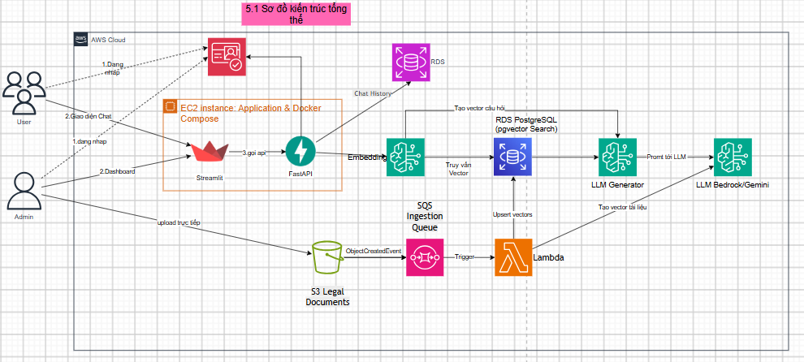
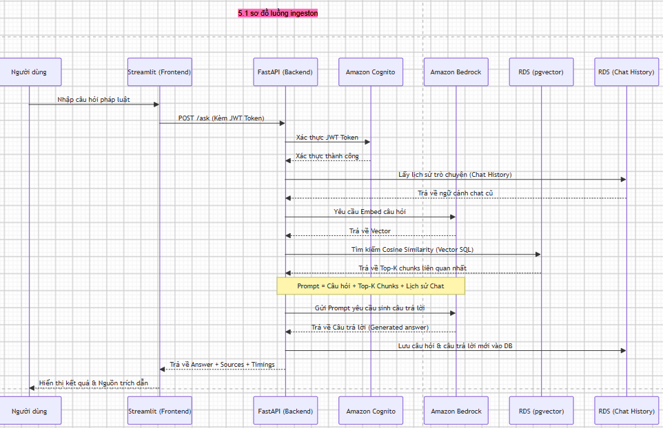

## Bối cảnh

**Vietnamese Legal RAG Chatbot** là hệ thống hỏi đáp thông minh chuyên biệt cho lĩnh vực pháp luật Việt Nam. Hệ thống cho phép người dùng đặt câu hỏi bằng tiếng Việt về các vấn đề pháp lý; từ đó truy xuất các điều khoản luật liên quan từ cơ sở dữ liệu vector và sinh câu trả lời chính xác nhờ mô hình ngôn ngữ lớn (LLM).

Hệ thống phục vụ ba nhóm đối tượng chính: người dân cần tra cứu nhanh thông tin pháp luật; sinh viên và nghiên cứu sinh luật học cần tham khảo điều khoản cụ thể; và quản trị viên cần quản lý tài liệu pháp luật, theo dõi chất lượng hệ thống và quản lý người dùng. Ứng dụng gồm FastAPI backend, Streamlit frontend và cơ sở dữ liệu PostgreSQL với pgvector extension.

**Repository:** [github.com/KhanhKoy/vietnamese-legal-llmops](https://github.com/KhanhKoy/vietnamese-legal-llmops)

## Vấn đề giải quyết

Việc tra cứu văn bản pháp luật Việt Nam hiện tại gặp nhiều khó khăn: khối lượng văn bản lớn và phân tán trên nhiều nguồn, ngôn ngữ pháp lý phức tạp khó tiếp cận với người dân, và thiếu công cụ tìm kiếm ngữ nghĩa hiểu được ngữ cảnh câu hỏi. Về mặt kỹ thuật, các giải pháp chatbot truyền thống dựa trên keyword matching không nắm bắt được ý nghĩa sâu của câu hỏi pháp lý, dẫn đến kết quả trả về không chính xác.

**Vietnamese Legal RAG Chatbot** giải quyết bằng cách áp dụng kỹ thuật RAG: chuyển đổi văn bản pháp luật thành vector embeddings, lưu trữ trong cơ sở dữ liệu vector (pgvector), và kết hợp retrieval ngữ nghĩa với LLM để sinh câu trả lời có dẫn nguồn. Kiến trúc hệ thống được tổ chức thành hai luồng chính: **Ingestion Pipeline** và **Query Processing.**

## Kiến trúc tổng quan

Vietnamese Legal RAG Chatbot sử dụng kiến trúc **serverless ingestion** kết hợp **containerized application** trên AWS tại Region `ap-southeast-1`. Tài liệu pháp luật được upload qua S3, xử lý bất đồng bộ qua SQS và Lambda; ứng dụng chạy trên EC2 với Docker Compose; dữ liệu vector nằm trên RDS PostgreSQL private.

### Năm lớp kiến trúc

| Lớp                     | Thành phần                                                                           | Vai trò chính                                                                                                  |
| ------------------------ | -------------------------------------------------------------------------------------- | ---------------------------------------------------------------------------------------------------------------- |
| Ingestion                | Amazon S3, Amazon SQS, AWS Lambda, Dead Letter Queue                                   | Tiếp nhận tài liệu pháp luật, xử lý bất đồng bộ, chunking và embedding tự động.                  |
| Embedding & Vector Store | SentenceTransformers (AITeamVN/Vietnamese_Embedding), Amazon RDS PostgreSQL + pgvector | Chuyển đổi văn bản thành vector representation và lưu trữ với khả năng tìm kiếm cosine similarity. |
| Retrieval & Generation   | Cosine Search, Google Gemini / Amazon Bedrock                                          | Truy xuất ngữ cảnh liên quan, xếp hạng lại và sinh câu trả lời có dẫn nguồn pháp luật.           |
| Application              | FastAPI, Streamlit, Docker Compose, EC2                                                | Cung cấp API endpoint, giao diện chat và admin dashboard.                                                     |
| Auth & Session           | Amazon Cognito (JWT + RBAC), RDS (chat history)                                        | Xác thực người dùng theo nhóm quyền, lưu trữ lịch sử hội thoại với TTL.                            |

### Sơ đồ kiến trúc tổng thể



### Luồng xử lý chính



## Tech stack

| Lớp             | Công nghệ/Dịch vụ sử dụng                                     | Vai trò trong hệ thống                                       |
| ---------------- | ------------------------------------------------------------------- | --------------------------------------------------------------- |
| Frontend         | Streamlit                                                           | Giao diện chat, đăng nhập/đăng ký, admin dashboard       |
| Backend          | FastAPI, Python 3.11, Gunicorn                                      | API endpoint, xử lý nghiệp vụ RAG, xác thực JWT           |
| Embedding        | SentenceTransformers (AITeamVN/Vietnamese_Embedding), Bedrock Titan | Vector hóa văn bản pháp luật và câu hỏi người dùng   |
| LLM              | Google Gemini 2.5 Flash, Amazon Bedrock (Claude 3 / Llama 3)        | Sinh câu trả lời dựa trên ngữ cảnh retrieved             |
| Vector Database  | Amazon RDS PostgreSQL + pgvector (HNSW/IVFFlat index)               | Lưu trữ và tìm kiếm vector embeddings với hiệu năng cao |
| Auth             | Amazon Cognito (User Pool, Groups: users/editors/admins)            | Xác thực JWT, phân quyền RBAC ba cấp                       |
| Session Storage  | Amazon RDS                                                          | Lưu lịch sử hội thoại với TTL tự động                  |
| Ingestion        | Amazon S3, Amazon SQS + DLQ, AWS Lambda                             | Pipeline xử lý tài liệu bất đồng bộ, fault-tolerant     |
| Containerization | Docker, Docker Compose                                              | Đóng gói và triển khai ứng dụng trên EC2                |

## Quy trình xử lý câu hỏi pháp luật

Khi người dùng đặt câu hỏi pháp luật, hệ thống thực hiện các bước sau:

1. **Người dùng gửi câu hỏi** → **FastAPI tiếp nhận request** và xác thực JWT token qua Cognito.
2. Backend **embed câu hỏi** thành vector sử dụng SentenceTransformer model chuyên biệt cho tiếng Việt.
3. Thực hiện **cosine similarity search** trên pgvector để truy xuất top-k đoạn văn bản pháp luật liên quan.
4. Xây dựng **prompt** với ngữ cảnh pháp luật và gửi đến LLM (Gemini hoặc Bedrock) để **sinh câu trả lời**.
5. Trả về response kèm **citations** (nguồn điều luật) và **timings_ms** (thời gian xử lý từng giai đoạn).

Luồng rút gọn:

```text
User Question → JWT Auth → Embed Query → pgvector Search 
             → Prompt Construction → LLM Generation → Response + Citations
```

## Hai luồng xử lý chính

### Luồng Ingestion (Document Pipeline)

Khi quản trị viên upload tài liệu pháp luật mới, hệ thống xử lý bất đồng bộ để không ảnh hưởng đến trải nghiệm người dùng đang chat. Tài liệu được upload lên **Amazon S3** qua presigned URL; S3 event notification kích hoạt message vào **Amazon SQS**; **AWS Lambda** consumer đọc message, tải file, thực hiện text chunking với overlapping window, embed từng chunk và lưu vào **pgvector**. Nếu xử lý thất bại, message được chuyển sang **Dead Letter Queue** để retry hoặc điều tra.

```text
Admin Upload → S3 Presigned URL → S3 Bucket → SQS Queue → Lambda
           → Download + Chunk + Embed → pgvector Insert
           (failure) → Dead Letter Queue → Retry/Alert
```

### Luồng Query (User Request Flow)

Người dùng truy cập qua **Streamlit** UI. Request được gửi đến **FastAPI** backend, xác thực JWT token qua **Cognito**. Backend thực hiện RAG pipeline: embed query, search pgvector, generate answer. Lịch sử hội thoại được lưu vào **RDS** với TTL để tự động xóa session cũ, giảm chi phí lưu trữ.

```text
User → Streamlit → FastAPI (Cognito JWT Auth)
     → RAG Pipeline (Embed → Search → Generate)
     → RDS (Save conversation history)
     → Response to User
```

## Thành phần AWS sử dụng

| Dịch vụ      | Mục đích                                                                                                             |
| -------------- | ----------------------------------------------------------------------------------------------------------------------- |
| Cognito        | Quản lý xác thực người dùng với User Pool, Groups (users/editors/admins) và JWT token.                         |
| RDS            | Lưu trữ lịch sử hội thoại với TTL tự động, throughput on-demand phù hợp workload không đều.              |
| S3             | Lưu trữ tài liệu pháp luật gốc, vector store backup và presigned upload cho ingestion.                          |
| SQS + DLQ      | Message queue cho pipeline ingestion bất đồng bộ, đảm bảo at-least-once delivery và fault tolerance.            |
| Lambda         | Xử lý serverless cho ingestion: chunking, embedding và lưu vector vào RDS.                                         |
| RDS PostgreSQL | Cơ sở dữ liệu managed với pgvector extension, hỗ trợ HNSW/IVFFlat index cho approximate nearest neighbor search. |
| Bedrock        | Dịch vụ LLM managed (Claude 3, Llama 3, Titan Embeddings) không cần quản lý GPU infrastructure.                   |
| EC2            | Host ứng dụng Docker Compose (FastAPI + Streamlit) trong quá trình phát triển và demo.                           |

## Kiến trúc Backend

### Cấu trúc mã nguồn Backend

```text
src/
├── api/
│   ├── main.py          # FastAPI app đơn giản (POST /ask, không auth)
│   ├── app.py           # FastAPI app đầy đủ (CORS, Cognito JWT, /api/*)
│   ├── routes.py        # /api/chat, /api/conversations, /api/admin/*
│   ├── auth.py          # Cognito JWT verification & RBAC
│   └── schemas.py       # Pydantic request/response models
│
├── rag_core/            # Core RAG pipeline
│   ├── config.py        # Settings từ .env + YAML
│   ├── dataset_reader.py# Đọc HuggingFace datasets / local parquet
│   ├── chunking.py      # Overlapping character-based text chunking
│   ├── embeddings.py    # SentenceTransformer hoặc Bedrock Titan
│   ├── vector_store.py  # pgvector storage & cosine search
│   ├── retriever.py     # Retrieval orchestration
│   ├── reranker.py      # Cross-encoder reranking
│   ├── qa_service.py    # End-to-end ask() pipeline
│   ├── generator.py     # LLM generation (Gemini hoặc Bedrock)
│   ├── prompt.py        # Prompt template construction
│   └── lambda_handler.py# AWS Lambda ingestion handler
│
├── services/
│   ├── chat_history.py  # DynamoDB conversation store
│   ├── cognito_admin.py # Cognito user management
│   ├── document_admin.py# Document CRUD (soft delete)
│   └── ingestion.py     # S3 presigned upload + manifest
│
├── storage/
│   ├── postgres_store.py# PostgreSQL app tables
│   └── sqlite_store.py  # SQLite fallback cho local dev
│
└── evaluation/
    ├── eval_runner.py   # Offline evaluation
    └── metrics.py       # Recall@k, MRR
```

### Luồng xử lý của QAService

`src/rag_core/qa_service.py` là trung tâm điều phối RAG pipeline:

1. Nhận câu hỏi từ API layer
2. Gọi `embeddings.py` để embed câu hỏi thành vector 768/1024 chiều
3. Gọi `vector_store.py` thực hiện cosine similarity search trên pgvector
4. Gọi `reranker.py` (nếu bật) để cross-encoder rerank top-k → top-n
5. Gọi `prompt.py` xây dựng prompt với ngữ cảnh pháp luật
6. Gọi `generator.py` gửi prompt đến LLM và nhận câu trả lời
7. Trả về response kèm sources và timings

## Kết quả đạt được

- Hoàn thiện pipeline RAG end-to-end cho văn bản pháp luật Việt Nam với retrieval chất lượng cao nhờ embedding chuyên biệt tiếng Việt.
- Triển khai ứng dụng với Docker Compose trên EC2, với Streamlit.
- Cung cấp dual LLM provider (Google Gemini và Amazon Bedrock) với khả năng chuyển đổi linh hoạt qua biến môi trường.
