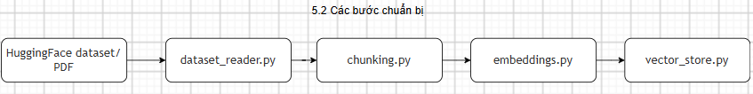

# Prerequisites — Các bước chuẩn bị

## 5.2.1. Chuẩn bị source code

- Clone source code về máy local
- Kiểm tra các thư mục chính: `src/`, `views/`, `scripts/`, `deploy/`
- Tạo virtual environment
- Cài dependencies từ `requirements.txt`
- Tạo file `.env` từ `.env.sample`

**Lệnh cài đặt nhanh (Quick setup):**

Sử dụng các lệnh sau để clone source code và chuẩn bị môi trường:

```bash
git clone https://github.com/KhanhKoy/vietnamese-legal-llmops
cd vietnamese-legal-llmops
cp .env.sample .env
python -m venv .venv
source .venv/bin/activate   # Windows: .venv\Scripts\activate
pip install -r requirements.txt
```

Hãy đảm bảo bạn đã điền đầy đủ các biến trong file `.env` trước khi chạy các module chính.

**Những file nên đọc trước khi chạy repo:**

| File                          | Vai trò                                   |
| ----------------------------- | ------------------------------------------ |
| `README.md`                 | Mô tả tổng quan project và cách chạy |
| `.env.sample`               | Mẫu cấu hình môi trường              |
| `streamlit_app.py`          | Entry chính của Streamlit                |
| `src/api/main.py`           | API mỏng cho`POST /ask`                 |
| `scripts/build_index.py`    | Script build dữ liệu vector              |
| `deploy/docker-compose.yml` | Cách chạy bằng Docker Compose           |

**Các nhóm biến môi trường đáng chú ý trong `.env.sample`:**

| Nhóm     | Biến chính                                                                         |
| --------- | ------------------------------------------------------------------------------------ |
| Dataset   | `HF_DATASET_NAME`, `LOCAL_DEMO_PATH`                                             |
| Chunking  | `CHUNK_SIZE_CHARS`, `CHUNK_OVERLAP_CHARS`                                        |
| Embedding | `EMBEDDING_MODEL_NAME`, `EMBEDDING_BATCH_SIZE`, `USE_BEDROCK_EMBEDDING`        |
| LLM       | `LLM_PROVIDER`, `GEMINI_API_KEY`, `BEDROCK_LLM_MODEL_ID`                       |
| Database  | `USE_PGVECTOR`, `PGHOST`, `PGPORT`, `PGDATABASE`, `PGUSER`, `PGPASSWORD` |
| API       | `AUTH_DISABLED`, `ENABLE_API_DOCS`, `CORS_ALLOWED_ORIGINS`                     |

## 5.2.2. Chuẩn bị dữ liệu

- Repo hiện có một file demo trong `data_demo/`: `44_VBHN-VPQH_699655.pdf`
- Ngoài dữ liệu local, `src/rag_core/dataset_reader.py` còn hỗ trợ đọc từ Hugging Face dataset qua biến `HF_DATASET_NAME`
- Trước khi build index, cần xác định rõ đang dùng dữ liệu local hay dữ liệu từ Hugging Face [huggingface.co/datasets/NguyenKH/core_legal_knowledge](https://huggingface.co/datasets/NguyenKH/core_legal_knowledge)

**Nguồn dữ liệu theo codebase:**

| Nguồn               | Dấu vết trong repo                                             | Ghi chú                                 |
| -------------------- | ---------------------------------------------------------------- | ---------------------------------------- |
| Hugging Face dataset | `HF_DATASET_NAME` trong `.env.sample`, `dataset_reader.py` | Là đường đọc dữ liệu mặc định |
| File demo local      | `data_demo/44_VBHN-VPQH_699655.pdf`                            | Dùng để kiểm tra nhanh hoặc demo    |

`dataset_reader.py` hiện đọc các trường như:

- `id`
- `title`
- `so_ky_hieu`
- `loai_van_ban`
- `co_quan_ban_hanh`
- `linh_vuc`
- `tinh_trang_hieu_luc`
- `content_markdown`

Sau khi đọc dữ liệu, pipeline sẽ:

1. Chuẩn hóa metadata
2. Chia văn bản thành các chunk
3. Tạo embedding theo batch
4. Ghi vào vector store để phục vụ truy vấn


