# Triển khai Hạ tầng Mạng (VPC)

**Mục tiêu:** Xây dựng hạ tầng mạng an toàn cho dự án Law-Chatbot (Vietnamese Legal LLMOps), đảm bảo cô lập Cơ sở dữ liệu RDS PostgreSQL (pgvector) và hàm xử lý Lambda trong mạng nội bộ (Private Subnet), đồng thời cho phép EC2 (chạy Streamlit và FastAPI) giao tiếp với người dùng qua Public Subnet.

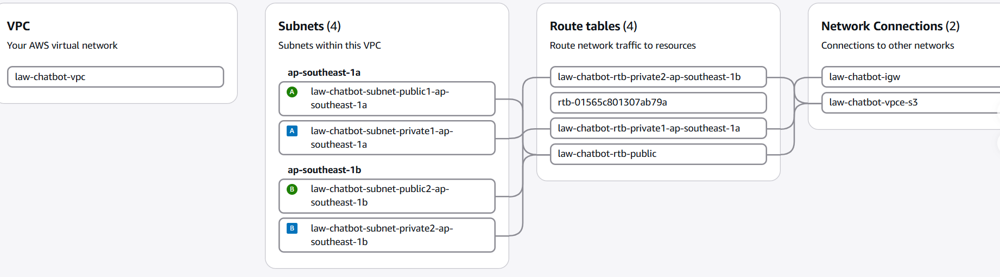

### Sơ đồ luồng giao tiếp (Network & Security Groups)

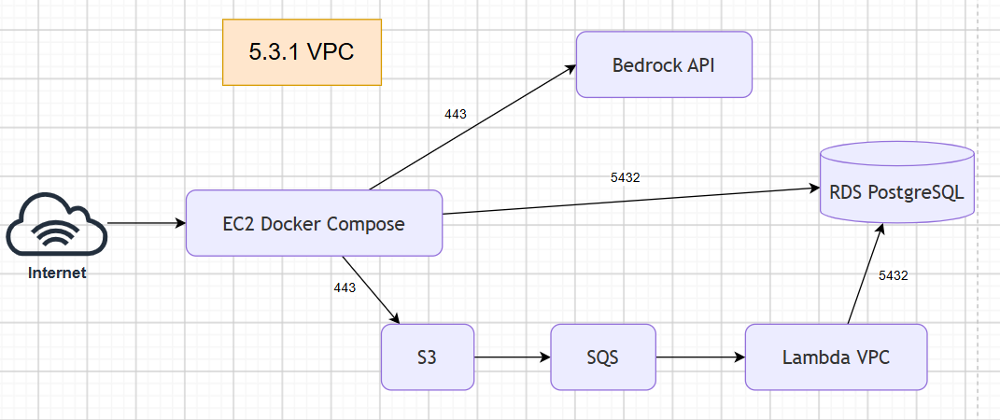

---

## 1. Khởi tạo VPC cốt lõi (VPC and more)

Quá trình này sẽ tự động tạo VPC, các Subnets, Route Tables và Internet Gateway cần thiết.

* Tại menu dịch vụ AWS, tìm kiếm và truy cập vào **VPC Dashboard**, sau đó nhấn nút **Create VPC**.

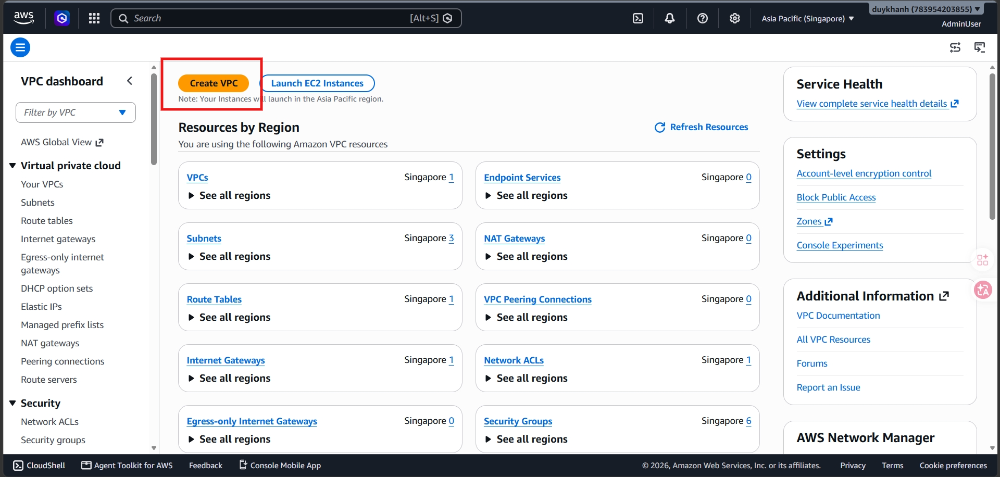

* Tại phần **Resources to create**, chọn tùy chọn **VPC and more** để hệ thống tự động sinh các thành phần liên quan.
* Tại ô **Name tag auto-generation**, nhập tên dự án là `law-chatbot`.
* Tại phần **IPv4 CIDR block**, giữ nguyên dải mạng mặc định là `10.0.0.0/16`.

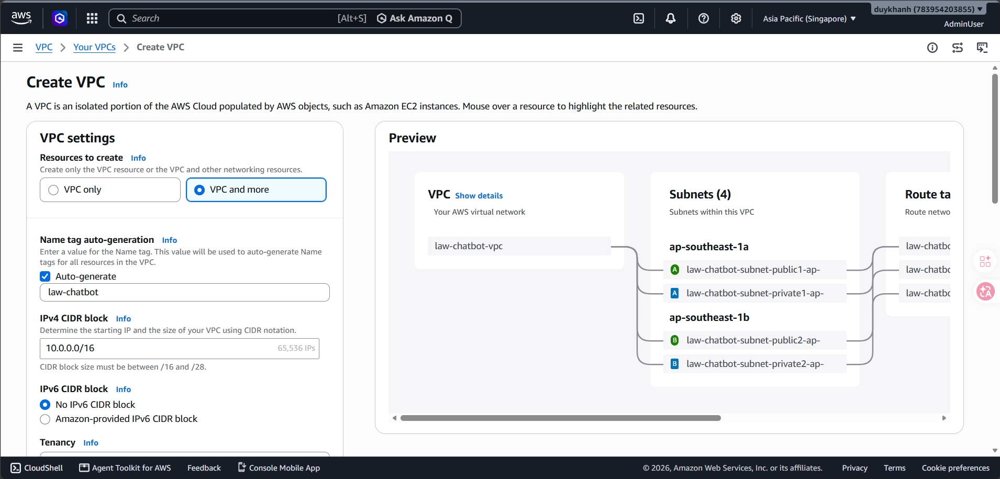

* Trong mục **Number of Availability Zones (AZs)**, chọn **2** để đảm bảo tính sẵn sàng cao (High Availability).
* Tại mục **Number of public subnets**, chọn **2** (dành cho EC2 và ALB sau này).
* Tại mục **Number of private subnets**, chọn **2** (dành cho RDS và Lambda).

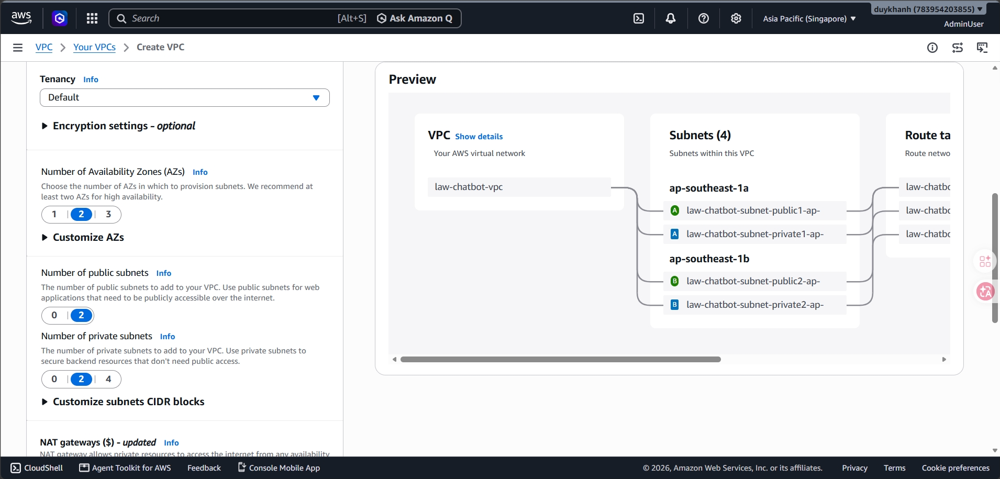

* Tại mục **NAT gateways ($)**, chọn **None** để tối ưu chi phí (sẽ dùng VPC Endpoint thay thế).
* Tại mục **VPC endpoints**, chọn **S3 Gateway** để các dịch vụ trong Private Subnet có thể truy cập S3 mà không cần ra Internet.

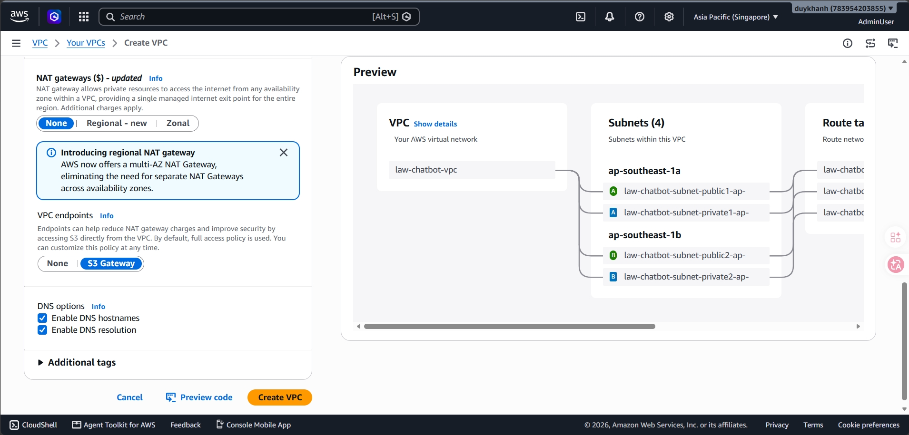

* Ở cột bên phải màn hình, kiểm tra lại cấu trúc mạng sẽ được tạo.
* Cuộn xuống cuối trang và nhấn nút **Create VPC**.

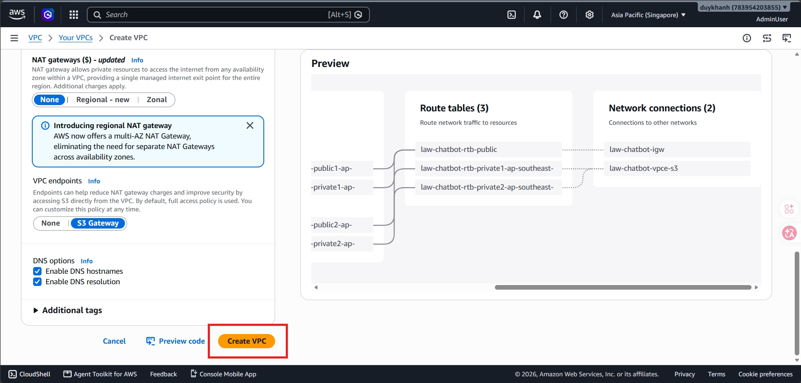

* Chờ quá trình khởi tạo hoàn tất và hệ thống báo thành công.

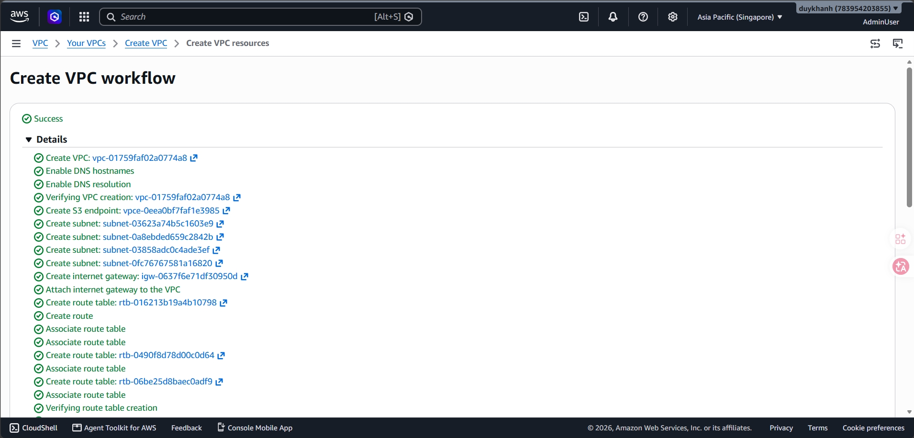

---

## 2. Thiết lập Security Groups (Tường lửa 3 lớp)

Các Security Group (SG) được tạo theo nguyên tắc đặc quyền tối thiểu, đảm bảo các thành phần chỉ giao tiếp qua các cổng (port) được chỉ định.

### 2.1. Tạo Security Group cho EC2 (law-chatbot-ec2-sg)

* Ở menu bên trái của VPC Dashboard, chọn mục **Security Groups** và nhấn nút **Create security group**.

* Điền tên `law-chatbot-ec2-sg` vào ô **Security group name** và nhập mô tả tương ứng.
* Tại mục **VPC**, xóa VPC mặc định và chọn đúng VPC `law-chatbot-vpc` vừa tạo.

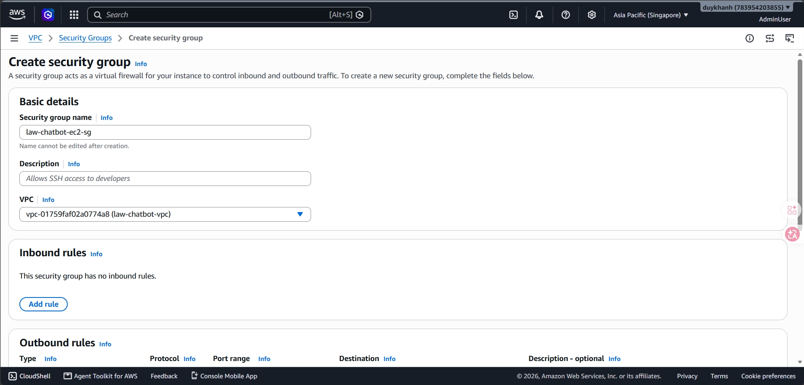

* Tại phần **Inbound rules**, nhấn **Add rule** và cấu hình 3 luồng truy cập: Port `8501` (Custom TCP) cho Streamlit, Port `8000` (Custom TCP) cho FastAPI và Port `22` (SSH) từ IP của quản trị viên.

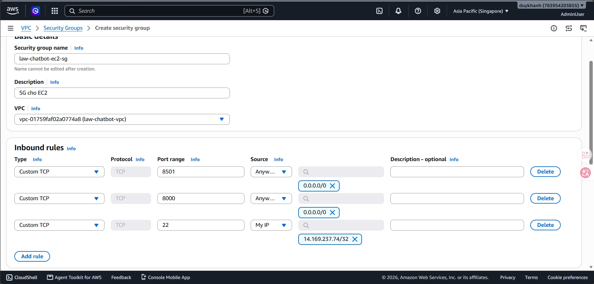

* Nhấn **Create security group** để lưu lại.

### 2.2. Tạo Security Group cho Lambda (law-chatbot-lambda-sg)

* Trở lại màn hình Security Groups, tiếp tục nhấn **Create security group**.

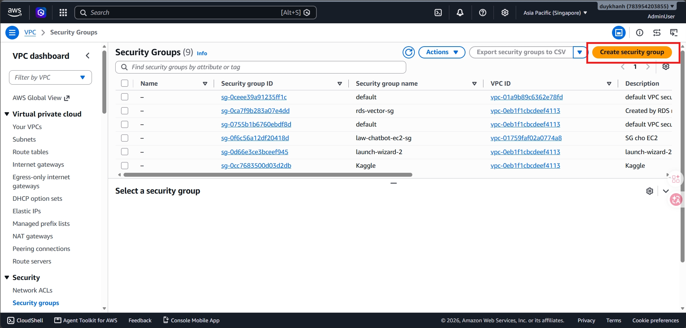

* Điền tên `law-chatbot-lambda-sg` và chọn VPC `law-chatbot-vpc`.
* Bỏ qua phần Inbound rules (không thêm rule nào) vì Lambda không nhận kết nối trực tiếp, phần **Outbound rules** giữ nguyên mặc định là All traffic.

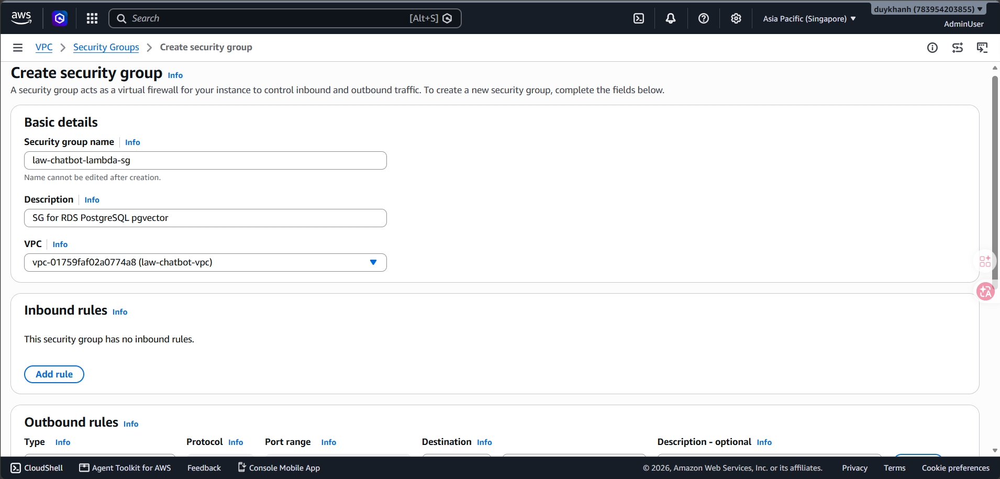

* Nhấn **Create security group**.

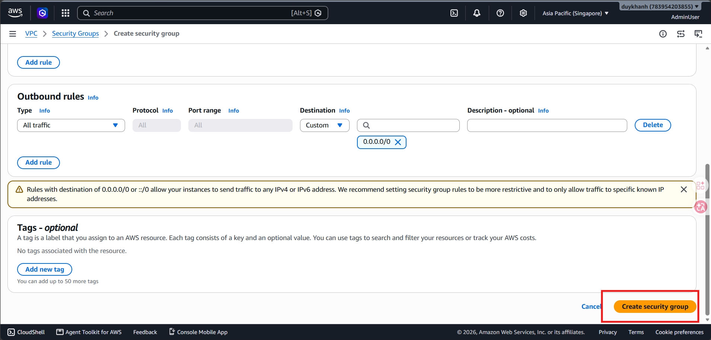

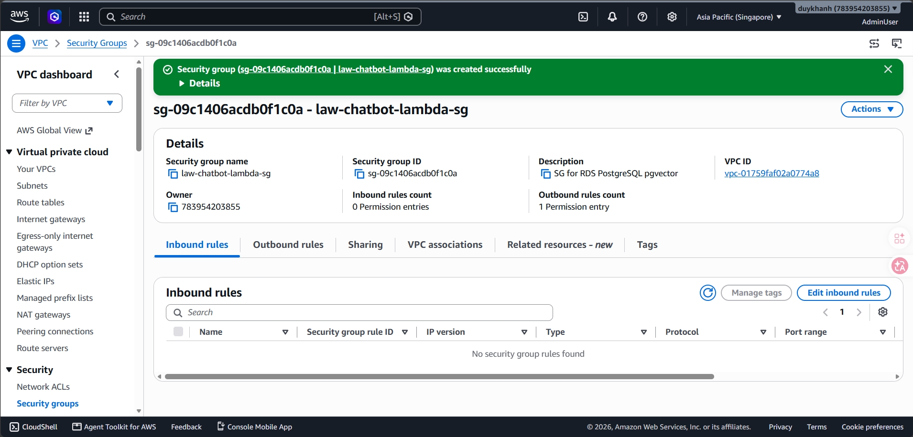

### 2.3. Tạo Security Group cho RDS (law-chatbot-rds-sg)

* Nhấn **Create security group**.

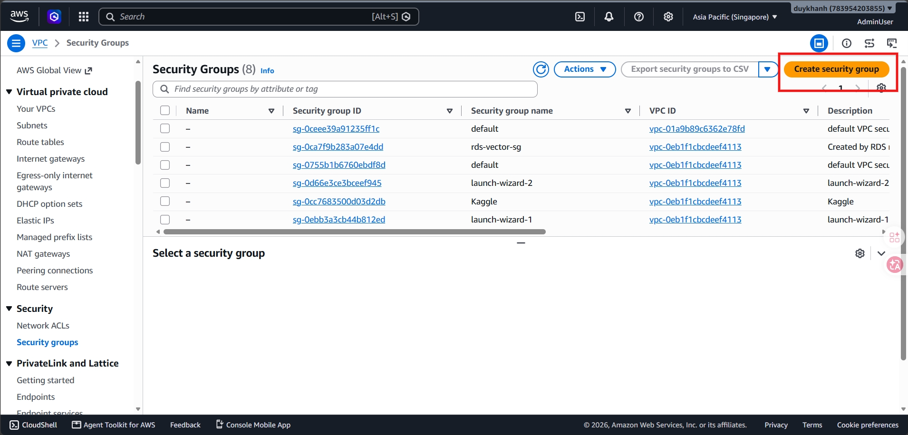

* Điền tên `law-chatbot-rds-sg` và chọn VPC `law-chatbot-vpc`.
* Tại phần **Inbound rules**, type chọn PostgreSQL (Port 5432). Tại mục **Source**, chọn **Custom** và chỉ định lần lượt đến 2 Security Group: `law-chatbot-ec2-sg` và `law-chatbot-lambda-sg`.

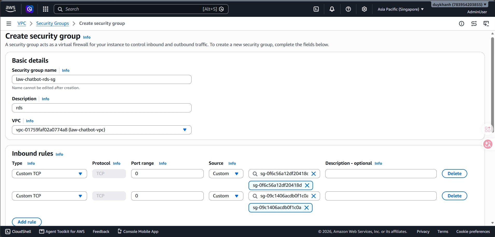

* Nhấn **Create security group** để hoàn tất cấu trúc bảo mật.

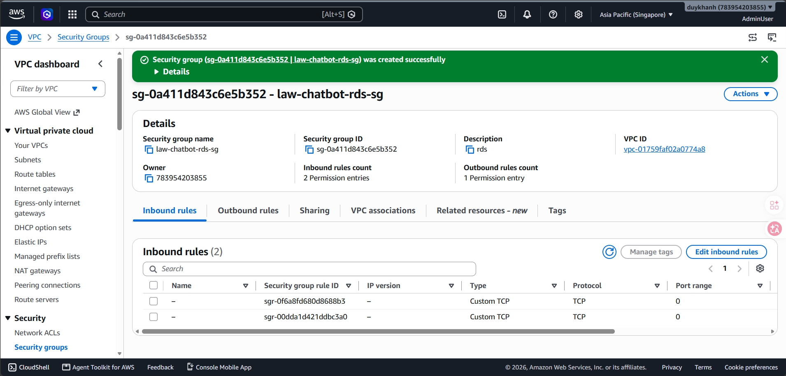

---

## 3. VPC Endpoints

Trong phạm vi triển khai hiện tại của dự án, nhóm chưa cấu hình VPC Endpoint trên AWS. Nguyên nhân là hệ thống đang ưu tiên triển khai phiên bản tối giản, trong đó EC2 có thể truy cập Internet trực tiếp để gọi các dịch vụ AWS như S3, Bedrock hoặc DynamoDB thông qua AWS SDK. Vì vậy, VPC Endpoint chưa phải là thành phần bắt buộc để hệ thống chạy được trong giai đoạn này.

VPC Endpoint được xem là một hạng mục mở rộng khi triển khai hệ thống theo hướng private network hoàn chỉnh. Khi EC2, Lambda hoặc các worker được đặt trong private subnet và không sử dụng NAT Gateway, các thành phần này sẽ không thể truy cập trực tiếp tới những dịch vụ có AWS public endpoint. Khi đó, cần tạo VPC Endpoint để lưu lượng từ private subnet đi tới dịch vụ AWS qua mạng nội bộ của AWS thay vì đi ra Internet.

Việc chưa sử dụng VPC Endpoint không ảnh hưởng tới logic xử lý của mã nguồn. Trong code, các dịch vụ AWS được gọi thông qua thư viện `boto3` như `boto3.client("s3")` hoặc `boto3.client("bedrock-runtime")`. VPC Endpoint chỉ là cấu hình ở tầng mạng AWS, không phải một module riêng trong ứng dụng. Khi endpoint được cấu hình đúng với private DNS và route table, các lời gọi AWS SDK sẽ tự động đi qua endpoint mà không cần thay đổi code.

**Kết luận:** Trong đồ án này, VPC Endpoint được đánh giá là một giải pháp bảo mật và tối ưu mạng định hướng cho giai đoạn đưa lên production. Thành phần này giúp giảm phụ thuộc vào Internet/NAT Gateway, giới hạn luồng truy cập trong mạng nội bộ AWS, tăng tính riêng tư cho các resource và tuân thủ mô hình triển khai an toàn cao nhất khi RDS, Lambda cùng ứng dụng backend được cô lập hoàn toàn.
