# Deploy Amazon RDS PostgreSQL

**Goal:** Create an Amazon RDS PostgreSQL instance with the `pgvector` extension. RDS is the vector store for legal text chunks, so QAService can embed queries and run similarity search.

## Architecture overview

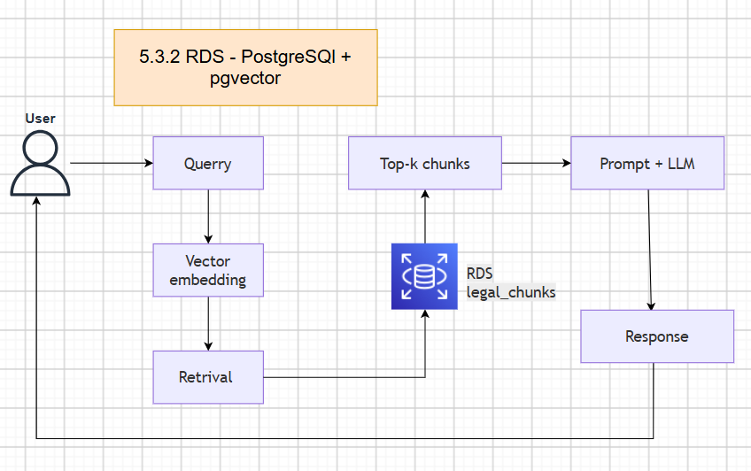

---

## Step 1: Create the RDS instance

This creates a database in a private subnet that only the project components can reach.

* Open AWS Management Console, search for **RDS**, and choose **Databases** in the left menu.
* Choose the orange **Create database** button.

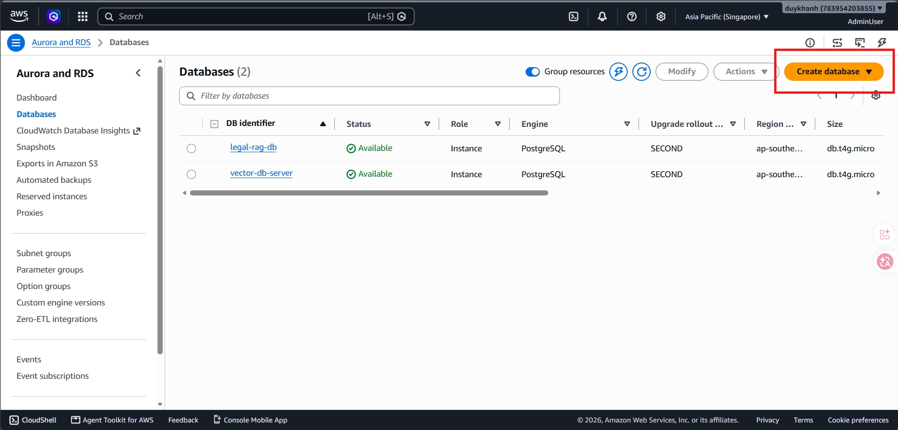

* Under **Engine options**, choose **PostgreSQL**.

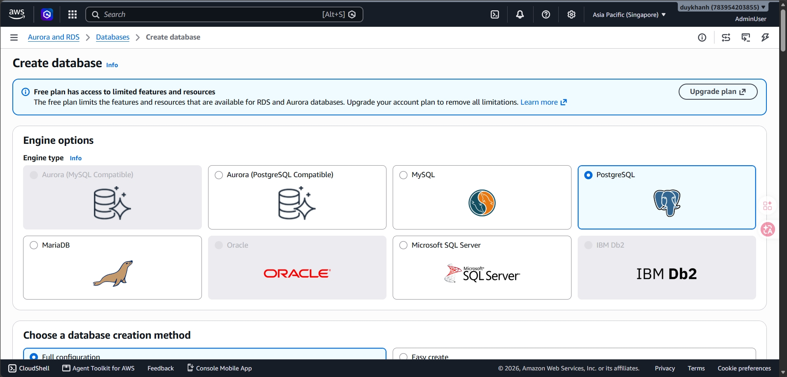

* Choose **Full configuration**.

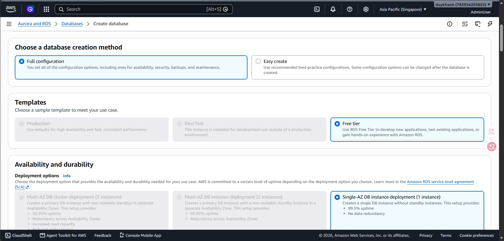

* Under **Settings**:

  * **DB instance identifier**: enter `vector-db-server`.
  * **Master username**: enter `postgres`.
  * **Master password**: enter `aws-law-chatbot`.

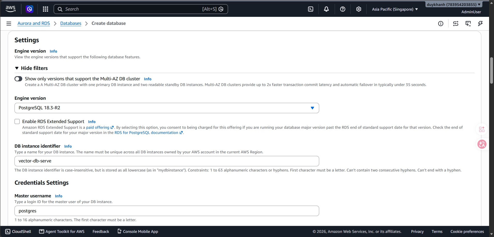

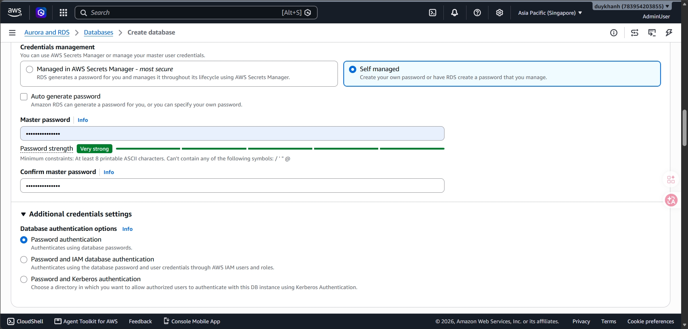

* Under **Instance configuration**, choose **Burstable classes** and size `db.t4.micro`.
* Under **Storage**, choose **General Purpose SSD (gp3)** with **20 GB** allocated storage.


* Under **Connectivity**:
  * **Virtual private cloud (VPC)**: select `law-chatbot-vpc` created earlier.
  * **Public access**: choose **No** (the database must not be reachable from the Internet).
  * **VPC security group (firewall)**: choose **Choose existing** and select `law-chatbot-rds-sg`.

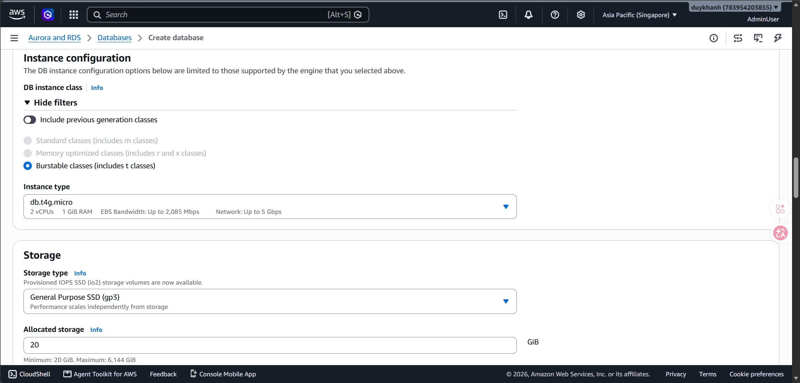

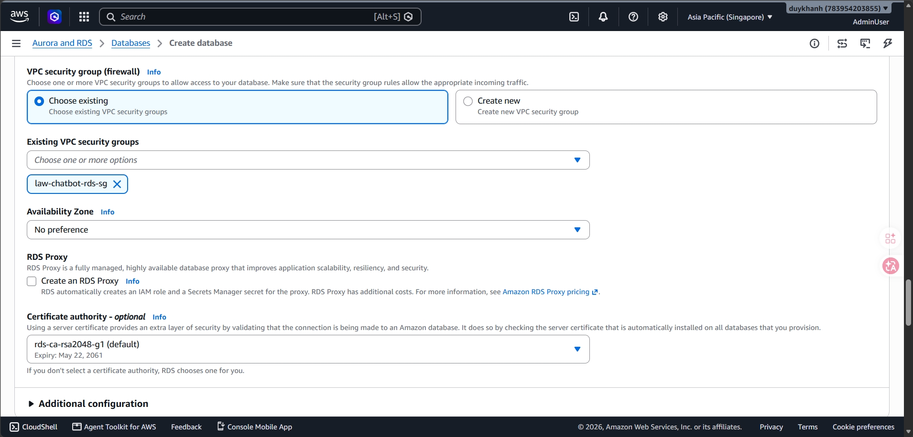

* Under **Additional configuration** (Database options), set the initial database name to `postgres`.

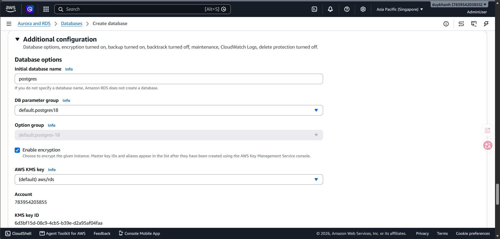

* Scroll to the bottom and choose **Create database**. Provisioning takes about 5–10 minutes.

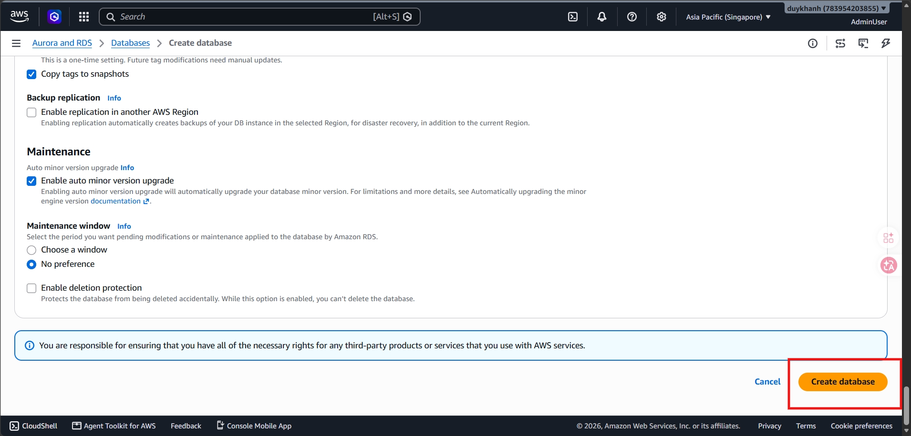

* When the status becomes **Available**, copy the **Endpoint** from the *Connectivity & security* tab.

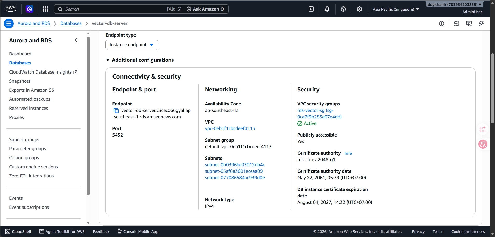

---

## Step 2: Enable pgvector and create tables

* Install the Database Client extension in VS Code, choose Add Connection, and fill in the Endpoint values.

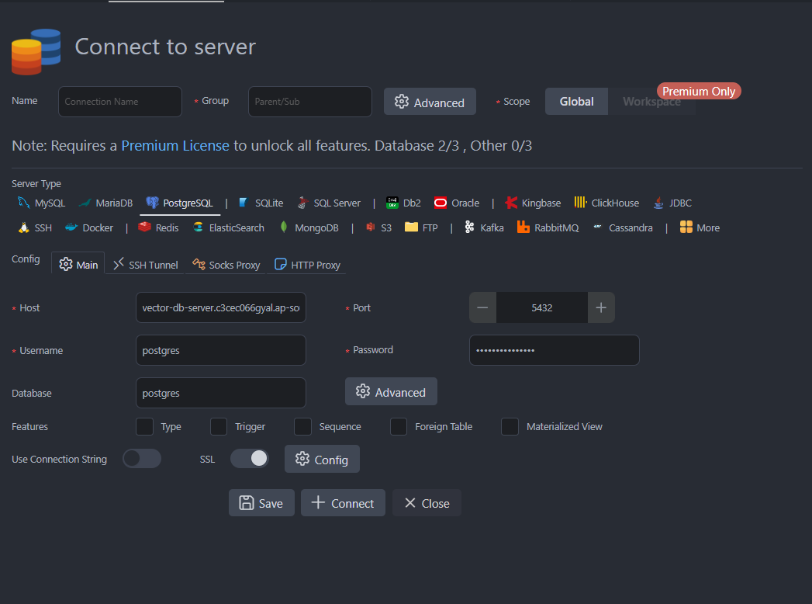

* After connecting, open the Query window (SQL Editor) and run:

```sql
CREATE EXTENSION IF NOT EXISTS vector;

CREATE TABLE IF NOT EXISTS legal_chunks (
    chunk_id   TEXT PRIMARY KEY,
    doc_id     TEXT,
    title      TEXT,
    content    TEXT,
    embedding  vector(1024),  -- dimension must match the embedding model
    metadata   JSONB,
    created_at TIMESTAMPTZ DEFAULT NOW()
);
```

## Step 3: Configure environment variables (`.env`)

Fill in the `.env` file:

```
USE_PGVECTOR=true
PGHOST=vector-db-server.c3cec066gyal.ap-southeast-1.rds.amazonaws.com
PGPORT=5432
PGDATABASE=postgres
PGUSER=postgres
PGPASSWORD=aws-law-chatbot
PGSSLMODE=require
```

## Step 4: Build the index (load data into the database)

After configuration, run the indexing script to embed data into the vector store.

* Open a terminal at the project root.
* Run:

```
python scripts/build_index.py
```

Wait until embedding finishes and rows appear in `legal_chunks`
