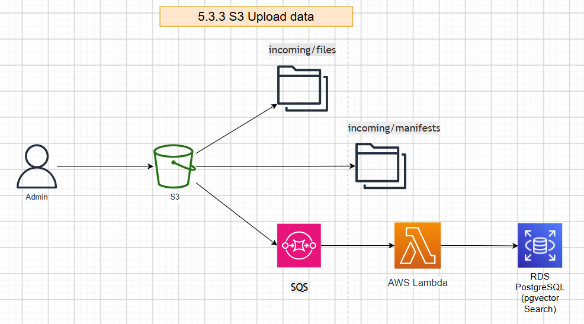
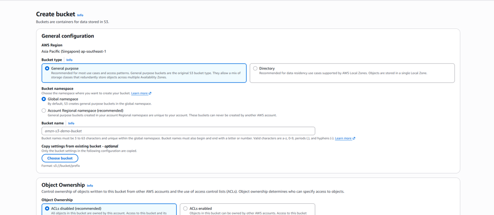
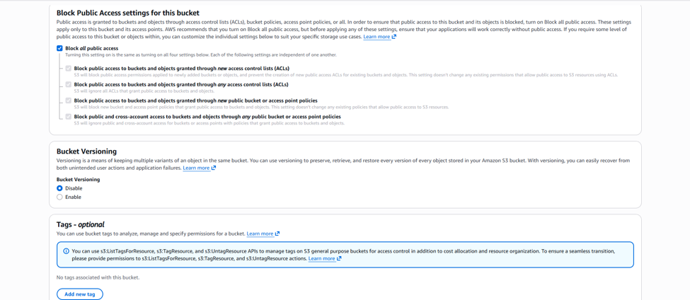
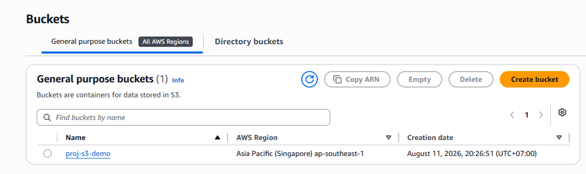
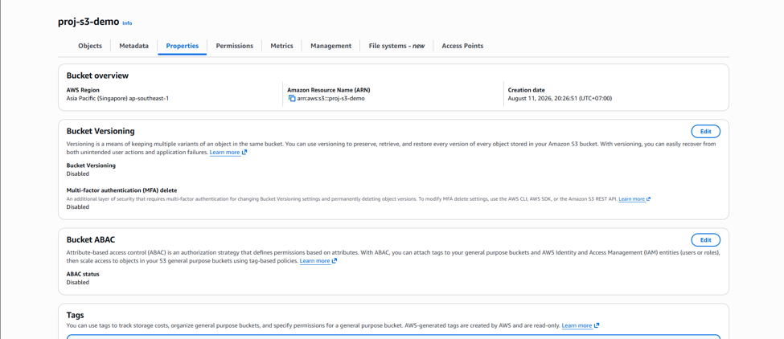
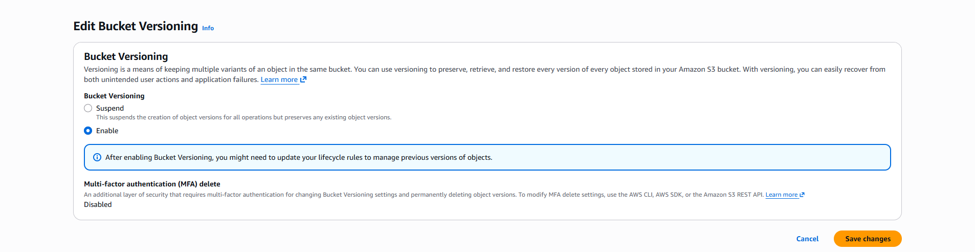
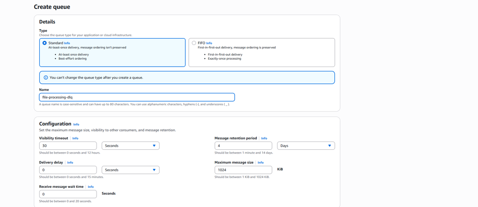
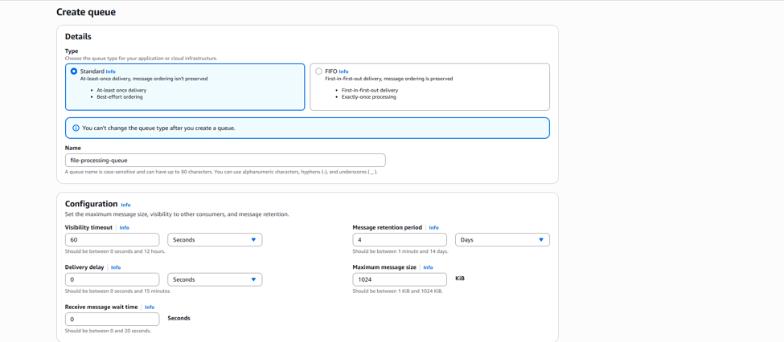
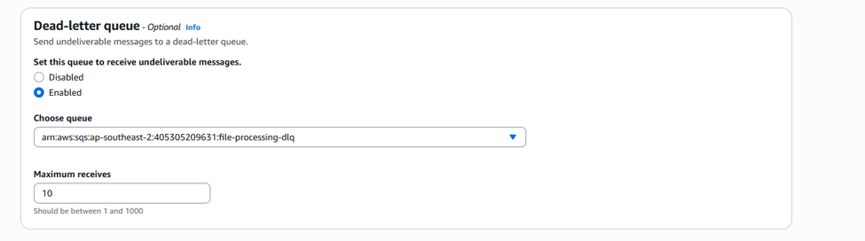
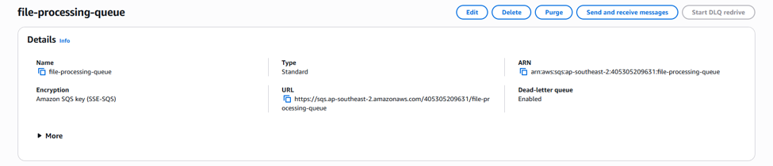

# Deploy S3 Bucket

## Architecture overview

## Create the project buckets

**Step 1: Create the bucket**

- Sign in to the AWS Console in Region `ap-southeast-1`, search for **Amazon S3**, then choose **Buckets → Create bucket.**
- Set the bucket name

- **Keep** the remaining settings
- Choose **Create**

**Step 2**

- Open the bucket you just created
- Go to the **Properties** tab → find **Bucket Versioning → Edit → Enable → Save changes**

**Step 3**

- Next, create the DLQ (Dead Letter Queue)
- Open **AWS Console** → **SQS** → **Queues** → **Create queue**. Choose
  Type: **Standard**

**Step 4**

- Then create the **Main Queue**. Under **Configuration**, set **Visibility Timeout: 60s**

- Find **Dead-letter queue → Enable → select the DLQ you just created**

- Copy the ARN of the **Main Queue**

