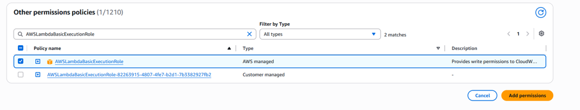
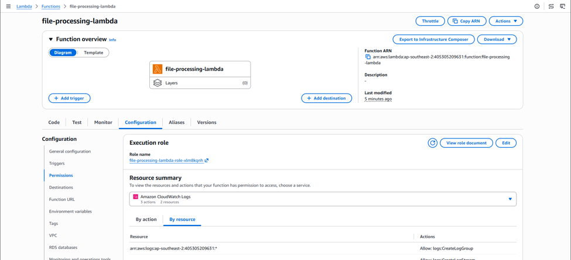
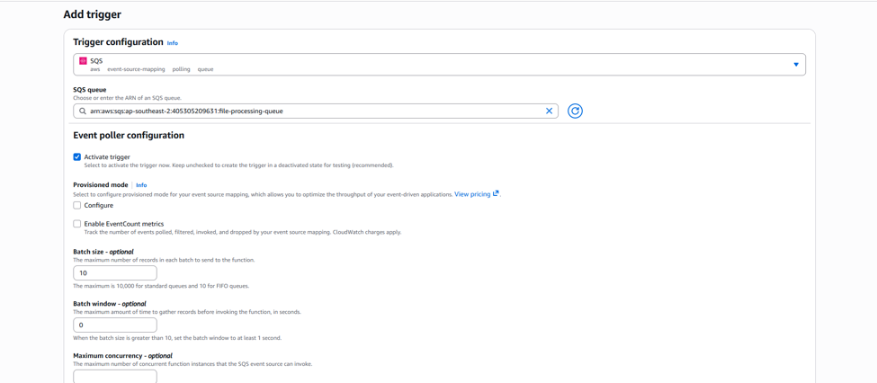
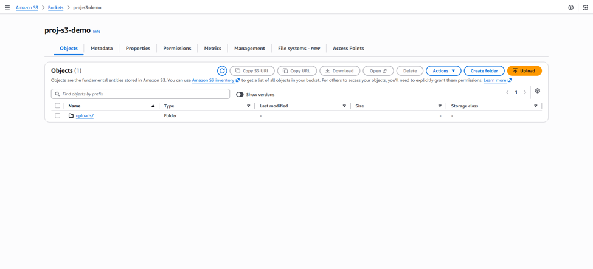
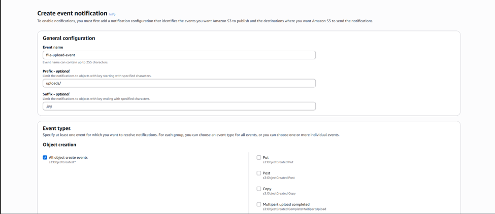

# Lambda

## Tổng quan Sơ đồ Kiến trúc

## Khởi tạo Lambda

Runtime chọn Python 3.14 -> Create function

Ấn vào Role name -> Search AWSLambdaBasicExecutionRole -> Add Permissions

Ấn Add trigger

Chọn SQS -> Chọn SQS Queue nãy vừa tạo (Main Queue) ->
Create

Quay lại Bucket -> Ấn qua tab Properties

Tìm **Event notifications -> Create event notification
-> Đặt tên -> Prefix là folder uploads/ -> All object create events**

**Mục Desination chọn -> SQS Queue -> Enter SQS queue
ARN -> Nhập link ARN Queue vào -> Save changes**
