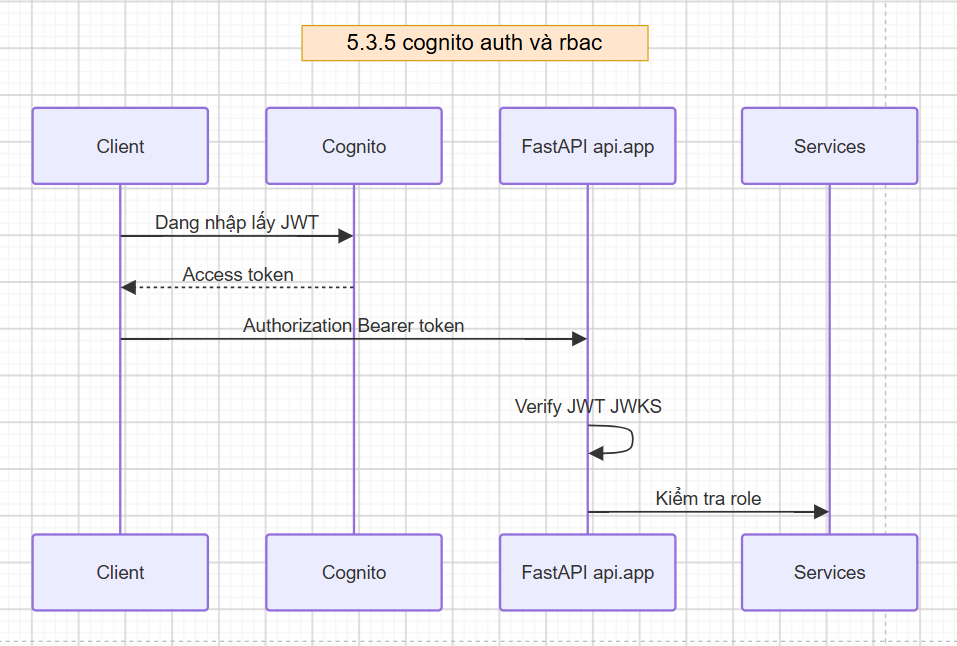
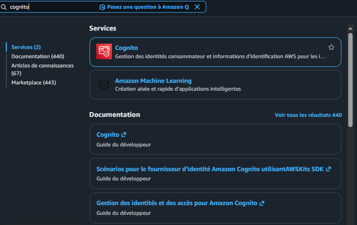
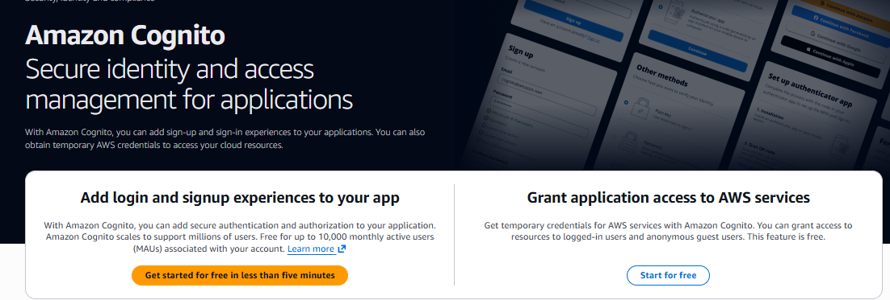
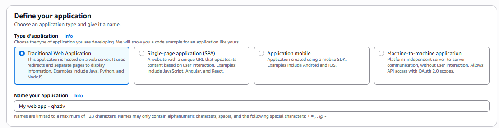
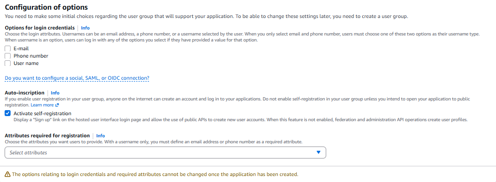
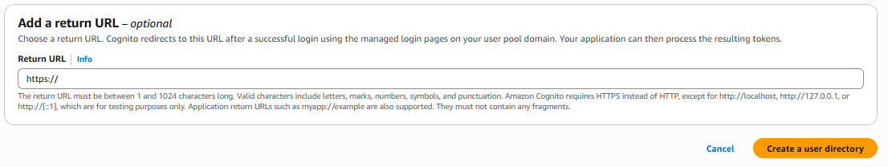

The system uses Amazon Cognito to manage user accounts and access to production features.

## Architecture overview

## User roles

| Group            | Permissions                                          |
| ---------------- | ---------------------------------------------------- |
| **users**  | Use the chatbot and other end-user features          |
| **admins** | User management, admin dashboard, full editor access |

Cognito user-management features live in
`src/services/cognito_admin.py`
This module supports:

- List users.
- Enable a user.
- Disable a user.
- Grant admin access.

The auth module `src/api/auth.py` handles:

- User authentication: validate credentials against the Cognito User Pool.
- User info: extract username, email, and groups from Cognito.
- Enforce permissions: check access with the `require_roles` decorator.

### Configure Amazon Cognito

Sign in to AWS Management Console.
In the search bar, type Cognito and open the Cognito service.

Choose `Get started for free in less than five minutes` to begin.

Under Define your application

* **Application type:**
  * Choose Single-page application (SPA) for a client-side web app with **React, Vue, Angular, Next.js**.
  * Choose Traditional Web Application for **Node.js/Express, Python/Django, Java, PHP** rendered on the server.
* **Name your application:** enter your app name.

Under Configuration of options

* **Options for login credentials:**
  * Select **Email** (users can sign in with email).
* **Self-registration:**
  * Keep **Activate self-registration** so users can create accounts.
* **Attributes required for registration:**
  * Open **Select attributes** and choose required fields (for example `email`, `name`).

Under Add a return URL

* If you use the AWS Hosted UI, enter the URL after a successful login.
* If you build a custom login UI (SDK/Amplify), you can leave this empty.

When finished, choose **Create a user directory** in the lower-right corner to create the User Pool.

The system uses an Amazon Cognito User Pool. Required settings go in `.env`, for example:
`COGNITO_USER_POOL_ID=...`
`COGNITO_APP_CLIENT_ID=...`
`AUTH_DISABLED=false`

In production, authentication stays enabled so admin features cannot be accessed without a valid identity.

### Admin features

Admin accounts can:

| Feature                       | Purpose                         |
| ----------------------------- | ------------------------------- |
| **User management**     | View and manage accounts        |
| **Enable/Disable user** | Activate or deactivate accounts |
| **Permissions**         | Manage admin access             |
| **Document management** | Upload and manage legal data    |
| **Admin dashboard**     | Monitor and manage the system   |
