Hệ thống được triển khai theo mô hình Demo Production trên môi trường điện toán đám mây AWS, cụ thể là một máy chủ ảo **AWS EC2 Instance**

## Tổng quan Sơ đồ Kiến trúc

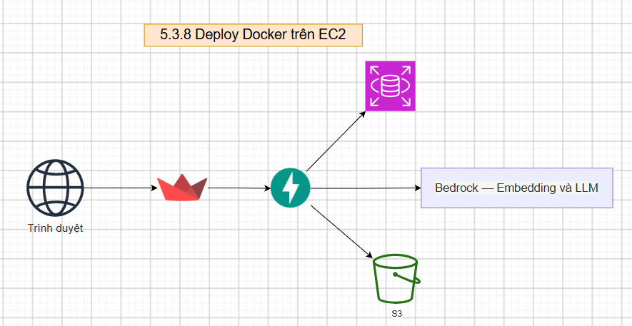

Các dịch vụ được đóng gói và quản lý tập trung thông qua Docker Compose với mô hình 2 Container độc lập

| Container           | Port | Vai trò                                |
| ------------------- | ---- | --------------------------------------- |
| **API**       | 8000 | Chạy Backend<br />FastAPI + QAService |
| **Streamlit** | 8501 | Chạy giao diện người dùng          |

Các file cấu hình chính:

- `deploy/Dockerfile`: Đóng gói ứng dụng thành Docker Image.
- `deploy/docker-compose.yml`: Điều phối các container.
- `deploy/entrypoint.sh`: Script khởi động theo `APP_MODE` (api / streamlit).

## Tạo một máy chủ ảo Amazon EC2 trên giao diện AWS Management Console

Đăng nhập vào AWS Management Console
Trên thanh tìm kiếm, nhập EC2 và chọn dịch vụ EC2.
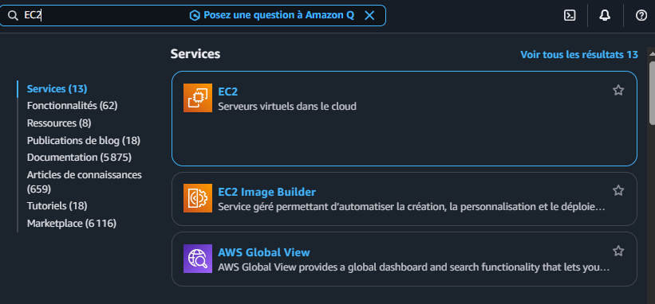

Ở góc trên bên phải màn hình, chọn Region gần nhất
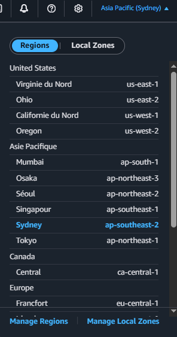

Tại bảng điều khiển  EC2 Dashboard , nhấn nút  Launch instance

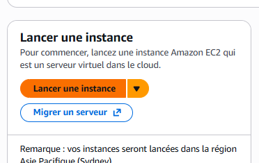

Tại mục Name and tags , nhập tên cho máy chủ

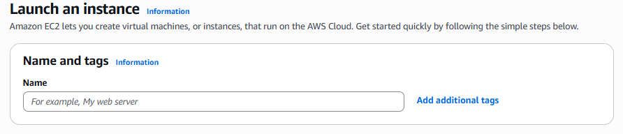

Tại mục Application and OS Images (Amazon Machine Image), chọn hệ điều hành muốn sử dụng

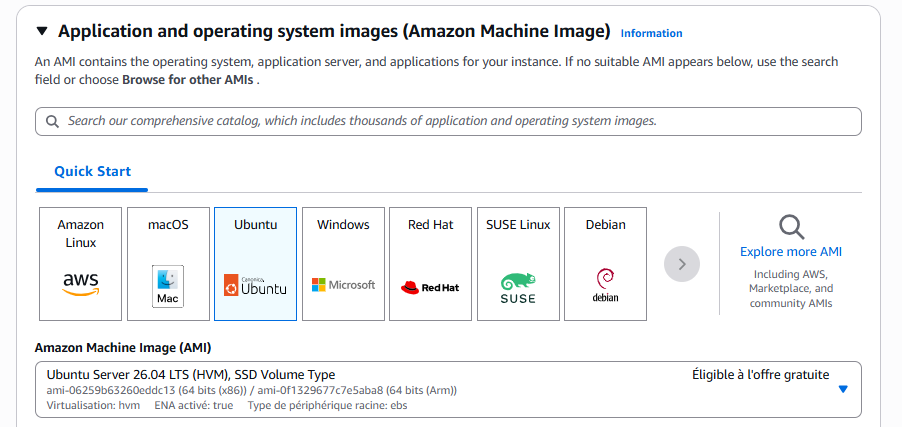

Tại mục Instance type, chọn cấu hình máy chủ phù hợp
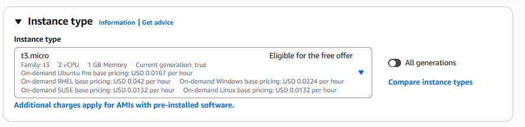

Tại mục Key Pair nhấn Create new key pair

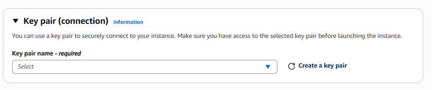

Đặt tên cho khóa
Chọn  Key pair type: `RSA`
Chọn Private key file format:

* Chọn `.pem` nếu dùng OpenSSH trên Terminal (Linux/Mac/Windows 10+) hoặc PuTTY phiên bản mới.
* Chọn `.ppk` nếu dùng PuTTY bản cũ.
* Nhấn **Create key pair** và lưu tệp về máy (AWS chỉ cho phép tải file này 1 lần duy nhất).

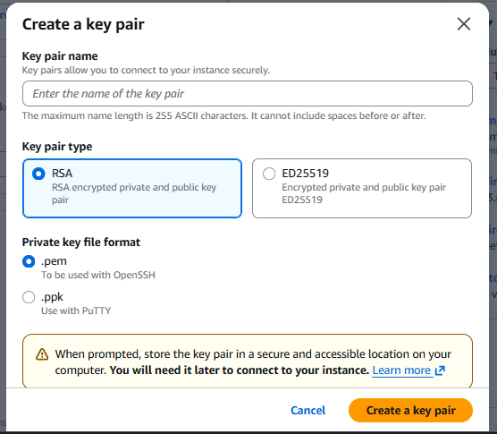

Cấu hình Mạng và Tường lửa (Network Settings)
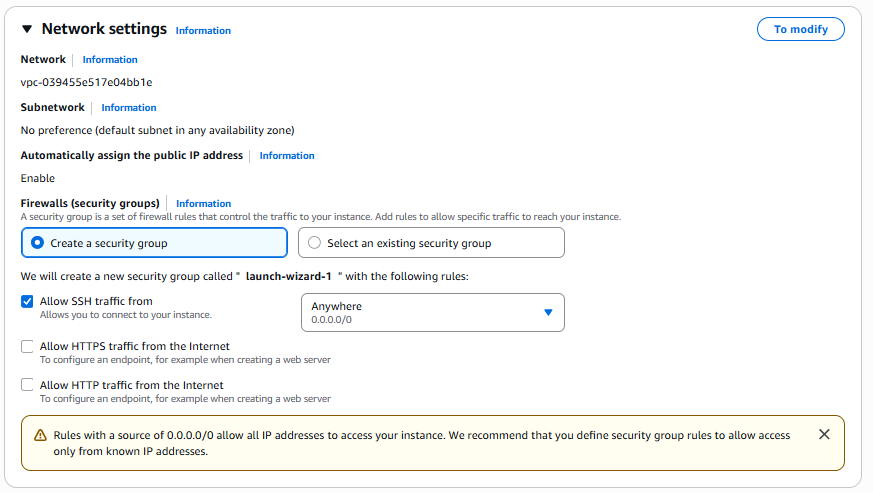

Cấu hình Ổ đĩa lưu trữ (Configure Storage)
Mặc định AWS sẽ tạo 1 ổ đĩa EBS (8 GiB cho Linux, 30 GiB cho Windows)
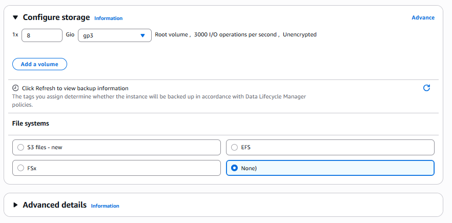

Nhấn nút Launch instance để khởi chạy
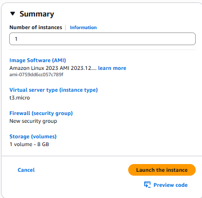

## Quy trình triển khai ứng dụng lên Amazon EC2

Sau khi tạo EC2 instance, thực hiện kết nối đến máy chủ thông qua SSH bằng key `.pem`

Trên máy tính (Windows) mở **Command Prompt** (CMD) di chuyển đến thư mục cùng cấp với file `.pem`

```bash
ssh -i law-chatbot-key.pem ubuntu@18.143.187.153
```

Sau khi đăng nhập thành công, tiến hành cập nhật hệ thống và cài đặt các công cụ phục vụ triển khai.

```bash
sudo apt update
sudo apt upgrade -y
```

Cài đặt Docker

```bash
sudo apt install -y docker.io
```

Sau khi cài đặt, khởi động Docker và thiết lập Docker tự động chạy cùng hệ thống

```bash
sudo systemctl start docker
sudo systemctl enable docker
```

Sau khi môi trường EC2 được chuẩn bị, tiến hành đưa source code của project lên máy chủ.

```bash
git clone <https://github.com/KhanhKoy/vietnamese-legal-llmops.git>
cd vietnamese-legal-llmops
git fetch origin
git checkout master
git pull origin master

Tạo file .env từ mẫu
cp .env.sample .env

Chỉnh sửa file .env
nano .env
```

Biến `.env` quan trọng cho Compose

```
API_URL=http://api:8000/ask
DATABASE_URL=...
GEMINI_API_KEY=...
AWS_ACCESS_KEY_ID=...
AWS_SECRET_ACCESS_KEY=...
AWS_REGION=...
```

Các giá trị thực tế phụ thuộc vào cấu hình của project sau đó lưu file (với nano: Ctrl+O → Enter → Ctrl+X để thoát nano).

Build Docker image từ source code

```bash
docker compose -f deploy/docker-compose.yml build
```

Trong quá trình này, Docker sẽ đọc Dockerfile, cài đặt các dependency cần thiết và tạo image cho các service của hệ thống.

Sau khi build thành công, khởi chạy các service ở chế độ background:

```bash
docker compose -f deploy/docker-compose.yml up -d
```

Kiểm tra trạng thái container

```bash
docker ps
```

Nếu các container có trạng thái Up hoặc healthy, hệ thống đã được khởi động thành công.

## Kiểm tra sau khi khởi động

| Kiểm tra    | Lệnh / URL                                                                        |
| ------------ | ---------------------------------------------------------------------------------- |
| API          | `curl http://localhost:8000/` hoặc Swagger `http://<EC2_PUBLIC_IP>:8000/docs` |
| Streamlit UI | `http://<ec2-public-ip>:8501`                                                    |
