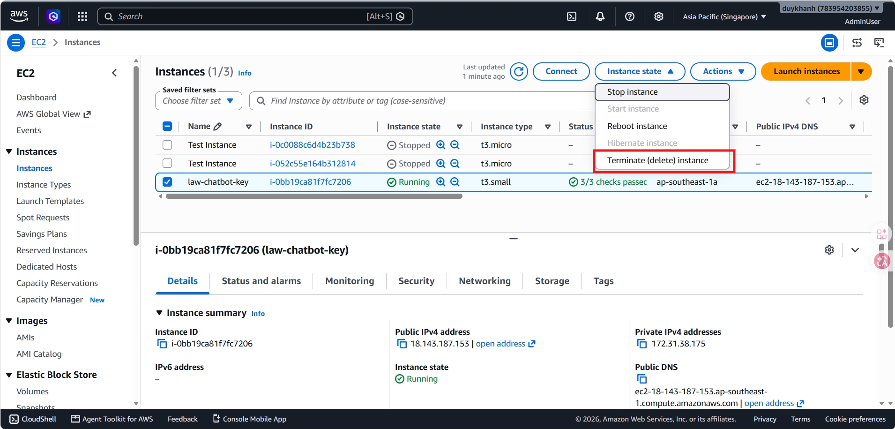
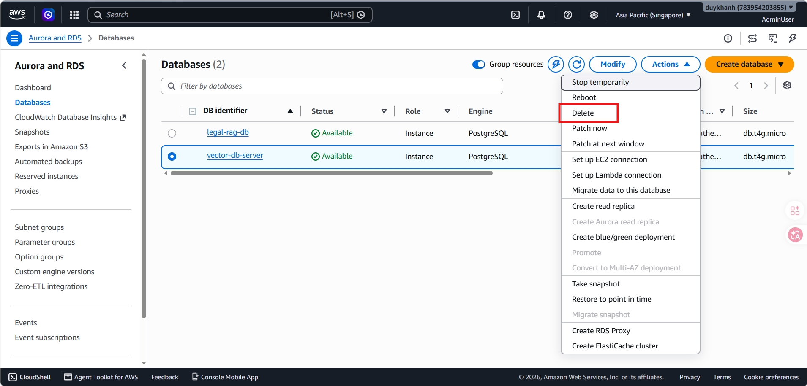
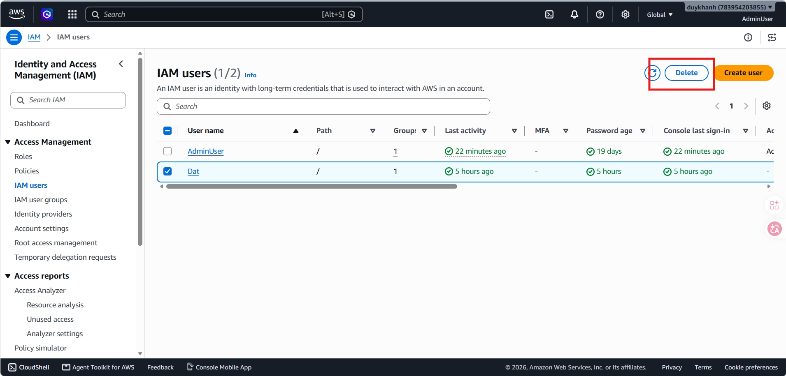
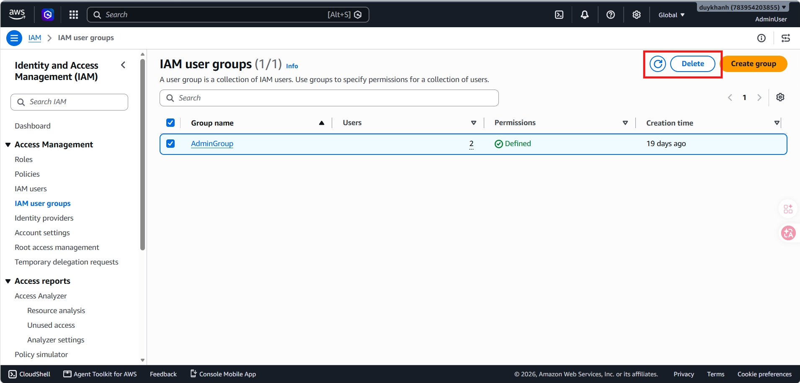
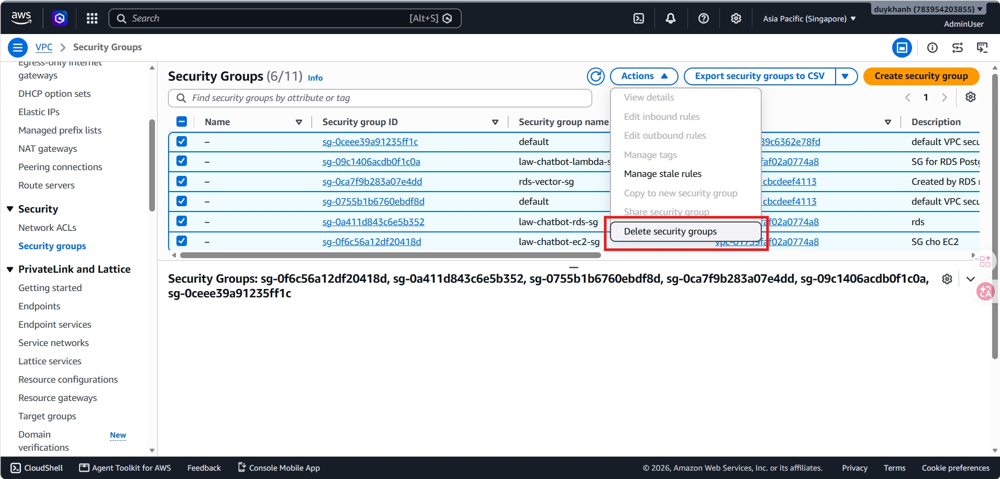
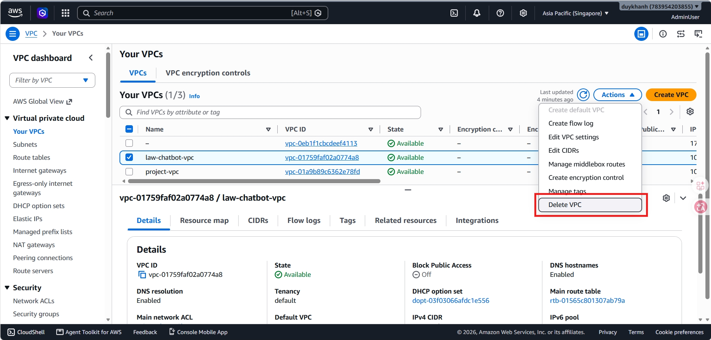

# Tổng kết Workshop

## 5.5.1. Kết quả đạt được

Sau khi hoàn thành Workshop, hệ thống Law-Chatbot đạt được:

- Chatbot hỏi đáp pháp luật hoàn chỉnh theo kiến trúc **RAG**
- Frontend **Streamlit** với các màn hình Login, Register, Chatbot, Admin
- Backend **FastAPI** với endpoint `/ask` và API đầy đủ `/api/*`
- Tích hợp **RDS PostgreSQL + pgvector** cho vector search
- Tích hợp **Amazon Bedrock** cho embedding/LLM trên cloud
- Luồng upload và ingestion tài liệu qua **S3 → SQS → Lambda**
- Lưu lịch sử hội thoại bằng **RDS PostgreSQL**
- Xác thực/phân quyền bằng **Cognito** cho API quản trị
- **CloudFormation** template cho tài nguyên nền
- Deploy production-ready bằng **Docker Compose** trên EC2

## 5.5.2. Chi phí sử dụng thực tế

Dưới đây là bảng tổng hợp chi phí sử dụng thực tế cho các dịch vụ AWS trong dự án Law-Chatbot, được ghi nhận trong chu kỳ một tháng (từ ngày 12/07/2026 đến ngày 11/08/2026).

*(Lưu ý: Mức phí có thể thay đổi tùy thuộc vào thời gian chạy máy chủ và lượng truy vấn thực tế, một số dịch vụ nằm trong gói Free Tier sẽ không phát sinh phí).*

| Dịch vụ                  | Mức phí (USD)   | Ghi chú                                                                                       |
| :------------------------- | :---------------- | :--------------------------------------------------------------------------------------------- |
| **Amazon EC2**       | $ 8.50            | Chi phí chạy instance`t3.micro` (tính theo số giờ bật máy thực tế).                 |
| **Amazon RDS**       | $ 16.20           | Dịch vụ tốn kém nhất trong Lab. Bao gồm instance`db.t4.micro` và 20GB gp3 Storage.    |
| **Amazon Bedrock**   | $ 1.45            | Tính theo số lượng token đầu vào/đầu ra khi gọi Claude 3 Sonnet và Titan Embedding. |
| **Amazon S3**        | $ 0.05            | Phí lưu trữ các file tài liệu PDF/TXT và số lượng request PUT/GET.                   |
| **AWS Lambda**       | $ 0.00            | Nằm trong giới hạn Free Tier (1 triệu requests/tháng).                                    |
| **Amazon SQS / SNS** | $ 0.00            | Số lượng bản tin trong lúc test chưa vượt quá Free Tier.                              |
| **Amazon Cognito**   | $ 0.00            | Miễn phí cho 50,000 MAU (người dùng hoạt động hàng tháng) đầu tiên.               |
| **Amazon VPC**       | $ 0.00            | Không sử dụng NAT Gateway nên không phát sinh chi phí hạ tầng mạng đắt đỏ.       |
| **Tổng cộng**      | **$ 26.20** | *(Số liệu lấy từ AWS Billing & Cost Management Dashboard)*                               |

---

## 5.5.3. Hướng dẫn dọn dẹp tài nguyên (Clean up)

Để tránh phát sinh các chi phí không mong muốn sau khi hoàn thành Workshop, cần thực hiện dọn dẹp tài nguyên. **Quy tắc quan trọng:** Phải xóa các dịch vụ theo thứ tự từ ngoài vào trong để tránh lỗi phụ thuộc (dependency).

**Bước 1: Dọn dẹp Máy chủ (EC2)**

* Truy cập **EC2 Console** $\rightarrow$ Chọn **Instances** $\rightarrow$ Tích chọn instance **law-chatbot-key** $\rightarrow$ Chọn **Instance state** $\rightarrow$ **Terminate instance**.

**Bước 2: Xóa Cơ sở dữ liệu (RDS)**

* Truy cập **RDS Console** $\rightarrow$ Chọn **Databases** $\rightarrow$ Chọn database `vector-db-server` $\rightarrow$ Nhấn **Actions** $\rightarrow$ **Delete**.

**Bước 3: Xóa Tài khoản và Phân quyền (IAM)**

* Truy cập **IAM Console** $\rightarrow$ Vào **Users** $\rightarrow$ Chọn user đã tạo (ví dụ: `Dat`) $\rightarrow$ Nhấn **Delete**.

* Vào **User groups** $\rightarrow$ Chọn group của dự án $\rightarrow$ Nhấn **Delete**.

**Bước 4: Gỡ bỏ Hạ tầng mạng và Bảo mật (VPC & Security Groups)**

* Vào **VPC Console** $\rightarrow$ Chọn **Security groups** $\rightarrow$ Xóa lần lượt các Security Group đã tạo.

* Vào mục **Your VPCs** $\rightarrow$ Chọn `law-chatbot-vpc` $\rightarrow$ Nhấn **Actions** $\rightarrow$ **Delete VPC**. Thao tác này sẽ tự động dọn dẹp sạch các Subnets, Route Tables và Internet Gateway đi kèm.

## 5.5.4. Hướng phát triển tiếp theo

- Deploy đầy đủ **CloudFormation stack** trên AWS thật
- Hoàn thiện **Lambda ingestion** trên production
- Bật **Cognito** đầy đủ cho production (không dùng AUTH_DISABLED)
- Bổ sung **CloudWatch logs/alarms** và SNS notification
- Chuyển secret sang **AWS Secrets Manager**
- Cân nhắc **RDS Proxy** nếu nhiều kết nối đồng thời
- Bổ sung **HTTPS/domain/WAF** khi public production
- Tối ưu thêm chất lượng retrieval và latency
